# SiLA 2 Part (A) - Overview, Concepts and Core Specification

Release v1.1 - 19 March 2022

© 2008-2022 Association Consortium Standardization in Lab Automation (SiLA)

http://www.sila-standard.org/

# Notices

Copyright © SiLA 2008-2022. All Rights Reserved.

This document and the information contained herein is provided on an "AS IS" basis and SiLA DISCLAIMS ALL WARRANTYES, EXPRESS OR IMPLIED, INCLUDING BUT NOT LIMITED TO ANY WARRANTY THAT THE USE OF THE INFORMATION HEREIN WILL NOT INFRinge ANY OWNERSHIP RIGHTS OR ANY IMPLIED WARRANTY OF MERCHANTABILITY OR FITNESS FOR A PARTICULAR PURPOSE.

SiLA takes no position regarding the validity or scope of any intellectual property or other rights that might be claimed to pertain to the implementation or use of the technology described in this document or the extent to which any license under such rights might or might not be available; neither does it represent that it has made any effort to identify any such rights.

# License

This document is licensed under the "Creative Commons Attribution-ShareAlike (CC BY-SA 4.0)" license (see CC BY-SA 4.0 license webpage). See also SiLA 2 Licensing.

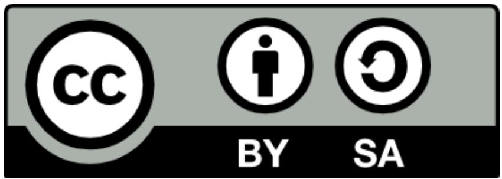

# SiLA 2 Version History

For the version history, please refer to Part (A) (Current Version).

Refer to the Structure of the SiLA 2 Specification for details about how the different documents are related.

# SiLA 2 Working Group Members

Authors, co-authors and contributors to the SiLA 2 standard.

<table><tr><td>Name</td><td>Role</td><td>E-Mail</td></tr><tr><td>Daniel Juchli</td><td>Work Group Leader</td><td>daniel.juchli@sila-standard.org</td></tr><tr><td>Maximilian Schulz</td><td>Member</td><td>maxxsschulz@gmail.com</td></tr><tr><td>Armin Engesser</td><td>Member</td><td>armin.engesser@siobra.de</td></tr><tr><td>Florian Meinicke</td><td>Member</td><td>florian.meinicke@cetoni.de</td></tr><tr><td>Georg Hinkel</td><td>Member</td><td>georg.hinkel@tecan.com</td></tr><tr><td>Jonas Austerjost</td><td>Member</td><td>jonas.austerjost@sartorius.com</td></tr><tr><td>Kok Hien Gan</td><td>Member</td><td>KokHien.Gan@thermofisher.com</td></tr><tr><td>Jeff Bonevich</td><td>Member</td><td>jeff.bonevich@thermofisher.com</td></tr><tr><td>KV Rao</td><td>Member</td><td>kv.rao@thermofisher.com</td></tr><tr><td>Lukas Bromig</td><td>Member</td><td>lukas.bromig@tum.de</td></tr><tr><td>Mark Doerr</td><td>Member</td><td>mark.doerr@uni-greifswald.de</td></tr><tr><td>Markus Meser</td><td>Member</td><td>markus.meser@siobra.de</td></tr><tr><td>Michael Osthege</td><td>Member</td><td>m.osthege@fz-juelich.de</td></tr><tr><td>Mike Groezinger</td><td>Member</td><td>mike.groezinger@siobra.de</td></tr><tr><td>Mitko Georgiev</td><td>Member</td><td>mkgeorgiev@gmail.com</td></tr><tr><td>Patrick Oberthür</td><td>Member</td><td>patrick.zirker@tu-dresden.de</td></tr><tr><td>Ritter Daniel</td><td>Member</td><td>d.ritter@ritter-pt.ch</td></tr><tr><td>Robert Soeldner</td><td>Member</td><td>Robert.Soeldner@sartorius-Stedim.com</td></tr><tr><td>Sebastian Hans</td><td>Member</td><td>sebastian.hans@tu-berlin.de</td></tr><tr><td>Sebastian Schärer</td><td>Member</td><td>sebastian.schaerer@roche.com</td></tr><tr><td>Stefan Koch</td><td>Member</td><td>koch@equicon.de</td></tr><tr><td>Dominic Lüthjohann</td><td>Contributor</td><td>dominic.luetjohann@labforward.io</td></tr><tr><td>Enrique Mireles</td><td>Contributor</td><td>enrique.mireles@labforward.io</td></tr><tr><td>Julian Luebke</td><td>Contributor</td><td>julian.luebke@labforward.io</td></tr><tr><td>Bernd Huf</td><td>Contributor</td><td>BHuf@hamilton.ch</td></tr><tr><td>Jérémy Zogg</td><td>Contributor</td><td></td></tr><tr><td>Julian Lübke</td><td>Contributor</td><td>luebke@cubuslab.com</td></tr><tr><td>Oskari Vinko</td><td>Contributor</td><td>oskari@unitelabs.ch</td></tr><tr><td>Ricardo Gaviria</td><td>Contributor</td><td>ricardo@unitelabs.ch</td></tr><tr><td>Samuel Bernhard</td><td>Contributor</td><td>sbernhard@hamilton.ch</td></tr><tr><td>Uwe Kindler</td><td>Contributor</td><td>uwe.kindler@ctoni.de</td></tr><tr><td>Christian Waltenspiel</td><td>Technical Writer</td><td>christian.waltenspiel@web.de</td></tr><tr><td>Patrick Ley</td><td>Technical Writer</td><td>okhofsk@gmail.com</td></tr><tr><td>Alexander Reeder</td><td>Observer</td><td>alexander.reeder@wega-it.com</td></tr><tr><td>Andy Mitchell</td><td>Observer</td><td>Andrew.Mitchell@unilever.com</td></tr><tr><td>Benjamin Schulz</td><td>Observer</td><td>benjamin.schulz@ipa.fraunhofer.de</td></tr><tr><td>Christian Ulmer</td><td>Observer</td><td>c.ulmer@campus.tu-berlin.de</td></tr><tr><td>Christina Mavreas</td><td>Observer</td><td>christina.mavreas.ipa@gmail.com</td></tr><tr><td>Daniel Marquard</td><td>Observer</td><td>marquard@iftc.uni-hannover.de</td></tr><tr><td>Dewang Sharma</td><td>Observer</td><td>dewang.sharma@paa-automation.com</td></tr><tr><td>Ekkehard Görlach</td><td>Observer</td><td>ekkehard.goerlach@novartis.com</td></tr><tr><td>Mario Blattner</td><td>Observer</td><td>mario.blattner@wega-it.com</td></tr><tr><td>Mark Auty</td><td>Observer</td><td>Mark.Auty@unilever.com</td></tr><tr><td>Mark Porr</td><td>Observer</td><td>porr@iftc.uni-hannover.de</td></tr><tr><td>Pierre-Luc Satin</td><td>Observer</td><td>pierre-luc.satin@med.uni-goettingen.de</td></tr><tr><td>Simon Seidel</td><td>Observer</td><td>simon.seidel@campus.tu-berlin.de</td></tr><tr><td>Simon Stumm</td><td>Observer</td><td>simon.stumm@sartorius.com</td></tr><tr><td>Stefan Maak</td><td>Observer</td><td>stefanmaak@freenet.de</td></tr><tr><td>Thomas Thaler</td><td>Observer</td><td>thomas.thaler@wega-it.com</td></tr><tr><td>Tim Meyer</td><td>Observer</td><td>tim.meyer@med.uni-goettingen.de</td></tr><tr><td>Niklas Mertsch</td><td>Observer</td><td>niklas.mertsch@stud.uni-goettingen.de</td></tr><tr><td>Bart van der Schoot</td><td>BoD Member</td><td>bart.vanderschoot@sila-standard.org</td></tr><tr><td>Burkhard Schaefer</td><td>BoD Member</td><td>b.schaefer@bssn-software.de</td></tr><tr><td>Erwin Althof</td><td>BoD Member</td><td>erwin.althof@novartis.com</td></tr><tr><td>Freundel Matthias</td><td>BoD Member</td><td>matthias.freundel@ipa.fraunhofer.de</td></tr><tr><td>Haike Suering</td><td>BoD Member</td><td>Haike.Suering@perkinelmer.com</td></tr><tr><td>Jason Meredith</td><td>BoD Member</td><td>jason.meredith@tecan.com</td></tr><tr><td>Oliver Peter</td><td>BoD Member</td><td>oliver.peter@idorsia.com</td></tr><tr><td>Patrick Courtney</td><td>BoD Member</td><td>patrick.courtney@sila-standard.org</td></tr><tr><td>Rob Harkness</td><td>BoD Member</td><td>rob.harkness@sila-standard.org</td></tr><tr><td>Thomas Frech</td><td>BoD Member</td><td>thomas.frech@sila-standard.org</td></tr><tr><td>Tom Kissling</td><td>BoD Member</td><td>tom.kissling@roche.com</td></tr></table>

# SiLA 2 Working Group Organization

Please refer to Part (A) (Current Version).

# SiLA 2 Roadmap

Please refer to Part (A) (Current Version).

# SiLA 2 Adoption

Please refer to Part (A) (Current Version).

# Status of The SiLA 2 Specification

Please refer to Part (A) (Current Version).

# Table of Contents

Notices

License

SiLA 2 Version History

SiLA 2 Working Group Members

SiLA 2 Working Group Organization

SiLA 2 Roadmap

SiLA 2 Adoption

Status of The SiLA 2 Specification

Table of Contents

Abstract

What's New in SiLA 2 Version 1.1

The New -Server-Initiated Connection Method

The Need for a Cloud-Native Approach

The Scenarios

The Lab Network Scenario

Corporate Network Scenario

Cloud Application Scenario

The Solution Approach

Corporate Network Scenario

Cloud Application Scenario

Technical Background of the New Server-Initiated Connection Method

Introduction

How to Get Started

Device Vendor, Service Provider, Device Designer

Software Developer

SiLA Integrator

Scientist / Lab Technician

High Level Overview

Standardization Documents and Process

Architectural Overview

SiLA Client and Server Interaction in a Nutshell

Design Principles

Reference Implementations and Utilities

= = = START OF NORMATIVE PART = = =

Structure of the SiLA 2 Specification

Terminology and Conformance Language

Architecture & Important Definitions

SiLA Server

SiLA Server Properties

SILA Server Name

SiLA Server Type

SiLA Server UUID

SiLA Server Version

SiLA Server Vendor URL

SiLA Server Description

SiLA Device

SiLA Client

Feature

Connection

Connection Method

Client-Initiated Connection Method

Server-Initiated Connection Method

Establishing a Connection

SiLA Client Request

Content of a SiLA Client Request

SiLA Server Response

Content of a SiLA Server Response

Header and Trailer

Payload

Feature Framework

Designing Features

Standard Features

Storing Features

Examples

Maintaining Features

Creating Features

Verifying Features

Modifying Features

Standardizing Features

Feature Definition

Best Practice

Feature Identifier

Best Practice

Examples

Feature Display Name

Best Practice

Example

Feature Description

Best Practice

Example

Commands

Best Practice

Example

Observable and Unobservable Commands

Best Practice

Command Parameters

Best Practice

Examples

Command Responses

Best Practice

Examples

Intermediate Command Responses

Best Practice

Examples

Defined Execution Errors in Command Execution Context

Command Execution

Unobservable Command

Observable Command

Properties

Best Practice

Observable or Unobservable Property? Design Considerations

Defined Execution Errors in Property Reading Context

Accessing Properties

Reading a Property Value

<table><tr><td>Subscribing to an Observable Property</td></tr><tr><td>Examples</td></tr><tr><td>SiLA Client Metadata</td></tr><tr><td>Best Practice</td></tr><tr><td>Examples</td></tr><tr><td>A “Lock Controller” Feature</td></tr><tr><td>Authorization Service</td></tr><tr><td>A “Gateway” Feature</td></tr><tr><td>Defined Execution Errors in Metadata Context</td></tr><tr><td>Defined Execution Errors</td></tr><tr><td>Best Practice</td></tr><tr><td>Example</td></tr><tr><td>Custom Data Types</td></tr><tr><td>Best Practice</td></tr><tr><td>SiLA Data Types</td></tr><tr><td>SiLA Basic Types</td></tr><tr><td>Additional Details on Time, Date and Timestamp</td></tr><tr><td>Time Durations</td></tr><tr><td>Best Practice</td></tr><tr><td>SiLA Derived Types</td></tr><tr><td>SiLA List Type</td></tr><tr><td>SiLA Structure Type</td></tr><tr><td>Best Practice</td></tr><tr><td>SiLA Structure Type vs. SiLA Binary Type</td></tr><tr><td>Structure Type vs. Using AnIML</td></tr><tr><td>SiLA Constrained Type</td></tr><tr><td>Constraints to SiLA Basic Types</td></tr><tr><td>Additional Details on Representing Constraint&#x27;s Data in the Feature Definition</td></tr><tr><td>Language</td></tr><tr><td>Content Type Constraint</td></tr><tr><td>Schema Constraint</td></tr><tr><td>Unit Constraint</td></tr><tr><td>Unit Conversion</td></tr><tr><td>Best Practice</td></tr><tr><td>Examples</td></tr><tr><td>Constraints to SiLA List Type</td></tr></table>

Feature Attributes

SiLA 2 Version

Feature Version

Maturity Level

Originator

Examples

Category

Examples

Feature Definition Language

The SiLA Service Feature

The Connection Configuration Service Feature

Error Categories

Validation Error

Execution Error

Defined Execution Error

Examples for Defined Execution Errors in the Command Execution Context

Plate Handling Feature

Authorization Service Feature

Examples for Defined Execution Errors in the Property Access Context

Sensor Off

Examples for Defined Execution Errors in the SiLA Client Metadata Context

Invalid Lock Identifier

Undefined Execution Error

Framework Error

Command Execution Not Accepted

Invalid Command Execution UUID

Command Execution Not Finished

Invalid Metadata

No Metadata Allowed

Connection Error

SiLA Server Discovery

Feature Discovery

Internationalization

Security

Encryption

Authentication

Authorization

Audit Trail

Versioning Strategy

Fully Qualified Identifier

Uniqueness of Fully Qualified Identifiers

Fully Qualified Feature Identifier

Fully Qualified Command Identifier

Fully Qualified Command Parameter Identifier

Fully Qualified Command Response Identifier

Fully Qualified Intermediate Command Response Identifier

Fully Qualified Defined Execution Error Identifier

Fully Qualified Property Identifier

Fully Qualified Custom Data Type Identifier

Fully Qualified Metadata Identifier

Recurrent Terminology

Identifier

Uniqueness of Identifiers

Display Name

Description

Best Practice

Parameter

UUID

Normative References

= = = END OF NORMATIVE PART = = =

Future Considerations

Feature Framework

Feature Extensions & Dependencies

Testing Features

GxP "Compliant" SiLA Servers or Features

"Feature Sets"

Additional Feature Fields

Defined Execution Error Parameters

Best Practice

Observable Properties / Observable Commands

Observable Property Filters

Best Practice

Predefined Observable Property Filters

Deadband Observable Property Filter

Minimum Interval Observable Property Filter

Optional Response

Additional Data Types

Quantity

"Dimension" Constraint

Data Type for Arbitrary Precision Numbers

Data Type for GxP True Values

Other Additions

SiLA Client UUID

"Reverse" Channel SiLA Server to Client

Goal

Reasoning / Rationale

Implementation

# Abstract

SiLA's mission is to establish international standards which create open connectivity in lab automation. SiLA's vision is to create interoperability, flexibility and resource optimization for laboratory instrument integration and software services based on standardized communication protocols and content specifications. SiLA promotes open standards to allow integration and exchange of intelligent systems in a cost-effective way.

SiLA 2 is based on open, well-established communication protocols and defines a thin domain-specific layer on top of these, consisting of common concepts and a vocabulary / taxonomy.

# What's New in SiLA 2 Version 1.1

SiLA 2 Version 1.1 introduces a new  $\cdot$ Connection Method, the  $\cdot$ Server-Initiated Connection Method. This new feature enables a few exciting new use cases for SiLA:

- Connect lab instruments to the cloud  
- Solve issues of accessing lab instruments, that reside in isolated lab networks, from a corporate network  
- Simplify security certificate management for encrypted and secure connections

# The New  $\cdot$ Server-Initiated Connection Method

Is a new SiLA 2 capability  
- Allows the  $\cdot$ Connection $\cdot$  to be initiated by the instrument (the  $\cdot$ SiLA Server $\cdot$ ), not only the controlling software (the  $\cdot$ SiLA Client $\cdot$ )  
- Implemented secure encryption and authentication, so that instruments can be firewalled  
- Enables standards-based IoT in the lab (no more vendor-specific approaches)  
- Allows placing applications in the cloud or in the corporate data center  
- All aspects of SiLA 2 (such as  $\cdot$ Features $\cdot$ ,  $\cdot$ Commands $\cdot$ , ...) will continue to work in a transparent manner  
Is supported by SiLA 2 reference implementations, no additional work for developers

# The Need for a Cloud-Native Approach

When communicating with an instrument, it must be reachable via the network. Connecting to the instrument may be difficult when using

Isolated lab networks  
Cloud-hosted applications

# The Scenarios

The Lab Network Scenario

Lab network scenario

Instrument

Client (LIMS, ELN, ...)

Lab Network

Corp Network

Internet

Client is on same network as the instrument. Connection succeeds.

SilA Rapid Integration

AnIML

Corporate Network Scenario

Corporate network scenario

Instrument

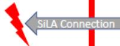

Client (LIMS, ELN,...)

Lab Network

Corp Network

Internet

Corporate network can not access lab network. Connection blocked by firewall.

SilA Rapid Integration

AnIML

# Cloud Application Scenario

Cloud application scenario

Instrument

Lab Network

SiLA Connection

Client

(LIMS,ELN,...)

either lab network nor corporate network. Connection blocked by corporate firewall.

Rapid Integration

# The Solution Approach

Solution approach

Instrument

Lab Net

Idea: Can the instrument initiate the connection?

Outbound connections are much easier.

Internet

Rapid Integration

# Corporate Network Scenario

Corporate network scenario

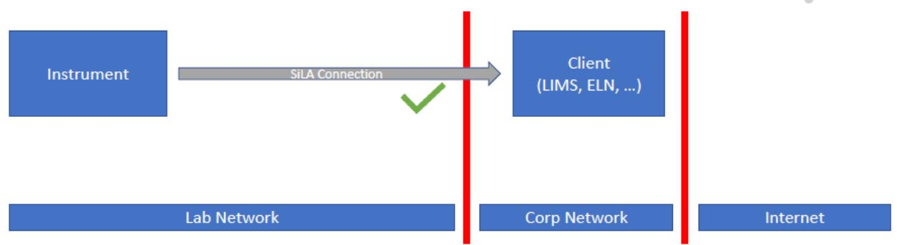

Corporate is reachable from lab network. Connection succeeds.

SilA Rapid Integration

AnIML

# Cloud Application Scenario

Cloud application scenario

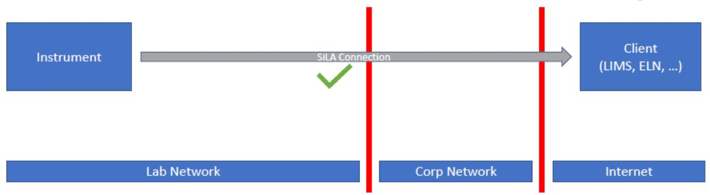

Internet can be reached from lab network and corporate network. Connection succeeds.

SilA Rapid Integration

AnIML

# Technical Background of the New  $\cdot$ Server-Initiated Connection Method

The SiLA cloud connection opens a virtual channel from the lab into the cloud.

The benefits of this approach are:

- No additional infrastructure needed for device vendors and lab environment  
- Easy to develop - same technology stack. Cloud functionality can be added as lib for each language platform. Once added, can be used transparent for any feature  
- Standard gRPC and HTTP/2 protocol connection handling and security models can be used

This approach makes it easy to connect to the cloud, meeting the same security requirements for the connection, such as authentication and encryption of the data. It also meets the protocol buffer messages specification and serialization to ensure interoperability between different platforms and vendors.

The Cloud SiLA client endpoint can be public HTTP/2 gRPC server endpoints, using standard TLS certificates for secure connections. For lab device vendors, this makes life much easier as there are no special requirements for the lab components.

The java reference implementation includes working examples for all aspects covered by new SiLA 2 -Server-Initiated Connection Method.

Like all SiLA 2 reference implementations, the reference of the new  $\cdot$ Server-Initiated Connection Method can be found at https://sila2.gitlab.io/sila_base/ and https://gitlab.com/SiLA2.

# Introduction

The SiLA Organization provides with the SiLA 2 Standard a framework for the exchange, integration, sharing, and retrieval of electronic laboratory information. These standards define how information is packaged and communicated from one system to another, setting the language, structure and SiLA Data Types required for seamless integration between systems. SiLA standards support good laboratory practice and the management, delivery, and evaluation of laboratory services, and are recognized as the most commonly used in the world.

The SiLA 2 Specification specifies interoperability schemes that allow laboratory devices and services to communicate with each other. It also defines the process of further developing the standard and its assets.

SiLA was formed in 2008. Its standards have been implemented numerous times. In 2015, The SiLA Organization decided to initiate the next generation of SiLA. A result of this work is the SiLA 2 specification. Good ideas from SiLA 1.x were evolved. Many concepts and ideas were adopted from proven and emerging (Internet) standards, the Internet of Things (IoT) and web technologies.

The aim of this specification is to apply existing technologies and standards to the laboratory domain.

Therefore, this specification is designed to be "lean and mean" and simple. It only describes what is absolutely needed in the domain of lab automation, and otherwise references other open standards and protocols.

SiLA 2 has been designed such that it will not require proprietary libraries to be implemented. Long-term stability, wide support and acceptance have been critical criteria for the selection of the underlying standards and technologies.

The ultimate goal of SiLA is to enable a new kind of lab automation. To this end, SiLA 2 is designed on solid principles to enable true plug-and-play operation.

# How to Get Started

This section provides pointers to the document sections relevant to specific stakeholders in the laboratory automation domain.

See also https://gitlab.com/SiLA2/sila_base.wikis/home.

Device Vendor, Service Provider, Device Designer

Assume you are the one that designs or provides a laboratory device or service. Part A helps to understand the layout of the SiLA 2 framework. The section Architecture is describing the main components, i.e. the  $\cdot$ SiLA Server $\cdot$ ,  $\cdot$ SiLA Client $\cdot$  and  $\cdot$ Feature $\cdot$ . Once that is clear, one can start to design  $\cdot$ Features $\cdot$  in a manner without using too many technical details.

# Software Developer

Assuming that you are the one that should implement a given specification, Part A is about the tech-agnostic declaration. Part B contains the mapping to the actual technical details.

# SiLA Integrator

The main task of integrating systems into the lab is bringing  $\cdot$ SiLA Servers $\cdot$  and  $\cdot$ SiLA Clients $\cdot$  together. Since the technical back layer is nearly symmetrical, your approach will be very similar to the software developer. Skim the architecture of Part A and get familiar with the  $\cdot$ Feature Framework $\cdot$ . Technical details can be found in Part B.

# Scientist / Lab Technician

Since there should be no developing included in the ambit of running a laboratory, Part A, especially the SiLA 2 -Feature Framework $\cdot$ , should be enough to understand it. In addition, since SiLA 2 is aiming to create a plug & play lab-environment, an interesting section might also be  $\cdot$ SiLA Server Discovery $\cdot$  and  $\cdot$ SiLA Feature Discovery $\cdot$ .

# High Level Overview

The SiLA 2 standardization process is a community process. The SiLA organization is investing a lot of effort into growing the community. Only a very active community that continues to develop the core standard, as well as -Feature Definitions- on top will guarantee a long-term evolution and success of the standard.

# Standardization Documents and Process

In order to make the SiLA 2 standard as future-proof as possible, concepts (Part A) have been separated from technical implementation details (Part B). The SiLA 2 standard is documented in several parts. The reason for this is that the individual parts are maintained and balloted separately.

<table><tr><td>Features
(Part C)</td><td>Collection of all core
and custom Features</td></tr><tr><td>Mapping
(Part B)</td><td>Mapping of concepts to
concrete technology
Implementation guide
for developers</td></tr><tr><td>Core
(Part A)</td><td>Overview &amp; Concepts
Feature Framework</td></tr></table>

The core and mapping specifications are written and maintained by the SiLA 2 Working group and kept as stable as possible. The flexible evolution and (vendor) specific extensions only happen on a  $\cdot$ Feature $\cdot$  level. This is reflected in our documentation layout:

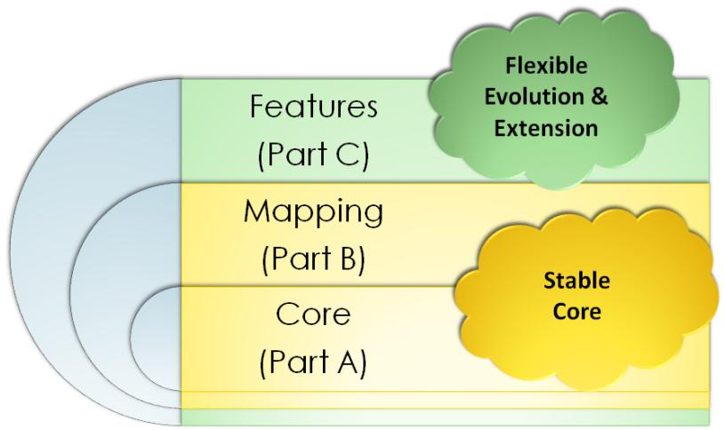

# Architectural Overview

The basic entities in SiLA 2 are the  $\cdot$ SiLA Client- and the  $\cdot$ SiLA Server-. A  $\cdot$ Connection- is opened either by the  $\cdot$ SiLA Client- (Client-Initiated Connection Method-) or the  $\cdot$ SiLA Server- (Server-Initiated Connection Method-). A  $\cdot$ Connection- is always established over a TCP/IP network (like an intranet or the Internet).

However, please note that  $\cdot$ SiLA Client- and  $\cdot$ SiLA Server- are only "roles" and not necessarily physical entities. A hardware device or a software application can in principle assume either role, even at the same time.

A central part of SiLA 2 is the discovery of  $\cdot$ SiLA Servers by  $\cdot$ SiLA Clients.  $\cdot$ SiLA Servers advertise themselves so  $\cdot$ SiLA Clients can find them in local networks.

A  $\cdot$ SiLA Server $\cdot$  is comparable to a "web server", that is offering services to a web browser (the  $\cdot$ SiLA Client $\cdot$ ). The behavior of a web server and web browser is comparable to a  $\cdot$ SiLA Server $\cdot$  and a  $\cdot$ SiLA Client $\cdot$  to a high extent.

A·SiLA Client·is looking for ·SiLA Servers·:

  
LIMS Performs SiLA Discovery

- SiLA Servers may respond with the required information so the -SiLA Client knows how to connect. This includes all relevant information needed for connecting like the IP address and TCP port.

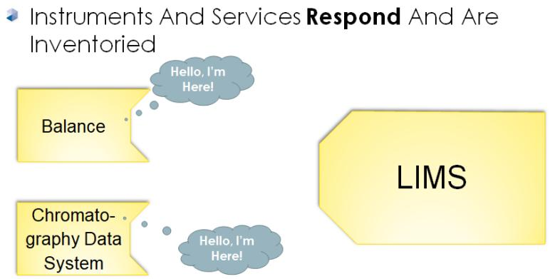

Once discovered, a  $\cdot$ SiLA Server $\cdot$  is able to advertise its capabilities. In SiLA 2, these capabilities are named  $\cdot$ Features $\cdot$ :

- Instruments and Services describe their Features ( $\rightarrow$  i.e. capabilities)

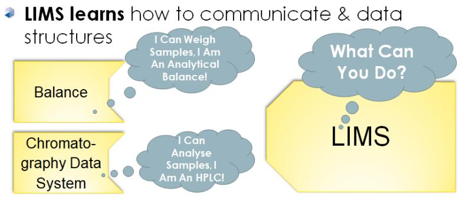

One of the biggest assets of SiLA is, that the  $\cdot$ Feature $\cdot$  design will directly influence the user experience. This enables a whole new range of use cases in the smart laboratory.

A  $\cdot$ SiLA Server may expose multiple  $\cdot$ Features, with some  $\cdot$ Features being able to modify the behavior of other  $\cdot$ Features. For example, a  $\cdot$ SiLA Server exposing a "Weighing Service"  $\cdot$ Feature might also expose an "Authorization Service"  $\cdot$ Feature. In turn, the  $\cdot$ Commands offered by the "Weighing"  $\cdot$ Feature are only accessible once authorized (through the "Authorization"  $\cdot$ Feature).

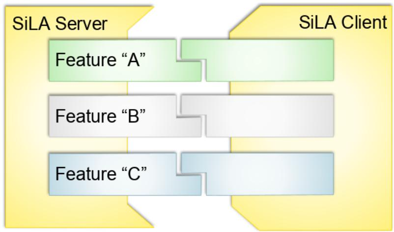

- Features can also be seen as the application programming interface (API) definition of a -SiLA Server. -Features can define Properties, -Commands and -SiLA Data Types. They also include a description of how to use them and any other information relevant to the execution or maintaining of the -Feature.

In contrast to an API in other technologies or standard formats, a SiLA  $\cdot$ Feature $\cdot$  can be designed by a subject matter expert (SME) who is not an IT expert. The "language" used to define a  $\cdot$ Feature $\cdot$  is close to the natural human language and therefore easily understandable for non-IT audiences.

SiLA  $\cdot$  Features $\cdot$  and  $\cdot$  SiLA Feature Discovery $\cdot$  empower programmers to write software that is able to deal with any SiLA-compliant device, without knowing it before. Such  $\cdot$  SiLA Clients $\cdot$  can discover  $\cdot$  SiLA Servers $\cdot$  and their  $\cdot$  Features $\cdot$  and even operate them.

There are  $\cdot$ Features: that are provided with the SiLA 2 standard. Most of these  $\cdot$ Features: are "device agnostic" and can be used universally, independent of the nature of the  $\cdot$ SiLA Server $\cdot$ . But also private or vendor-specific  $\cdot$ Features: are possible.  $\cdot$ Features: can be added to the  $\cdot$ Online Feature Repository $\cdot$ , but SiLA 2 also works without a repository.

The SiLA Organization strives to find consensus for different  $\cdot$ Features $\cdot$ covering the same functionality and try to standardize one version of such  $\cdot$ Features $\cdot$ . However,  $\cdot$ Features $\cdot$ covering the same or similar functionality may also coexist.

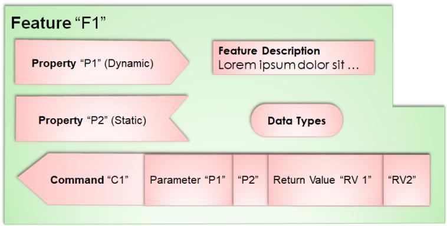

Once a  $\cdot$ SiLA Client knows the  $\cdot$ Features offered by a  $\cdot$ SiLA Server, the  $\cdot$ SiLA Client can start using these  $\cdot$ Features:

LIMS Performs Instrument Control & Sample Submission  
- Services Return Complete and Traceable Data Describing What They Did

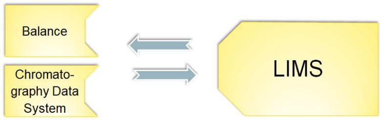

SiLA does not specify or enforce any additional architectural constraints. An application architect or designer is free in how to setup  $\cdot$ SiLA Clients $\cdot$  and  $\cdot$ SiLA Servers $\cdot$ . However, the SiLA 2 Specification proposes best practices in many areas and aspects that should be followed to be SiLA-compliant. They are meant as good examples to encourage the design of  $\cdot$ Features $\cdot$  in the recommended way, but without the constraint of having to do so.

SiLA enables true plug & play and service orientation:

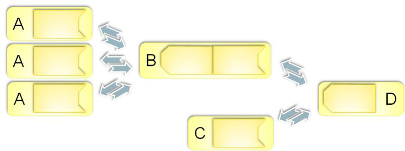

Each yellow box represents a  $\cdot$ SiLA Server,  $\cdot$ SiLA Client or both. The arrows indicate a Connection between the  $\cdot$ SiLA Client and the  $\cdot$ SiLA Server: This illustrates a number of communication scenarios.

A. Laboratory devices, such as pipettors, plate handlers, plate sealers, i.e.  $\cdot$ SiLA Servers $\cdot$ implementing their respective  $\cdot$ Features $\cdot$ .  
B. A process management system (PMS) orchestrating these laboratory devices, acting as a  $\cdot$ SiLA Client to them and exposing a higher level  $\cdot$ Feature $\cdot$  as a  $\cdot$ SiLA Server $\cdot$ .  
C. Another laboratory device, for example an analytical instrument offering a respective  $\cdot$ Feature $\cdot$  as a  $\cdot$ SiLA Server $\cdot$ .  
D. A graphical user interface, acting as a  $\cdot$ SiLA Client and controlling the PMS and the analytical device from a user's perspective.

# SiLA Client and Server Interaction in a Nutshell

1. Establishing the  $\cdot$  Connection $\cdot$  Two ways of establishing a  $\cdot$  Connection $\cdot$  do exist:

a. ·Client-Initiated Connection Method:: A·SiLA Client· needs to know the ·Address· of the ·SiLA Server· to connect to it. A·SiLA Client· can use ·SiLA Server Discovery· to determine the ·Address·. A·SiLA Client· connects to the ·SiLA Server· at the ·Address·.

b. Server-Initiated Connection Method: A  $\cdot$ SiLA Server needs to know the Address of the  $\cdot$ SiLA Client to connect to it. A  $\cdot$ SiLA Server connects to the  $\cdot$ SiLA Client at the Address.

2. The SiLA Client retrieves the  $\cdot$ SiLA Service Feature to get details about the  $\cdot$ SiLA Server and discover  $\cdot$ Features ( $\cdot$ SiLA Feature Discovery $\cdot$ ).

3. Ways of binding

a. Late binding at run-time: a  $\cdot$  SiLA Client $\cdot$  discovers and uses  $\cdot$  Features $\cdot$  at run-time.  
b. Early binding at design time: the  $\cdot$ Features $\cdot$  a  $\cdot$ SiLA Client $\cdot$  is accessing were already known while designing the  $\cdot$ SiLA Client $\cdot$ .

4. SiLA Client and SiLA Server interaction:

a. Executing an ·Unobservable Command·  
b. Executing an ·Observable Command·  
c. Reading a  $\cdot$  Property  
d. Subscribing to a  $\cdot$ Property $\cdot$

5. Closing the  $\cdot$  Connection

# Design Principles

- The SiLA 2 architecture is based on some fundamental aspects, like being explicit in everything and being strict in all specifications.  
- Type safety is important.  
- Clean separation of concerns (such as definition of the data and the transport of the data between involved parties). This has been realized through a clear separation between the core specification, -Feature Definitions- and the mapping specification that provides the details for actually implementing SiLA.  
- SiLA 2 is based on existing standards for interoperability of systems (such as Internet standards) and only defines those things (such as taxonomies / naming conventions) needed for the laboratory domain on top.  
- A message-driven architecture that gracefully handles network interruptions.  
- SiLA 2 should be accessible to a wide range of users. From software programmers to scientists and subject matter experts, SiLA 2 should be easy to understand.  
- SiLA 2 is not a static specification. To remain relevant, it is continuously maintained and enhanced. Therefore, an important goal was to create working processes and ways to achieve consensus that facilitate (and do not hinder) evolution.  
- Prepare the basis for a living ecosystem that helps evolving and improving the SiLA 2 Specification and fosters implementations.

# Reference Implementations and Utilities

Reference implementations and utilities of the SiLA 2 working group can be found on https://gitlab.com/SiLA2. Please note, that these repositories are strongly supported by the SiLA organization but, except for https://gitlab.com/SiLA2/sila_base, the repositories are not a part of the official SiLA 2 Standard.

$$
= = = \text {S T A R T O F N O R M A T I V E P A R T} = = =
$$

# Structure of the SiLA 2 Specification

COMPLETE; as of 0.1]

The SiLA 2 Specification is a multi part specification:

- Part (A) - Overview, Concepts and Core Specification (current version of this document): contains the user requirements specification of SiLA 2. It describes what SiLA would like to achieve.

It describes the core of SiLA 2 including the Features Framework in detail, but does not map to a specific implementation. This document deals with:

- Overview of the design goals  
- SiLA 2 -Features - specification  
- SiLA 2 - Features - design rules  
- SiLA 2 -Features·development and balloting process  
- Error handling and -SiLA Data Types  
Security and Authentication  
- SiLA Server Discovery and SiLA Feature Discovery

- Part (B) - Mapping Specification (current version): describes how the user requirements shall be implemented. The mapping specification document describes the specific mapping to a technology and an actual implementation.  
- Part (C) - Standard Features Index (current version): The Standard Features Index document is an index to  $\cdot$ Features $\cdot$  that are either standardized or currently being discussed to become standardized.

# Terminology and Conformance Language

COMPLETE; as of 0.1]

Unless otherwise noted, the entire text of this specification is normative. Exceptions include:

Notes  
Sections explicitly marked non-normative  
Examples and their commentary  
- Informal descriptions of details formally and normatively stated elsewhere (such informal descriptions are typically introduced by phrases like "Informally, ..." or "It is a consequence of ... that ...")

Explicit statements that some material is normative are not implying that other material is non-normative, other than the items mentioned in the list just described.

Special terms are defined at their point of introduction in the text.

For example:

[Definition: Term] a Term is something used with a special meaning. The definition is labeled as such and the Term it defines is displayed in boldface. The end of the definition is not specially marked in the displayed or printed text. Uses of defined Terms are links to their definitions, set off with middle dots, for instance  $\cdot$ Term $\cdot$ .

Normative text describes one or both of the following kinds of elements:

Vital elements of the specification  
- Elements that contain the conformance language keywords as defined by RFC2119 "Key words for use in RFCs to Indicate Requirement Levels"

Informative text is potentially helpful to the user, but dispensable. Informative text can be changed, added, or deleted editorially without negatively affecting the implementation of the specification. Informative text does not contain conformance keywords.

All text in this document between "START OF NORMATIVE PART" and "END OF NORMATIVE PART" is, by default, normative.

The key words "MUST", "MUST NOT", "REQUIRED", "SHALL", "SHALL NOT", "SHOULD", "SHOULD NOT", "RECOMMENDED", "MAY", and "OPTIONAL" in this document are to be interpreted as described in RFC2119 "Key words for use in RFCs to Indicate Requirement Levels".

# Architecture & Important Definitions

[COMPLETE; as of 0.1]

SiLA's architecture is built around the following elements:

# SiLA Server

[COMPLETE; as of 0.1, updates: 1.1]

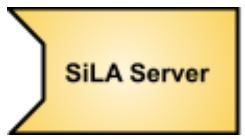

-SiLA Server

[Definition: SiLA Server] A SiLA Server is a system (a software system, a laboratory instrument, or device) that offers •Features• to a •SiLA Client•. Every SiLA Server MUST implement the •SiLA Service Feature•.

A  $\cdot$ SiLA Server can either be a physical laboratory instrument (i.e. a spectrophotometer, a balance, a pH meter, ...) or a software system (i.e. a software system such as a Laboratory Information Management System - LIMS, a Laboratory Notebook - ELN, a Laboratory Execution System - LES, an Enterprise Resource Planning System - ERP, ...) that offers functionalities to a  $\cdot$ SiLA Client. A  $\cdot$ SiLA Server can offer a set of functionalities. All functionalities are specified and described by  $\cdot$ Features.

A  $\cdot$ SiLA Server $\cdot$ MUST allow at least one  $\cdot$ Connection $\cdot$ at the same time. It is RECOMMENDED that a  $\cdot$ SiLA Server $\cdot$ allows parallel  $\cdot$ Connections $\cdot$ of multiple  $\cdot$ SiLA Clients $\cdot$ as its resources allow.

The  $\cdot$ SiLA Server· MAY decide to only allow one  $\cdot$ SiLA Client· to execute  $\cdot$ Commands· or access  $\cdot$ Properties· at the same time. However, it is RECOMMENDED that the  $\cdot$ SiLA Server· allows many  $\cdot$ SiLA Clients· to execute  $\cdot$ Commands· or access  $\cdot$ Properties· simultaneously.

A ·SiLA Server· MAY support ·Command· queuing and / or parallel ·Command· execution by one or multiple ·SiLA Clients·.

[Definition: Lifetime of a SiLA Server] The Lifetime of a SiLA Server is the time span between the state of power-up and being ready to accept  $\cdot$  Connections $\cdot$  and the shutdown process of a  $\cdot$ SiLA Server $\cdot$ , after which no new  $\cdot$  Connections $\cdot$  will be accepted.

# SiLA Server Properties

[COMPLETE; as of 0.1]

A  $\cdot$ SiLA Server $\cdot$  has several properties used for its identification, see also The SiLA Service Feature:

SILA Server Name

[COMPLETE; as of 0.1]

<table><tr><td>Item</td><td>Description</td></tr><tr><td>SILA Server Name</td><td>[Definition: SiLA Server Name] The SiLA Server Name is a human readable name of the ·SiLA Server·. By default this name SHOULD be equal to the ·SiLA Server Type·. This property MUST be configurable via the ·SiLA Service Feature·’s “Set Server Name” Command. This property has no uniqueness guarantee. A SiLA Server Name is the ·Display Name· of a ·SiLA Server· (i.e. MUST comply with the rules for any ·Display Name·, hence be a string of UNICODE characters of maximum 255 characters in length).</td></tr></table>

SiLA Server Type

COMPLETE; as of 0.1]

<table><tr><td>Item</td><td>Description</td></tr><tr><td>SiLA Server Type</td><td>[Definition: SiLA Server Type] The SiLA Server Type is a human readable ·Identifier· of the ·SiLA Server· used to describe the entity that the ·SiLA Server· represents. For example, the make and model for a hardware device (·SiLA Device·). A SiLA Server Type MUST comply with the rules for any ·Identifier· and start with an upper-case letter (A-Z) and MAY be continued by lower and upper-case letters (A-Z and a-z) and digits (0-9) up to a maximum of 255 characters in length.</td></tr></table>

SiLA Server UUID

COMPLETE; as of 0.1]

<table><tr><td>Item</td><td>Description</td></tr><tr><td>SiLA Server UUID</td><td>[Definition: SiLA Server UUID] The SiLA Server UUID is a ·UUID· of a ·SiLA Server·. Each ·SiLA Server· MUST generate a ·UUID· once, to uniquely identify itself. It needs to remain the same even after the ·Lifetime of a SiLA Server· has ended.</td></tr></table>

SiLA Server Version [COMPLETE; as of 0.1]  

<table><tr><td>Item</td><td>Description</td></tr><tr><td>SiLA Server Version</td><td>[Definition: SiLA Server Version] The SiLA Server Version is the version of the SiLA Server. A &quot;Major&quot; and a &quot;Minor&quot; version number (e.g. 1.0) MUST be provided, a Patch version number MAY be provided. Optionally, an arbitrary text, separated by an underscore MAY be appended, e.g. “3.19.373_mighty_lab/devices”.</td></tr></table>

SiLA Server Vendor URL

COMPLETE; as of 0.1]

<table><tr><td>Item</td><td>Description</td></tr><tr><td>SiLA Server Vendor URL</td><td>[Definition: SiLA Server Vendor URL] The SiLA Server Vendor URL is the URL to the website of the vendor or the website of the product of this SiLA Server. This URL SHOULD be accessible at all times. The URL is a Uniform Resource Locator as defined in RFC 1738.</td></tr></table>

SiLA Server Description

COMPLETE; as of 0.1]

<table><tr><td>Item</td><td>Description</td></tr><tr><td>SiLA Server Description</td><td>[Definition: SiLA Server Description] The SiLA Server Description is the description of the SiLA Server. It SHOULD include the use and purpose of this SiLA Server.</td></tr></table>

# SiLA Device

COMPLETE; as of 0.1]

[Definition: SiLA Device] A SiLA Device is a SiLA Server that is a physical thing made or adapted for a particular purpose, especially a piece of mechanical or electronic equipment. A SiLA Device is a specialization of a SiLA Server with additional requirements regarding joining a communication network.

A  $\cdot$ SiLA Device $\cdot$ MUST support automatic connection to a communication network.

A  $\cdot$ SiLA Device $\cdot$ MUST support automatic determination of its  $\cdot$ Address $\cdot$  in the communication network.

# SiLA Client

[COMPLETE; as of 0.1]

  
-SiLA Client

[Definition: SiLA Client] A SiLA Client is a system (a software system, a laboratory instrument, or device), that is using  $\cdot$ Features $\cdot$  offered by a  $\cdot$ SiLA Server $\cdot$ .

# Feature

# COMPLETE; as of 0.1]

[Definition: Feature] Each Feature describes a specific behavior of a  $\cdot$ SiLA Server· (e.g. the ability to measure a spectrum, to register a sample in a LIMS, control heating, etc.). Features are implemented by a  $\cdot$ SiLA Server· and used by a  $\cdot$ SiLA Client·. The  $\cdot$ SiLA Service Feature· MUST be implemented by each  $\cdot$ SiLA Server·. The  $\cdot$ SiLA Service Feature· offers basic information about the  $\cdot$ SiLA Server· and about all other Features the  $\cdot$ SiLA Server· implements.

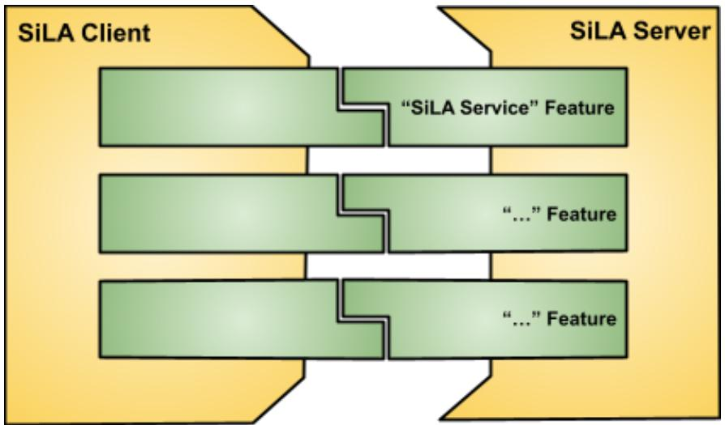  
- SiLA Client·connecting to ·SiLA Server·through ·Features·

The number and nature of the  $\cdot$ Features that a  $\cdot$ SiLA Server $\cdot$ implements MUST be static for the whole  $\cdot$ Lifetime of a SiLA Server $\cdot$  (no dynamic adding or removing of  $\cdot$ Features $\cdot$  is allowed).

- Features are specified within a -Feature Definition. SiLA defines a set of best practices on how
- Features should be designed.

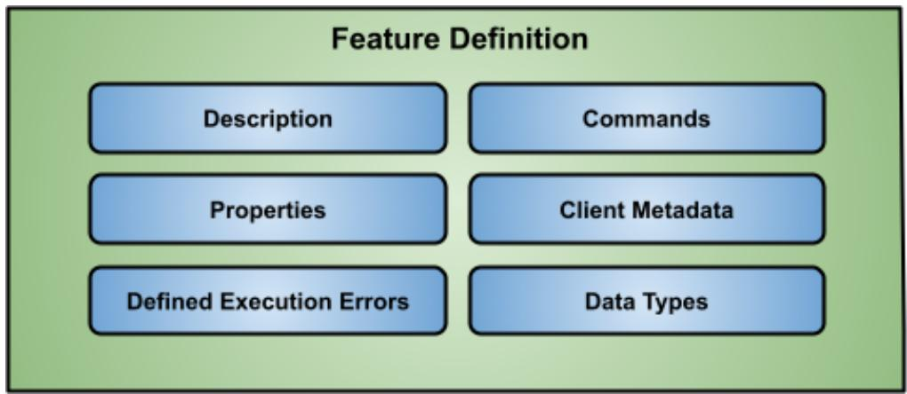

High Level overview of a  $\cdot$ Feature $\cdot$

Whereas everybody can freely design  $\cdot$ Features, a goal of the SiLA organization is as well to standardize certain  $\cdot$ Features that can be commonly used. Therefore, SiLA 2 also defines a process for maintaining  $\cdot$ Features on a best practice basis.

# Connection

[COMPLETE; as of 0.1, updates: 1.1]

[Definition: Connection] A Connection is the communication channel between a  $\cdot$ SiLA Client and a  $\cdot$ SiLA Server, established over a communication network. All information exchange between a  $\cdot$ SiLA Client and a  $\cdot$ SiLA Server must be exchanged through the Connection.

[Definition: Address] An Address is an identifier that uniquely identifies a  $\cdot$ SiLA Client or a  $\cdot$ SiLA Server in a communication network.

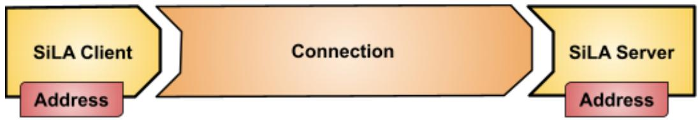  
·SiLA Client· connected to ·SiLA Server·

# Connection Method

[COMPLETE; as of 0.1, updates: 1.1]

[Definition: Connection Method] The Connection Method specifies which of the parties is establishing the  $\cdot$ Connection $\cdot$ .

Client-Initiated Connection Method

COMPLETE; as of 1.1]

[Definition: Client-Initiated Connection Method] With the Client-Initiated Connection Method, the  $\cdot$ SiLA Client $\cdot$  is establishing the  $\cdot$ Connection $\cdot$  to the  $\cdot$ SiLA Server $\cdot$ . This  $\cdot$ Connection Method $\cdot$  is available as of  $\cdot$ SiLA 2 Version $\cdot$  "0.1".

The  $\cdot$ Client-Initiated Connection Method  $\cdot$  MUST be supported always by all  $\cdot$ SiLA Servers $\cdot$ .

Server-Initiated Connection Method

COMPLETE; as of 1.1]

[Definition: Server-Initiated Connection Method] With the Server-Initiated Connection Method, (a.k.a. "cloud connectivity" or "reverse connection"), the  $\cdot$ SiLA Server is establishing the  $\cdot$ Connection to the  $\cdot$ SiLA Client. This  $\cdot$ Connection Method is available as of  $\cdot$ SiLA 2 Version "1.1".

A  $\cdot$ SiLA Server· conforming to  $\cdot$ SiLA 2 Version· equal to or larger than “1.1” SHALL support the  $\cdot$ Server-Initiated Connection Method·. Such a  $\cdot$ SiLA Server· indicates the availability of the  $\cdot$ Server-Initiated Connection Method· support by offering the  $\cdot$ Connection Configuration Service Feature·.

# Establishing a Connection

COMPLETE; as of 0.1, updates: 1.1]

The  $\cdot$  Connection $\cdot$  between a  $\cdot$  SiLA Client $\cdot$  and  $\cdot$  SiLA Server $\cdot$  can either be established by the  $\cdot$  SiLA Client $\cdot$  ("client-initiated"  $\cdot$  Connection $\cdot$ ) or the  $\cdot$  SiLA Server $\cdot$  ("server-initiated"  $\cdot$  Connection $\cdot$ ). Independent of which side opened the  $\cdot$  Connection $\cdot$ , all mechanisms specified in this document MUST work in the same way.

The  $\cdot$ Connection $\cdot$  MAY be closed by the  $\cdot$ SiLA Client $\cdot$  or the  $\cdot$ SiLA Server $\cdot$  at any time. It is RECOMMENDED that the  $\cdot$ SiLA Server $\cdot$  only closes the  $\cdot$ Connection $\cdot$  in exceptional cases, e.g. due to a lack of resources or when the  $\cdot$ Lifetime of a SiLA Server $\cdot$  is reached.

Both ·SiLA Server· and ·SiLA Client· MUST handle closing or losing of the ·Connection· gracefully, at anytime during the ·Lifetime of a SiLA Server·.

In case a  $\cdot$  Connection $\cdot$  has been closed or lost, the  $\cdot$  SiLA Server $\cdot$  MUST stop sending  $\cdot$  Observable Property $\cdot$  changes or  $\cdot$  Command Execution Info $\cdot$  events from  $\cdot$  Observable Command $\cdot$  execution to the affected  $\cdot$  SiLA Client $\cdot$ . The  $\cdot$  SiLA Server $\cdot$  MUST, however, continue processing  $\cdot$  Observable Commands $\cdot$  that the  $\cdot$  SiLA Client $\cdot$  has initiated and that were already accepted for  $\cdot$  Command $\cdot$  execution by the  $\cdot$  SiLA Server $\cdot$ .  $\cdot$  Command Execution UUIDs $\cdot$  MUST remain valid as specified, so that a  $\cdot$  SiLA Client $\cdot$  is still able to use it after having re-connected to the  $\cdot$  SiLA Server $\cdot$ .

See also  $\cdot$  Connection Error..

# SiLA Client Request

COMPLETE; as of 0.1]

[Definition: SiLA Client Request] A SiLA Client Request is a piece of information sent from a  $\cdot$ SiLA Client to a  $\cdot$ SiLA Server within a  $\cdot$ Connection.

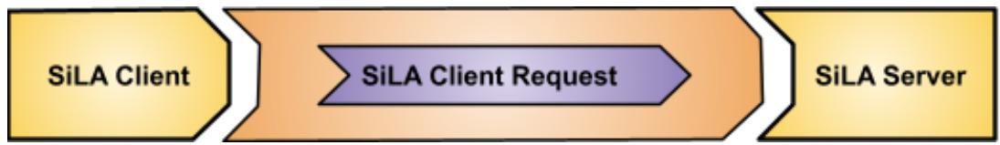  
A·SiLA Client Request·within a·Connection·

Content of a SiLA Client Request

COMPLETE; as of 0.1]

A  $\cdot$ SiLA Client Request is a composition of a  $\cdot$ Header followed by a  $\cdot$ Payload.

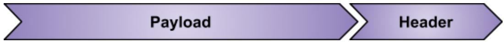  
Components of a  $\cdot$  SiLA Client Request

# SiLA Server Response

COMPLETE; as of 0.1]

[Definition: SiLA Server Response] A SiLA Server Response is a piece of information sent from a  $\cdot$ SiLA Server to a  $\cdot$ SiLA Client within a  $\cdot$ Connection. A SiLA Server Response is always returned in reply to a  $\cdot$ SiLA Client Request. For subscriptions (to  $\cdot$ Observable Properties or Observable Commands), a streamed SiLA Server Response is sent as long as the subscription is active.

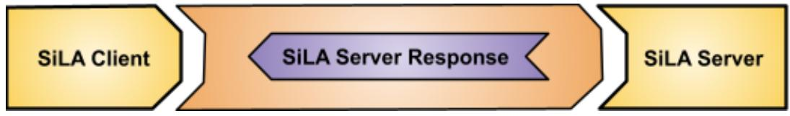  
A·SiLA Server Response·within a·Connection·

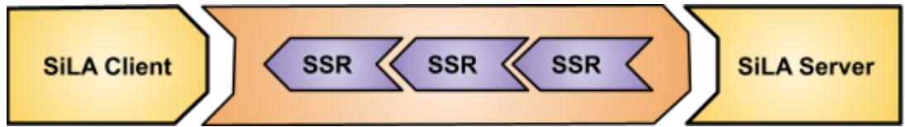  
A streamed  $\cdot$  SiLA Server Response $\cdot$  within a  $\cdot$  Connection $\cdot$

Content of a SiLA Server Response

COMPLETE; as of 0.1]

A  $\cdot$  SiLA Server Response: is a composition of a  $\cdot$  Header followed by a  $\cdot$  Payload.

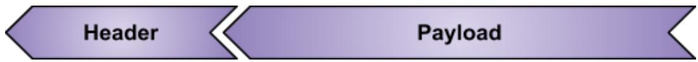  
Components of a  $\cdot$ SiLA Server Response

A streamed  $\cdot$  SiLA Server Response $\cdot$  is a composition of a  $\cdot$  Header $\cdot$  followed by any number of  $\cdot$  Payloads $\cdot$ , followed by a  $\cdot$  Trailer $\cdot$ .

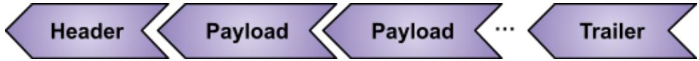  
Components of a streamed  $\cdot$  SiLA Server Response

# Header and Trailer

COMPLETE; as of 0.1]

[Definition: Header] A Header is the first part of a  $\cdot$ SiLA Client Request or  $\cdot$ SiLA Server Response. A Header contains for example  $\cdot$ SiLA Client Metadata of the  $\cdot$ Payload and error information.

[Definition: Trailer] A Trailer is the last part of a streamed  $\cdot$ SiLA Server Response $\cdot$ . A Trailer contains for example error information.

# Payload

COMPLETE; as of 0.1]

[Definition: Payload] The Payload is the actual data exchanged between a  $\cdot$ SiLA Client- and a  $\cdot$ SiLA Server-.

# Feature Framework

[COMPLETE; as of 0.1]

[Definition: Feature Framework] Feature Framework is an overarching  $\cdot$ Term $\cdot$ describing the intention of  $\cdot$ Features $\cdot$  in SiLA 2, how to design, store and maintain them.

Each  $\cdot$ SiLA Server offers a certain capability and each  $\cdot$ SiLA Client wants to use or access this capability. The capability or behavior is exposed through one or more  $\cdot$ Features $\cdot$ .

- Features are a key component of the SiLA 2 Standard as they define the interaction between a -SiLA Client and a -SiLA Server. Every single Feature describes a certain aspect of the overall behavior of the -SiLA Server. Collectively the Features create the -SiLA Server behavior.

Every  $\cdot$ Feature $\cdot$ MUST be created in such a way that it can function alone. It is paramount that the  $\cdot$ Feature $\cdot$ is easy to understand only by reading the  $\cdot$ Feature Definition $\cdot$ .

Note that the behavior of the  $\cdot$ Features can be altered by other  $\cdot$ Features thus changing the overall behavior of the  $\cdot$ SiLA Server when implemented (for example: AuthorizationService).

Each  $\cdot$ Feature $\cdot$  MUST encapsulate complexity as much as possible. The  $\cdot$ Feature Framework $\cdot$  is designed in a way that non-technical experts, such as scientists or subject matter experts (SMEs) are able to create a  $\cdot$ Feature Definition $\cdot$ . However and in addition, the  $\cdot$ Feature Framework $\cdot$  is designed in a way that  $\cdot$ Feature Definitions $\cdot$  are easily interpretable and implementable by technical people.

It is RECOMMENDED that a  $\cdot$ Feature $\cdot$  does have little or no state (that is it SHALL follow a stateless design). However, a  $\cdot$ Feature Designer $\cdot$  MAY decide that a stateful design is necessary and MAY decide to expose status through SiLA  $\cdot$  Properties $\cdot$  or  $\cdot$ Command Responses $\cdot$  of  $\cdot$ Commands $\cdot$ .

Only one mandatory -Feature-, the -SiLA Service Feature-, MUST be implemented by each and every -SiLA Server-.

A  $\cdot$ SiLA Server $\cdot$  MAY expose one or more  $\cdot$ Feature Version $\cdot$  (s) of the same  $\cdot$ Feature $\cdot$  at the same time.

A  $\cdot$ SiLA Client $\cdot$  SHALL be able to use one or more  $\cdot$ Feature Version $\cdot$  (s) of the same  $\cdot$ Feature $\cdot$ simultaneously.

SiLA 2 not only specifies how to design  $\cdot$ Features $\cdot$  but also defines the process of how  $\cdot$ Features $\cdot$  are to be maintained through  $\cdot$ Attributes $\cdot$ .

# Designing Features

[COMPLETE; as of 0.1]

[Definition: Feature Designer] A Feature Designer is a person designing a  $\cdot$ Feature $\cdot$ . Usually this SHALL be a subject matter expert for the domain that the  $\cdot$ Feature $\cdot$  addresses.

- Features are the central point in the SiLA Standard definition. Therefore correct conception and implementation of the -Features is paramount. For this to be assured a -Feature Designer must adhere to the -Feature design rules and conventions as described in the chapters below.

- Features: MUST be designed without a specific implementation in mind as much as possible. The focus should be on describing the behavior (behavioral design), clarity and reusability.

All names and descriptions indicated to be human readable (generally all content of a  $\cdot$ Feature Definition that is marked to be human readable) MUST be in the American English language. A  $\cdot$ SiLA Server implementer MAY decide to provide localized versions, see also Internationalization.

# Standard Features

[COMPLETE; as of 0.1]

[Definition: SiLA Standard Feature] A SiLA Standard Feature is a  $\cdot$ Feature that has been standardized by the SiLA organization according to the standardization procedure. An officially standardized and released  $\cdot$ Feature-MUST have the  $\cdot$ Originator-set to "org.silastandard" and the  $\cdot$ Maturity Level-to "Normative". There is a formal process for becoming a SiLA Standard Feature according to the SiLA by-laws.

# Storing Features

[COMPLETE; as of 0.1]

All ·Feature Definitions· with ·Originator· “org.silastandard” MUST be stored in the ·Online Feature Repository·, all other ·Feature Definitions· MAY also be stored there.

[Definition: Online Feature Repository] The Online Feature Repository is a place for storing  $\cdot$ Feature Definitions $\cdot$ . It can be found on GitLab.

- Feature Definitions: MUST be stored as an XML file conforming to the -Feature Definition Language: at the GitLab repository sila_base under the following path:

"featuredefinitions / {·Originator·} / {·Category·} / {·Feature Identifier·}'-v' {Major ·Feature Version·}'_ {Minor ·Feature Version·}'.sila.xml"

where each dot (".") separated component of the -Originator- and each dot (".") separated component of the -Category- will be a new subfolder in this path structure.

# Examples

[COMPLETE; as of 0.1]

sila_base / featuredefinitions / org / silastandard / core / SiLAService-v1_0.sila.xml

sila_base / featuredefinitions / org / silastandard / examples / GreetingProvider-v1_0.sila.xml

# Maintaining Features

[COMPLETE; as of 0.1]

Each  $\cdot$ Feature $\cdot$ MUST have an  $\cdot$ Originator $\cdot$ ,  $\cdot$ Category $\cdot$ ,  $\cdot$ Maturity Level $\cdot$  and  $\cdot$ Feature Version $\cdot$ assigned to it, see  $\textbf{Feature Attributes}$ . Each  $\cdot$ Feature $\cdot$  has a life cycle and needs to be managed

throughout its whole life. SiLA defines a life cycle for  $\cdot$ Features $\cdot$ , its states and possible transitions between these states. The possible states of a  $\cdot$ Feature $\cdot$  are defined by its  $\cdot$ Attributes $\cdot$ .

The state diagram below illustrates how these states are related to each other.

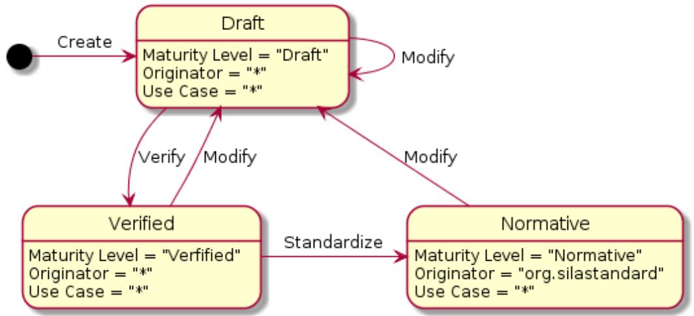  
Feature Development and Maintenance Process

The following transitions in the life cycle of a  $\cdot$ Feature Definitions are valid:

Creating Features

[COMPLETE; as of 0.1]

Initial creation of a new  $\cdot$ Feature $\cdot$ SHALL result in a  $\cdot$ Feature $\cdot$  with  $\cdot$ Maturity Level $\cdot$  Draft $\cdot$ .

Verifying Features

[COMPLETE; as of 0.1]

After verification that a -Feature- meets the SiLA standard definitions and best practices, a -Feature- SHALL have -Maturity Level- Verified-.

As of now, only members of the SiLA 2 working group are allowed to officially verify that a  $\cdot$ Feature-meets the SiLA standard definitions and best practices. Any  $\cdot$ Feature-to be verified MUST be uploaded to the  $\cdot$ Online Feature Repository- and a request for official verification has to be sent to a member of the SiLA 2 working group to start the process. This process might be changed in the future to allow officially accredited bodies to perform the verification.

Modifying Features

[COMPLETE; as of 0.1]

Any modification of a  $\cdot$ Feature $\cdot$  or its  $\cdot$ Attributes $\cdot$  (except for modifying the  $\cdot$ Maturity Level $\cdot$ , which is implicit) SHALL end up in the state  $\cdot$ Draft $\cdot$ . During this transition, the  $\cdot$ Feature Version $\cdot$ $\cdot$ Attribute $\cdot$  MUST be updated as specified in section Feature Version below.  $\cdot$ Feature Definitions $\cdot$  MUST be maintained in a way to enable full backwards and forwards compatibility.

Standardizing Features

[COMPLETE; as of 0.1]

The standardization of a  $\cdot$ Feature $\cdot$  follows a process specified in the by-laws of SiLA. Only  $\cdot$ Features $\cdot$  with  $\cdot$ Originator $\cdot$  "org.silastandard" SHALL be standardizable and able to reach the  $\cdot$ Maturity Level $\cdot$  Normative $\cdot$ .

# Feature Definition

# [COMPLETE; as of 0.1]

[Definition: Feature Definition] The Feature Definition describes a certain behavior of a  $\cdot$ Feature $\cdot$  in an exact and very specific way.

Designing good -Features- is an art and this specification provides examples on how to design good -Features- in the best practice sections located in each section.

A  $\cdot$ Feature Definition: contains the following information:

- Details about the  $\cdot$ Feature $\cdot$ , such as  $\cdot$ Feature Identifier $\cdot$ ,  $\cdot$ Feature Display Name $\cdot$  and  $\cdot$ Feature Description $\cdot$  
Details about all  $\cdot$ Commands offered  
Details about all -Properties- offered  
A Definition of all  $\cdot$ SiLA Data Types· used  
- A Definition of all SiLA Client Metadata used  
- Details about all ·Execution Errors· that can happen while executing ·Commands·, accessing Properties or using SiLA Client Metadata  
Additional  $\cdot$ Attributes $\cdot$ of the  $\cdot$ Feature

# Best Practice

# COMPLETE; as of 0.1]

The  $\cdot$ Feature Definition $\cdot$ MUST specify the behavior it is modeling in a self-contained and complete way. It MUST contain an extensive  $\cdot$ Feature Description $\cdot$ of the behavior it models. $\cdot$ Constraints $\cdot$ , like under which preconditions a  $\cdot$ Command $\cdot$ should be called, valid  $\cdot$ Parameter $\cdot$ ranges and any other dependencies MUST be detailed. In case the behavior that the  $\cdot$ Feature $\cdot$ is describing is exporting a state, all states and their transitions MUST be described.

# Feature Identifier

COMPLETE; as of 0.1]  

<table><tr><td>Item</td><td>Description</td></tr><tr><td>Feature Identifier</td><td>[Definition: Feature Identifier] A Feature Identifier is the ·Identifier·of a ·Feature·. Each ·Feature·MUST have a Feature Identifier. All
·Features·sharing the scope of the same ·Originator·and
·Category·MUST have unique Feature Identifiers. Uniqueness
MUST be checked without taking lower and upper case into account, see   Uniqueness of Identifiers.</td></tr></table>

# Best Practice

[COMPLETE; as of 0.1]

The ·Feature Identifier· SHOULD be in CamelCase (i.e. written in the upper camel case style).

The -Feature Identifier- SHOULD be in the form of one or more noun(s) with one of the three following suffixes: Service, Provider or Controller, whereas the suffix SHOULD be selected as follows:

- Controller: "active"  $\cdot$  Features; if a  $\cdot$  Feature is responsible for the management of a certain task.  
- Provider: "passive"  $\cdot$  Features $\cdot$ ; these  $\cdot$  Features $\cdot$  are responsible for gathering information and making it available to be called upon.  
- Service: All -Features that do not fall in one of these above mentioned categories, or fall in both.

This form of nomenclature creates a name that describes what the  $\cdot$ Feature $\cdot$  is, while also giving insight into the behavior it describes.

# Examples

COMPLETE; as of 0.1]

SiLAService, InitializationController, LockController, PauseController, SimulationController, LocalizationProvider.

# Feature Display Name

COMPLETE; as of 0.1]

<table><tr><td>Item</td><td>Description</td></tr><tr><td>Feature Display Name</td><td>[Definition: Feature Display Name] A Feature Display Name is the ·Display Name· of a ·Feature·.</td></tr></table>

# Best Practice

[COMPLETE; as of 0.1]

It is RECOMMENDED to use the -Feature Identifier with spaces between the words to make it more readable. The name SHOULD indicate what capabilities the -Features- describes. The -Feature Display Name-MUST be human readable text in American English (see also Internationalization).

While the  $\cdot$ Feature $\cdot$  Designer is free to choose whatever name they want, just taking the  $\cdot$ Feature Identifier $\cdot$  is good practice since the  $\cdot$ Feature Identifier $\cdot$  SHOULD already entail all the information that the  $\cdot$ Feature Display Name $\cdot$  should display. Giving a short but concise description of the functionality of the  $\cdot$ Feature $\cdot$ . It is important to SiLA that the environment is easy to understand. A human readable name that describes the  $\cdot$ Feature $\cdot$  gives even non-developers a brief description of that  $\cdot$ Feature $\cdot$  and what a user can expect from it.

# Example

COMPLETE; as of 0.1]

The  $\cdot$ SiLA Service Feature· (  $\cdot$  Identifier· "SiLAService") has a  $\cdot$ Feature Display Name· of "SiLA Service", likewise "InitializationController" becomes "Initialization Controller" and "LockController" "Lock Controller".

# Feature Description

[COMPLETE; as of 0.1]

<table><tr><td>Item</td><td>Description</td></tr><tr><td>Feature Description</td><td>[Definition: Feature Description] A Feature Description is the ·Description· of a ·Feature·. A Feature Description MUST describe the behaviors / capabilities the ·Feature· models in human readable form and with as many details as possible. The Feature Description SHOULD contain all details about the ·Feature· as described under best practice below. The Feature Description MUST be human readable text in American English (see also Internationalization).</td></tr></table>

# Best Practice

[COMPLETE; as of 0.1]

The most important part of a good  $\cdot$ Feature is the  $\cdot$ Feature Description. The  $\cdot$ Feature Description-MUST be a plain text, detailing:

The behavior of the  $\cdot$ Feature $\cdot$ .  
- The intention of the  $\cdot$ Feature and the context when it is applicable.  
- Whether the involved  $\cdot$ Commands $\cdot$  have to be called in a specific sequence or whether there are specific pre-conditions.  
- Whether there are dependencies between  $\cdot$ Commands $\cdot$  and which these are.  
- How this  $\cdot$ Feature $\cdot$  modifies the behavior of other  $\cdot$ Features $\cdot$ , if applicable  
A "How to use"-guide for the  $\cdot$ Feature $\cdot$

It is important to note that the  $\cdot$ Feature Description $\cdot$  is not the same thing as  $\cdot$ Feature Definition $\cdot$  as the latter is the whole  $\cdot$ Feature $\cdot$  while the  $\cdot$ Feature Description $\cdot$  is only the descriptional text elucidated above. Since easy comprehension and implementation is one of the main goals of SiLA, the  $\cdot$ Feature Description $\cdot$  serves the expressive service of clarifying any issues in implementation or use of the  $\cdot$ Feature $\cdot$ . A good  $\cdot$ Feature $\cdot$  will have a  $\cdot$ Feature Description $\cdot$  that provides answers to the users questions in regards to the use of the  $\cdot$ Feature $\cdot$ .

# Example

COMPLETE; as of 0.1]

For example the  $\cdot$ SiLA Service Feature has the following  $\cdot$ Feature Description:

The Feature each SiLA Server MUST implement. Any interaction described in this feature MUST not affect the behavior of any other Feature. It specifies Commands and Properties to discover the Features a SiLA Server implements as well as details about the SiLA Server.

# Commands

COMPLETE; as of 0.1, updates: 1.1]

[Definition: Command] A Command models an action that will be performed on a  $\cdot$ SiLA Server $\cdot$ . A Command MAY except  $\cdot$ Command Parameters $\cdot$  and MAY return  $\cdot$ Command Responses $\cdot$  after Command execution or MAY provide  $\cdot$ Intermediate Command Responses $\cdot$  during execution. There are  $\cdot$ Unobservable Commands $\cdot$  and  $\cdot$ Observable Commands $\cdot$ .

<table><tr><td>Item</td><td>Description</td></tr><tr><td>Command Identifier</td><td>[Definition: Command Identifier] A Command Identifier is the ·Identifier· of a ·Command·. A Command Identifier MUST be unique within the scope of a ·Feature·. Uniqueness MUST be checked without taking lower and upper case into account, see Uniqueness of Identifiers.</td></tr><tr><td>Command Display Name</td><td>[Definition: Command Display Name] A Command Display Name is the human readable ·Display Name· of a ·Command·.</td></tr><tr><td>Command Description</td><td>[Definition: Command Description] A Command Description is the ·Description· of a ·Command·.</td></tr></table>

# Best Practice

COMPLETE; as of 0.1]

A·Feature Designer· SHOULD adhere to the following guidelines:

<table><tr><td>Item</td><td>Guideline</td></tr><tr><td>Command Identifier</td><td>The ·Command Identifier· SHOULD be in CamelCase (i.e. written in the upper camel case style). The ·Command Identifier· is RECOMMENDED to be of the form: Verb[Adjective(s)][Noun(s)] (verb in imperative singular, optional adjective(s), optional noun(s)). The verb is to indicate the action to be taken, and the adjective/noun the rest of the description. The developers and/or users can then easily understand or identify which ·Feature· does what. Thus making the correct use of that ·Feature· easier.</td></tr><tr><td>Command Display Name</td><td>A human readable name for this ·Command·. It is RECOMMENDED to use the ·Command Identifier· with spaces between the words. The utility and functionality of the ·Command· SHOULD be indicated by the ·Command Display Name·.</td></tr><tr><td>Command Description</td><td>Details and any additional information that is necessary for the complete understanding of the use of this ·Command· SHOULD also be added to the ·Command Description·. This information could contain pre- or post conditions or ·Parameter· constraints and dependencies on status.</td></tr></table>

# Example

[COMPLETE; as of 0.1]

GetFeatureDefinition

<table><tr><td>Command Identifier</td><td>GetFeatureDefinition</td></tr><tr><td>Command Display Name</td><td>Get Feature Definition</td></tr><tr><td>Command Description</td><td>Get all details on one ·Feature· through the fully qualified ·Feature Identifier·.</td></tr><tr><td>Command Observable Setting</td><td>No</td></tr></table>

# Observable and Unobservable Commands

[COMPLETE; as of 0.1]

A -Feature Designer- MUST specify how a -Command- will have to behave when executed. -Commands- can either be -Observable Commands- or -Unobservable Commands-, as described below.

[Definition: Unobservable Command] Any  $\cdot$ Command- for which observing the progress or status of the  $\cdot$ Command- execution on the  $\cdot$ SiLA Server- is not possible or does not make sense, SHOULD be defined as an Unobservable Command, i.e. a  $\cdot$ Command- with item "Observable" set to "No".

Note: When using an  $\cdot$ Unobservable Command $\cdot$  it is possible that the  $\cdot$ SiLA Client $\cdot$  is never able to receive the  $\cdot$ Command Response $\cdot$  (e.g. due to network failures). Use an  $\cdot$ Observable Command $\cdot$  avoid these cases.

[Definition: Observable Command] Any  $\cdot$ Command $\cdot$  for which observing the progress or status of the  $\cdot$ Command $\cdot$  execution on the  $\cdot$ SiLA Server $\cdot$  is possible and makes sense, e.g. measuring a spectrum, SHOULD be an Observable Command, i.e. a  $\cdot$ Command $\cdot$  with item "Observable" set to "Yes".

<table><tr><td>Item</td><td>Description</td></tr><tr><td>Command Observable Setting</td><td>[Definition: Command Observable Setting] The Command Observable Setting specifies whether a ·Command· is an ·Observable Command· or an ·Unobservable Command·. The value MUST be either “Yes” (·Observable Command·) or “No” (·Unobservable Command·). For details, see Command Execution.</td></tr></table>

Best Practice

[COMPLETE; as of 0.1]

A ·Feature Designer· SHOULD decide whether a ·Command· is observable or not based on these best practices:

1. It is a potentially long lasting operation, for which a human being expects a non-immediate completion: The  $\cdot$ Command $\cdot$  should be observable.  
2. The designer wants to make sure that the result is not lost, even if the connection is lost: The command should be observable.  
3. It is only about sending data from a client to server, e.g. changing the settings: The Command should be unobservable.

# Command Parameters

COMPLETE; as of 0.1]

[Definition: Command Parameter] A Command Parameter is a  $\cdot$ Parameter of a  $\cdot$ Command. It MUST be submitted with the  $\cdot$ Command execution request. A  $\cdot$ Command MAY have one or more Command Parameters.

<table><tr><td>Item</td><td>Description</td></tr><tr><td>Command Parameter Identifier</td><td>[Definition: Command Parameter Identifier] The Command Parameter Identifier is the ·Identifier· of a ·Command Parameter·. A Command Parameter Identifier MUST be unique within the scope of all ·Parameters· of a ·Command·.</td></tr><tr><td>Command Parameter Display Name</td><td>[Definition: Command Parameter Display Name] A Command Parameter Display Name is the ·Display Name· of a ·Command Parameter·.</td></tr><tr><td>Command Parameter Description</td><td>[Definition: Command Parameter Description] A Command Parameter Description is the ·Description· of a ·Command Parameter·.</td></tr><tr><td>Command Parameter Data Type</td><td>[Definition: Command Parameter Data Type] A Command Parameter Data Type is The ·SiLA Data Type· of a ·Command Parameter·.</td></tr></table>

Best Practice

[COMPLETE; as of 0.1]

A ·Feature Designer· SHOULD adhere to the following guidelines:

<table><tr><td>Item</td><td>Guidelines</td></tr><tr><td>Command Parameter Identifier</td><td>The ·Command Parameter Identifier· SHOULD be in CamelCase (i.e. written in the upper camel case style). The ·Command Parameter Identifier· SHOULD be of the form: AdjectiveNoun(s) (optional adjective, singular or plural noun(s), depending on context). 
The adjective/noun used SHOULD indicate the utility and functionality of the ·Command Parameter·. In other words, it SHOULD describe what it is that is used by the ·Command·.</td></tr><tr><td>Command Parameter Display Name</td><td>A human readable name for this ·Command Parameter·. It is RECOMMENDED to use the ·Command Parameter Identifier· with spaces between the words.</td></tr><tr><td>Command Parameter Description</td><td>The ·Description· of this ·Command Parameter· SHOULD give an accurate depiction of what the ·Command Parameter· is and what it is used for by the ·Command·. In case it is necessary for other ·Commands· or has certain prerequisites this SHOULD also be included in the ·Command Parameter Description·. This is to further reduce the amount of errors and facilitate the use of each of the ·Commands· simply by reading the ·Command Parameter Description·.</td></tr></table>

Examples

COMPLETE; as of 0.1]

TargetTemperature

<table><tr><td>Command Parameter Identifier</td><td>TargetTemperature</td></tr><tr><td>Command Parameter Display Name</td><td>Target Temperature</td></tr><tr><td>Command Parameter Description</td><td>The target temperature that the server will try to reach. Note that the ·Command· might be completed at a temperature that it evaluates to be close enough.</td></tr><tr><td>Command Parameter Data Type</td><td>·SiLA Real Type· with a ·Unit Constraint· for ℃.</td></tr></table>

# Command Responses

COMPLETE; as of 0.1]

[Definition: Command Response] A Command Response contains a result of a  $\cdot$ Command $\cdot$ execution. A  $\cdot$ Command $\cdot$ MAY have one or more Command Responses.

In contrast to many programming languages that only offer one Command Response, SiLA 2 likes to use symmetries whenever possible, hence the decision to have the possibility to have zero or more Command Responses like it is the case for  $\cdot$  Parameters $\cdot$ .

<table><tr><td>Item</td><td>Description</td></tr><tr><td>Command Response Identifier</td><td>[Definition: Command Response Identifier] A Command Response Identifier is the ·Identifier· of a ·Command Response·. A Command Response Identifier MUST be unique within the scope of al ·Command Responses· of a ·Command·. Uniqueness MUST be checked without taking lower and upper case into account, see Uniqueness of Identifiers.</td></tr><tr><td>Command Response Display Name</td><td>[Definition: Command Response Display Name] A Command Response Display Name is the ·Display Name· of a ·Command Response·.</td></tr><tr><td>Command Response Description</td><td>[Definition: Command Response Description] A Command Response Description is a ·Description· of a ·Command Response·.</td></tr><tr><td>Command Response Data Type</td><td>[Definition: Command Response Data Type] A Command Response Data Type is the ·SiLA Data Type· of a ·Command Response·.</td></tr></table>

Best Practice

COMPLETE; as of 0.1]

A·Feature Designer· SHOULD adhere to the following guidelines:

<table><tr><td>Item</td><td>Guidelines</td></tr><tr><td>Command Response Identifier</td><td>The ·Identifier· of a ·Command Response· SHOULD be in CamelCase (i.e. written in the upper camel case style). The ·Command Response Identifier· SHOULD be in the form: AdjectiveNoun(s) (optional adjective, singular or plural noun(s), depending on context). 
The adjective/noun used SHOULD indicate the utility and functionality of the ·Command Response·. In other words, it SHOULD describe what it is that is returned by the ·Command·.</td></tr><tr><td>Command Response Display Name</td><td>A human readable name for the ·Command Response·. It is RECOMMENDED to use the ·Command Response Identifier· with spaces between separate words.</td></tr><tr><td>Command Response Description</td><td>The ·Description· of the ·Command Response· SHOULD give an accurate depiction of what it is and what the ·Command· returns.</td></tr></table>

A ·Feature Designer· SHOULD NOT use a ·Command Response· to inform about a successful or failed completion of the ·Command· (e.g. do not specify a ·Command Response· of a ·SiLA Boolean Type· with ·Command Response Identifier· “Success”). It is RECOMMENDED to use an ·Execution Error· to communicate an error and a successful completion is given by no error being thrown.

Examples

[COMPLETE; as of 0.1]

<table><tr><td>Command Response Identifier</td><td>Barcode</td></tr><tr><td>Command Response Display Name</td><td>Barcode</td></tr><tr><td>Command Response Description</td><td>The barcode related to the sample produced in this ·Command·. The barcode is of type Code128.</td></tr><tr><td>Command Response Data Type</td><td>·SiLA String Type· (Potentially with an appropriate ·Constraint·).</td></tr></table>

# Intermediate Command Responses

# COMPLETE; as of 0.1]

[Definition: Intermediate Command Response] An Intermediate Command Response is a partial  $\cdot$ SiLA Server Response of an  $\cdot$ Observable Command. An  $\cdot$ Observable Command MAY have one or more Intermediate Command Responses.

- Unobservable Commands·MUST NOT have ·Intermediate Command Responses·.

<table><tr><td>Item</td><td>Description</td></tr><tr><td>Intermediate Command Response Identifier</td><td>[Definition: Intermediate Command Response Identifier] An Intermediate Command Response Identifier is the ·Identifier· of an ·Intermediate Command Response·. An Intermediate Command Response Identifier MUST be unique within the scope of all ·Intermediate Command Responses· of a ·Command·. Uniqueness MUST be checked without taking lower and upper case into account, see Uniqueness of Identifiers.</td></tr><tr><td>Intermediate Command Response Display Name</td><td>[Definition: Intermediate Command Response Display Name] An Intermediate Command Response Display Name is the ·Display Name·of an ·Intermediate Command Response·.</td></tr><tr><td>Intermediate Command Response Description</td><td>[Definition: Intermediate Command Response Description] An Intermediate Command Response Description is the ·Description· of an ·Intermediate Command Response·.</td></tr><tr><td>Intermediate Command Response Data Type</td><td>[Definition: Intermediate Command Response Data Type] An Intermediate Command Response Data Type is the ·SiLA Data Type· of an ·Intermediate Command Response·.</td></tr></table>

# Best Practice

# COMPLETE; as of 0.1]

It is a good practice to specify Intermediate Command Responses: for long lasting -Commands that are able to produce intermediate results during the -Command- execution. Since Intermediate Command Responses: are subscription-based, there can be no guarantee that they are actually received. So they SHOULD not be used for information that is expected to be transmitted. Instead, Command Responses: SHOULD be used for such information.

A·Feature Designer·SHOULD adhere to the following guidelines:

<table><tr><td>Item</td><td>Guidelines</td></tr><tr><td>Intermediate Command Response Identifier</td><td>The ·Intermediate Command Response Identifier· SHOULD be in CamelCase (i.e. written in the upper camel case style). The ·Intermediate Command Response Identifier· SHOULD be in the form: AdjectiveNoun(s) (optional adjective, singular or plural noun(s), depending on context).</td></tr><tr><td></td><td>The adjective/noun used SHOULD indicate the utility and functionality of the ·Intermediate Command Response·. In other words, it SHOULD describe what it is that is returned by the ·Command·.</td></tr><tr><td>Intermediate Command Response Display Name</td><td>A human readable name for the ·Intermediate Command Response·. It is RECOMMENDED to use the ·Intermediate Command Response Identifier with spaces between separate words.</td></tr><tr><td>Intermediate Command Response Description</td><td>The ·Description· of the ·Intermediate Command Response· SHOULD give an accurate depiction of what it is and what the ·Command· returns as an intermediate result.</td></tr></table>

Examples

[COMPLETE; as of 0.1]

<table><tr><td>Intermediate Command Response Identifier</td><td>IntermediateAbsorbanceSpectrum</td></tr><tr><td>Intermediate Command Response Display Name</td><td>Intermediate Absorbance Spectrum</td></tr><tr><td>Intermediate Command Response Description</td><td>The intermediate spectrum as measured during the execution of this command, if available, as described in the description of the command.</td></tr><tr><td>Intermediate Command Response Data Type</td><td>·SiLA Binary Type· with a ·Content Type Constraint·.</td></tr></table>

# Defined Execution Errors in Command Execution Context

COMPLETE; as of 0.2]

One or more -Defined Execution Errors-MAY be specified for a  $\cdot$ Command-. The -Defined Execution Errors-themselves are defined in the context of the  $\cdot$ Feature- (and not the  $\cdot$ Command-), so they can be re-used within the  $\cdot$ Feature-, e.g. for different  $\cdot$ Commands-.

<table><tr><td>Item</td><td>Description</td></tr><tr><td>Defined Execution Errors</td><td>A list of ·Defined Execution Error Identifiers·referring to all the ·Defined Execution Errors·that can happen when executing this ·Command·.</td></tr></table>

# Command Execution

[COMPLETE; as of 0.1]

A  $\cdot$ SiLA Server $\cdot$ MUST only start a  $\cdot$ Command $\cdot$ execution after all  $\cdot$ Parameters $\cdot$ have been properly received (i.e. there was no  $\cdot$ Connection Error $\cdot$ while sending the  $\cdot$ Parameters $\cdot$ ) and after validating all  $\cdot$ Parameters $\cdot$  (i.e. there was no  $\cdot$ Validation Error $\cdot$ ).

In case one or more  $\cdot$ SiLA Clients try to execute the identical or different  $\cdot$ Commands at the same time, the  $\cdot$ SiLA Server  $\cdot$ MUST decide whether:

to execute the  $\cdot$  Commands $\cdot$  in parallel,  
to execute the  $\cdot$  Commands $\cdot$  sequentially, by queueing  $\cdot$  Commands $\cdot$  or  
to reject the  $\cdot$  Command $\cdot$  execution.

Whether or not a  $\cdot$ SiLA Server $\cdot$  supports parallel  $\cdot$ Command $\cdot$  execution, queueing of  $\cdot$ Command $\cdot$  execution or whether a  $\cdot$ SiLA Server $\cdot$  rejects multiple, simultaneous  $\cdot$ Command $\cdot$  executions is upon the sole discretion of the  $\cdot$ SiLA Server $\cdot$  implementation.

In case the  $\cdot$ SiLA Server does not allow the  $\cdot$ Command execution, a  $\cdot$ Command Execution Not Accepted Error (  $\cdot$  Framework Error.) MUST be issued by the  $\cdot$ SiLA Server. A  $\cdot$ SiLA Server MAY for instance decline executing a  $\cdot$ Command if another  $\cdot$ Command is already running and the  $\cdot$ SiLA Server does not support parallel  $\cdot$ Command execution or queueing of  $\cdot$ Commands.

The  $\cdot$ SiLA Server $\cdot$ MUST always accept  $\cdot$ Command $\cdot$ execution for  $\cdot$ Commands $\cdot$ of the  $\cdot$ SiLA Service Feature $\cdot$ .

# Unobservable Command

# COMPLETE; as of 0.1]

A  $\cdot$ SiLA Server $\cdot$  SHOULD execute  $\cdot$ Unobservable Commands $\cdot$  as quickly as possible, as there is no opportunity for a  $\cdot$ SiLA Client $\cdot$  to see the current progress or remaining time of the execution.

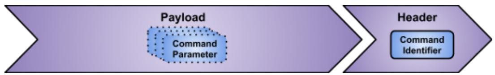

Structure of a  $\cdot$ SiLA Client Request to initiate an Unobservable Command execution

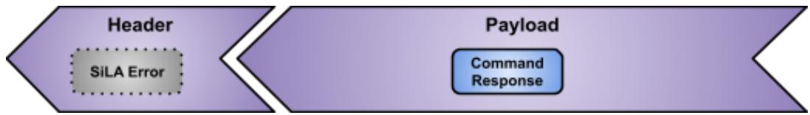

Structure of a  $\cdot$ SiLA Server Response $\cdot$  in reply to an  $\cdot$ Unobservable Command $\cdot$  execution Sequence diagram of an  $\cdot$ Unobservable Command $\cdot$  execution:

# Observable Command

# COMPLETE; as of 0.1]

After  $\cdot$ Command·initiation and accepting the execution, the  $\cdot$ SiLA Server·MUST return the  $\cdot$ Command Execution UUID·to the  $\cdot$ SiLA Client·.

The  $\cdot$ SiLA Server· MAY optionally also return a  $\cdot$ Lifetime of Execution· to the  $\cdot$ SiLA Client·. If no  $\cdot$ Lifetime of Execution· is provided, then the  $\cdot$ Command Execution UUID· MUST be valid as long as the  $\cdot$ Lifetime of a SiLA Server·. It is RECOMMENDED to return a defined  $\cdot$ Lifetime of Execution· as otherwise the  $\cdot$ SiLA Server· doesn't have an ability to control the associated resources.

Afterwards, the  $\cdot$ SiLA Server $\cdot$ MUST either start the  $\cdot$ Command $\cdot$ execution, schedule it for later  $\cdot$ Command $\cdot$ execution or issue an error, at its sole discretion and depending on its capabilities.

[Definition: Command Execution UUID] A Command Execution UUID is the  $\cdot$ UUID of a  $\cdot$ Command execution. It is unique within one instance of a  $\cdot$ SiLA Server and its lifetime (Lifetime of a SiLA Server).

[Definition: Lifetime of Execution] The Lifetime of Execution is the duration during which a  $\cdot$ Command Execution UUID· is valid. The Lifetime of Execution is always a relative duration with respect to the point in time the  $\cdot$ SiLA Server· initiated the response to the  $\cdot$ SiLA Client· (the point in time when the SiLA Server returns the  $\cdot$ Command Execution UUID· to the  $\cdot$ SiLA Client·). It is the

responsibility of the  $\cdot$ SiLA Client to account for potential transmission delays between  $\cdot$ SiLA Server and  $\cdot$ SiLA Client.

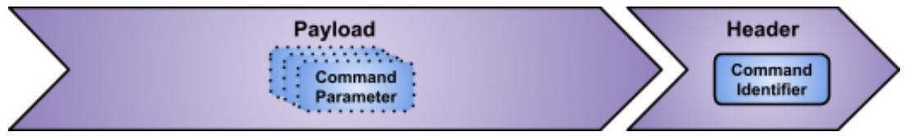

Structure of a  $\cdot$  SiLA Client Request to initiate an  $\cdot$  Observable Command execution

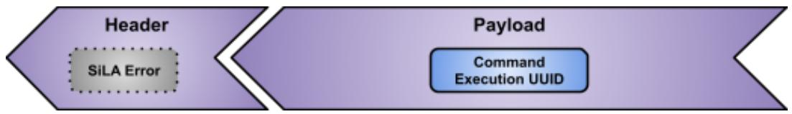

Structure of a  $\cdot$ SiLA Server Response in reply to an  $\cdot$ Observable Command initiation

The  $\cdot$ SiLA Server $\cdot$  MUST provide  $\cdot$ Command Execution Info $\cdot$  on request or via subscription.

[Definition: Command Execution Info] The Command Execution Info provides information about the current status of a ·Command· being executed. It consists of the ·Command Execution Status·, and optionally the ·Progress Info· and an ·Estimated Remaining Time·. In addition, an updated ·Lifetime of Execution· MUST be provided, if a ·Lifetime of Execution· has been provided at ·Command· initiation.

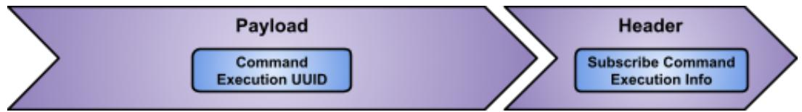

Structure of a  $\cdot$ SiLA Client Request to subscribe to the  $\cdot$ Command Execution Info

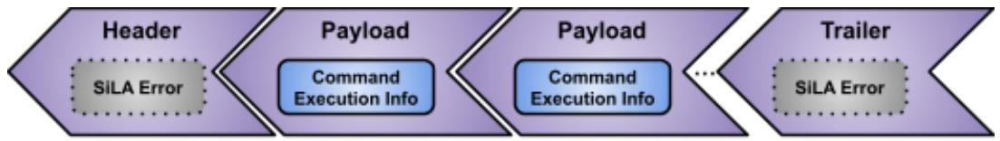

Structure of a streamed  $\cdot$  SiLA Server Response: in reply to a subscription to the  $\cdot$ Command Execution Info

[Definition: Command Execution Status] The Command Execution Status provides details about the execution status of a  $\cdot$ Command. It is either, and in this sequence, first "Command Waiting", second "Command Running" and third "Command Finished Successfully" or "Command Finished With Error". The Command Execution Status cannot be reverted back to a previous state that has already been left. That is, once the  $\cdot$ Command is running, the state cannot go back to waiting etc.

[Definition: Progress Info] Progress Info is the estimated progress of a  $\cdot$ Command $\cdot$  execution, in percent (0...100%).

[Definition: Estimated Remaining Time] Estimated Remaining Time is the estimated remaining execution time of a  $\cdot$ Command $\cdot$ .

If the  $\cdot$ SiLA Server provides an updated  $\cdot$ Lifetime of Execution as part of the  $\cdot$ Command Execution Info, the updated lifetime MUST always result in an absolute lifetime that is equal to or

greater than prior lifetimes reported. The absolute lifetime of a  $\cdot$ Command Execution UUID $\cdot$  MUST never be reduced, but MAY be extended any time.

Note that it follows that, if the  $\cdot$ SiLA Server did not provide a  $\cdot$ Lifetime of Execution in the  $\cdot$ Command initiation, it is illegal to provide an updated  $\cdot$ Lifetime of Execution in the  $\cdot$ Command Execution Info. Vice versa, if the  $\cdot$ SiLA Server did provide a  $\cdot$ Lifetime of Execution, the  $\cdot$ SiLA Server  $\cdot$  MUST always send updated  $\cdot$ Lifetime of Execution in the  $\cdot$ Command Execution Info.

In order to retrieve or subscribe to the  $\cdot$ Command Execution Info $\cdot$ ,  $\cdot$ Command Response $\cdot$  or  $\cdot$ Intermediate Command Responses $\cdot$ , the  $\cdot$ SiLA Client $\cdot$  MUST use the  $\cdot$ Command Execution UUID $\cdot$ .

Retrieving or subscribing to  $\cdot$  Intermediate Command Responses: is only available if  $\cdot$  Intermediate Command Responses: are specified in the  $\cdot$  Feature: for the corresponding  $\cdot$  Command:.

A  $\cdot$ SiLA Client $\cdot$  MAY share the  $\cdot$ Command Execution UUID $\cdot$  with other  $\cdot$ SiLA Clients $\cdot$  to allow them to access the same information about the  $\cdot$ Observable Command $\cdot$  identified by the shared  $\cdot$ Command Execution UUID $\cdot$ .

If a -SiLA Client- uses an invalid -Command Execution UUID- for querying a -SiLA Server-, the -SiLA Server- MUST return an -Invalid Command Execution UUID Error-.

After  $\cdot$ Command $\cdot$  execution (status: Command Finished Successfully or Command Finished With Error), the  $\cdot$ SiLA Client $\cdot$  MAY ask the  $\cdot$ SiLA Server $\cdot$  for the  $\cdot$ Command Response $\cdot$  for the respective  $\cdot$ Command Execution UUID $\cdot$ . The  $\cdot$ SiLA Server $\cdot$  MUST either return the  $\cdot$ Command Response $\cdot$  or an error if the  $\cdot$ Command $\cdot$  execution was not successful.

If a -SiLA Client- asks for a -Command Response- when the -Command- execution has not finished yet (status: Command Waiting or Command Running), the -SiLA Server- MUST return a -Command Execution Not Finished Error-.

- Command Execution UUIDs· of an ·Observable Command· MUST remain valid for a duration that is defined by the ·Lifetime of Execution·. After the ·Command Execution UUID· has expired the ·Command Execution UUID· MAY be invalidated and all subscriptions associated with this ·Command Execution UUID· MAY be canceled. The ·SiLA Server· MAY then also delete the ·Command Response· and free all resources associated with it.

Sequence diagram of executing an  $\cdot$  Observable Command:

  
Observable Command

# Properties

[COMPLETE; as of 0.1, updates: 1.1]

[Definition: Property] A Property describes certain aspects of a  $\cdot$ SiLA Server that do not require an action on the  $\cdot$ SiLA Server. Properties may be changed by actions of the SiLA server. Properties are always read-only.

A  $\cdot$ Property $\cdot$ MUST be Observable or Unobservable. The two different types of  $\cdot$ Properties $\cdot$ SHALL be separated by their possible reading behaviors.

[Definition: Unobservable Property] An Unobservable Property is a  $\cdot$ Property that can be read at any time but no subscription mechanism is provided to observe its changes.

[Definition: Observable Property] An Observable Property is a  $\cdot$ Property that can be read at any time and that offers a subscription mechanism to observe any change of its value.

Reading a  $\cdot$ Property $\cdot$ MUST NOT have side effects on the  $\cdot$ SiLA Server $\cdot$ , i.e. the actual reading process itself SHALL NOT affect the value of any  $\cdot$ Property $\cdot$ of the  $\cdot$ SiLA Server $\cdot$ .

<table><tr><td>Item</td><td>Description</td></tr><tr><td>Property Identifier</td><td>[Definition: Property Identifier] A Property Identifier is the ·Identifier· of a ·Property·. A Property Identifier MUST be unique within the scope of a ·Feature·. Uniqueness MUST be checked without taking lower and upper case into account, see Uniqueness of Identifiers.</td></tr><tr><td>Property Display Name</td><td>[Definition: Property Display Name] A Property Display Name is the ·Display Name· of a ·Property·.</td></tr><tr><td>Property Description</td><td>[Definition: Property Description] A Property Description is the ·Description· of a ·Property·.</td></tr><tr><td>Property Observable Setting</td><td>[Definition: Property Observable Setting] The Property Observable Setting specifies whether a ·Property· is an ·Observable Property· or an ·Unobservable Property·. The value MUST be either “Yes” (·Observable Property·) or “No” (·Unobservable Property·). For details see Accessing Properties.</td></tr><tr><td>Property Data Type</td><td>[Definition: Property Data Type] A Property Data Type is the ·SI LA Data Type· of a ·Property·.</td></tr></table>

Best Practice

[COMPLETE; as of 0.1]

A·Feature Designer· SHOULD adhere to the following guidelines:

<table><tr><td>Item</td><td>Guideline</td></tr><tr><td>Property Identifier</td><td>The ·Property Identifier· SHOULD be in CamelCase (i.e. written in the upper camel case style). The ·Property Identifier· SHOULD be of the form: Adjective[Noun(s)] (optional adjective, singular or plural noun(s), depending on context).</td></tr><tr><td>Property Display Name</td><td>It is RECOMMENDED to use the ·Property Identifier· with spaces between the words.</td></tr><tr><td>Property Description</td><td>The ·Description· of the ·Property· SHOULD give an accurate, in depth depiction of what the ·Property· is. If the ·Property· has a ·Command· that specifically can write to the ·Property· this SHOULD be described here. Any further details, necessary for the use of the ·Property· SHOULD be mentioned here.</td></tr></table>

- Properties are always read-only. If a -Feature Designer likes to enable write access to a -Property, he or she has to explicitly define -Command(s) that directly (e.g. a "setter" -Command-) or indirectly (e.g. a -Command that implicitly triggers the change of a -Property-) change the value of a -Property-.

The following reasons led to the decision not to allow writing of  $\cdot$  Property $\cdot$  values directly:

- SiLA would like to encourage stateless designs and designs that have the least possible side effects. Allowing writable  $\cdot$  Property $\cdot$  could lead to unwanted side effects.  
- Writing -Property-values could lead to -Validation Errors-. Whereas it can be expected that a -Command- results in an error, a user would not expect an error by just writing a new value to a -Property-.

# Observable or Unobservable Property? Design Considerations

Here are some guidelines that help  $\cdot$ Feature Designers to decide whether to make a  $\cdot$ Property $\cdot$ an  $\cdot$ Observable Property $\cdot$ or  $\cdot$ Unobservable Property $\cdot$ :

As a general rule,  $\cdot$ Properties $\cdot$  should be made  $\cdot$ Observable Properties $\cdot$  if a client should be notified about any change of the  $\cdot$ Property $\cdot$  value.

However, there are reasons for making a  $\cdot$ Property $\cdot$  an  $\cdot$ Unobservable Property $\cdot$ , even if its value can change over time:

- The change of the  $\cdot$ Property $\cdot$ value is not very frequent and asking a  $\cdot$ SiLA Client $\cdot$  to poll for new values seem legitimate  
- SiLA Clients are most likely not interested in getting regular updates of the  $\cdot$ Property $\cdot$ value  
- An -Observable Property· adds effort during implementation and usage and a -Feature Designer· may explicitly decide to avoid this additional effort to keep this effort low.

Note: The  $\cdot$ SiLA Server Name· of the  $\cdot$ SiLA Service Feature· was chosen to be an  $\cdot$ Unobservable Property· as the working group considered it to be important that the implementation of the  $\cdot$ SiLA Service Feature· remains as simple as possible.

# Defined Execution Errors in Property Reading Context

COMPLETE; as of 0.2]

One or more  $\cdot$ Defined Execution Errors $\cdot$  MAY be specified for a  $\cdot$ Property $\cdot$ . The  $\cdot$ Defined Execution Errors $\cdot$  themselves are defined in the context of the  $\cdot$ Feature $\cdot$  (and not the  $\cdot$ Property $\cdot$ ), so they can be re-used within the  $\cdot$ Feature $\cdot$ , e.g. among different  $\cdot$ Properties $\cdot$ .

<table><tr><td>Item</td><td>Description</td></tr><tr><td>Defined Execution Errors</td><td>A list of ·Defined Execution Error Identifiers·referring to all the ·Defined Execution Errors·that can happen when accessing this ·Property·.</td></tr></table>

# Accessing Properties

[COMPLETE; as of 0.1]

Reading a Property Value

[COMPLETE; as of 0.1]

A  $\cdot$ SiLA Client $\cdot$  SHALL be able to read the value of an  $\cdot$ Observable Property $\cdot$  or an  $\cdot$ Unobservable Property $\cdot$  at any time within the  $\cdot$ Lifetime of a SiLA Server $\cdot$ . The  $\cdot$ SiLA Server $\cdot$  MUST return the  $\cdot$ Property $\cdot$ 's current value or issue an  $\cdot$ Execution Error $\cdot$  in case the  $\cdot$ SiLA Server $\cdot$  is unable to determine the value of the  $\cdot$ Property $\cdot$ .

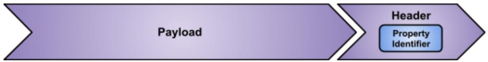  
Structure of a  $\cdot$  SiLA Client Request to initiate a  $\cdot$  Property read

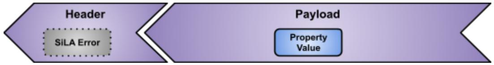  
Structure of a  $\cdot$ SiLA Server Response $\cdot$  in reply to a  $\cdot$ Property $\cdot$  read

Sequence diagram of reading an  $\cdot$  Observable Property or an  $\cdot$  Unobservable Property:

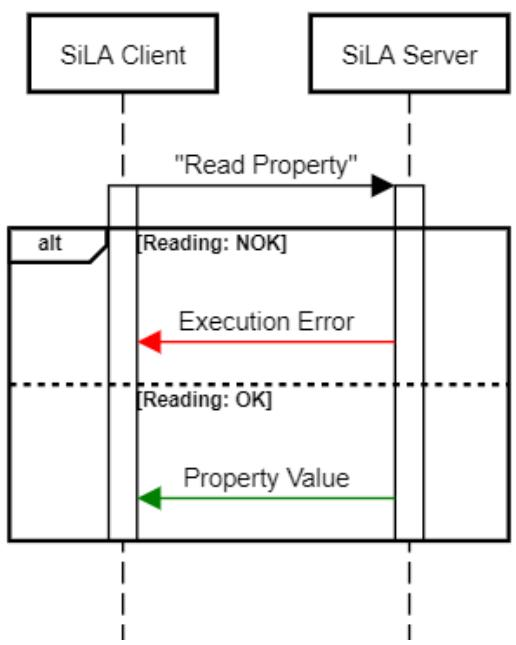  
Reading a Property

Subscribing to an Observable Property

COMPLETE; as of 0.1]

[Definition: Property Subscription] A Property Subscription is the subscription of an  $\cdot$ Observable Property $\cdot$  by a  $\cdot$ SiLA Client $\cdot$ .

The  $\cdot$ SiLA Server $\cdot$ MUST allow the  $\cdot$ SiLA Client $\cdot$ to subscribe to any  $\cdot$ Observable Property $\cdot$ . The  $\cdot$ SiLA Server $\cdot$ MUST return the  $\cdot$ Property $\cdot$ 's current value once when subscribed, as if the  $\cdot$ SiLA Client $\cdot$ was reading a  $\cdot$ Property $\cdot$ once. A new  $\cdot$ Property $\cdot$ value is sent whenever the value changes.

In case the  $\cdot$ SiLA Server $\cdot$  is unable to determine the current value of the  $\cdot$ Property $\cdot$ , the  $\cdot$ SiLA Server $\cdot$  MUST issue an  $\cdot$ Execution Error $\cdot$  and MUST cancel the subscription after that.

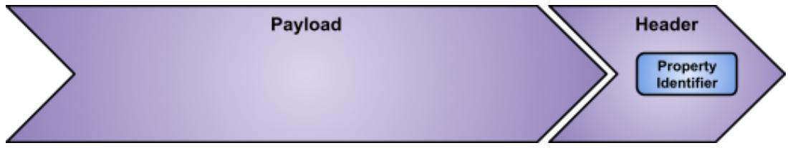  
Structure of a  $\cdot$ SiLA Client Request to initiate a  $\cdot$ Property Subscription

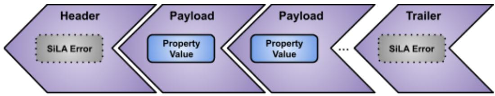

Structure of a streamed  $\cdot$  SiLA Server Response $\cdot$  in reply to a  $\cdot$  Property Subscription $\cdot$

A  $\cdot$  Property Subscription $\cdot$  MAY be canceled by the  $\cdot$ SiLA Client $\cdot$  at any time.

A  $\cdot$ Property Subscription $\cdot$  SHALL implicitly be canceled by an interruption or loss of the  $\cdot$ Connection $\cdot$  ( $\cdot$ Connection Error $\cdot$ ) or by explicitly closing the  $\cdot$ Connection $\cdot$  by the  $\cdot$ SiLA Client $\cdot$ . The  $\cdot$ SiLA Server $\cdot$  SHALL detect these cases and stop sending new  $\cdot$ Property $\cdot$  values to  $\cdot$ SiLA Clients $\cdot$

whose  $\cdot$  Connection $\cdot$  has been closed or lost. In these cases, it is the responsibility of the  $\cdot$ SiLA Client $\cdot$  to re-establish the  $\cdot$ Property Subscription $\cdot$ , if desired.

Sequence diagram of subscribing to an  $\cdot$ Observable Property:

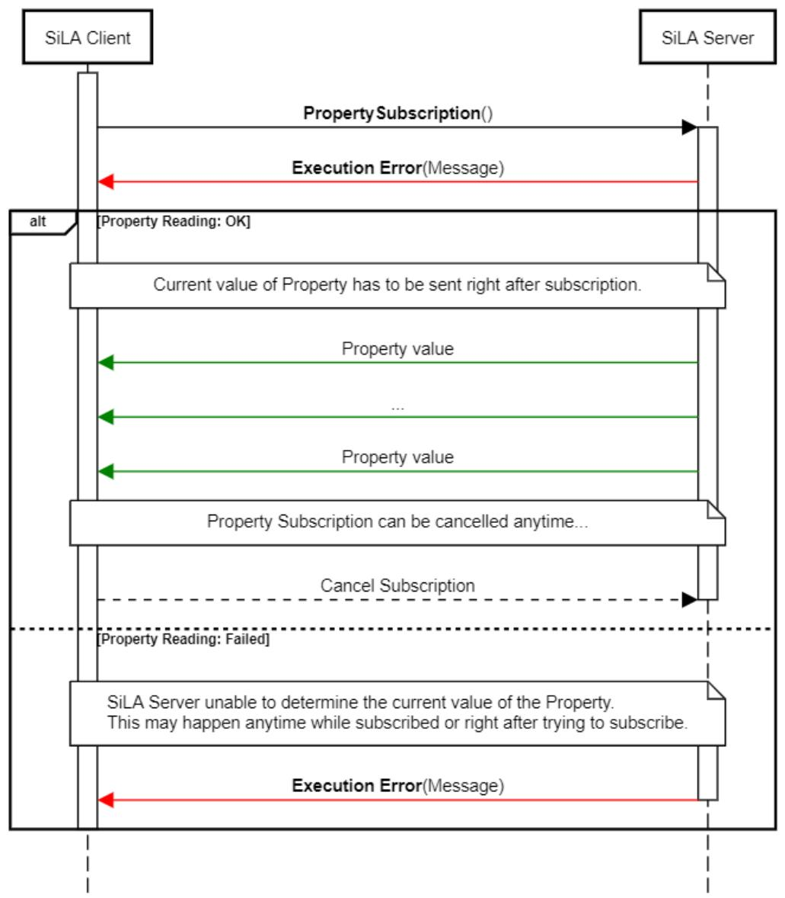  
Subscribing to a Property

# Examples

COMPLETE; as of 0.1]

An example of an  $\cdot$ Observable Property is e.g. a "Bath Temperature". An example of an  $\cdot$ Unobservable Property is e.g. a "Serial Number".

# SiLA Client Metadata

[COMPLETE; as of 0.2]

A ·Feature Designer· MAY specify ·SiLA Client Metadata· that a ·SiLA Client· can send together with a ·Command· execution, reading or subscribing to a ·Property·.

[Definition: SiLA Client Metadata] SiLA Client Metadata is information that a  $\cdot$ SiLA Server expects to receive from a  $\cdot$ SiLA Client when executing a  $\cdot$ Command or reading or subscribing to a  $\cdot$ Property. If expected SiLA Client Metadata is not received, a Invalid Metadata Framework Error must be issued. This must be checked before parameter validation. Each SiLA Client Metadata has a specific  $\cdot$ Metadata Identifier and a  $\cdot$ SiLA Data Type. Metadata is intended for small pieces of data, and transmission might fail for values larger than 1 KB.

- SiLA Client Metadata·MUST NOT affect the ·SiLA Service Feature·. That means that every call of the ·SiLA Service Feature·MUST NOT contain any ·SiLA Client Metadata·. If a ·SiLA Server·receives ·SiLA Client Metadata·within the header of a ·SiLA Service Feature·call, it MUST issue a ·No Metadata Allowed Error·.

A  $\cdot$ SiLA Server\` that implements a  $\cdot$ Feature\` which defines  $\cdot$ SiLA Client Metadata\` MUST provide a list for each  $\cdot$ SiLA Client Metadata\` that contains all  $\cdot$ Features\` /  $\cdot$ Commands\` /  $\cdot$ Properties\` that are affected by that  $\cdot$ SiLA Client Metadata\` . The affected  $\cdot$ Features\` /  $\cdot$ Commands\` /  $\cdot$ Properties\` are identified by their respective Fully Qualified Identifiers\`, of which a  $\cdot$ Feature Identifier represents all  $\cdot$ Commands\` and  $\cdot$ Properties\` of the respective  $\cdot$ Feature\` . The list for all  $\cdot$ Features\` /  $\cdot$ Commands\` /  $\cdot$ Properties\` affected by  $\cdot$ SiLA Client Metadata\` MUST not change during the Lifetime of a SiLA Server\`

Note: As the  $\cdot$ SiLA Service Feature $\cdot$ MUST never be affected by  $\cdot$ SiLA Client Metadata $\cdot$ , the list of affected  $\cdot$ Features $\cdot$ ,  $\cdot$ Commands $\cdot$  or  $\cdot$ Properties $\cdot$ MUST never contain any  $\cdot$ Commands $\cdot$  or  $\cdot$ Properties $\cdot$  of the  $\cdot$ SiLA Service Feature $\cdot$  or the  $\cdot$ SiLA Service Feature $\cdot$  Identifier $\cdot$  itself.

If a -SiLA Server- implements a -Feature- that defines -SiLA Client Metadata-, the -SiLA Server-MUST expect the -SiLA Client Metadata- to be present as specified in the list of affected -Features/ -Commands/ Properties or issue an -Invalid Metadata Error- otherwise.

In case a  $\cdot$  SiLA Server $\cdot$  receives  $\cdot$ SiLA Client Metadata $\cdot$  unexpectedly (i.e. not in the list of affected  $\cdot$ Features $\cdot$ ,  $\cdot$ Commands $\cdot$  or  $\cdot$ Properties $\cdot$ ), the  $\cdot$ SiLA Server $\cdot$  MUST ignore it.

·SiLA Client Metadata, if specified, MUST be sent to the ·SiLA Server by the ·SiLA Client when:

- Executing  $\cdot$ Unobservable Commands  
- Executing an  $\cdot$  Observable Command $\cdot$ ; only with the  $\cdot$  Command $\cdot$  initiation (see  $\cdot$  Observable Command $\cdot$ , InitiateCommand; not with Subscribe- or GetCommandExecutionInfo, Subscribe- or GetIntermediateResponse or GetResponse)  
- Reading a  $\cdot$  Property  
- Executing a  $\cdot$  Property Subscription

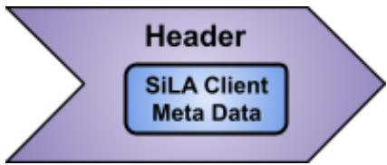

·SiLA Client Metadata· is sent as part of the ·Header· of a ·SiLA Client Request·

Item

Description

<table><tr><td>Metadata Identifier</td><td>[Definition: Metadata Identifier] A Metadata Identifier is the ·Identifier· of a ·SiLA Client Metadata·. A Metadata Identifier MUST be unique within the scope of a ·Feature·. Uniqueness MUST be checked without taking lower and upper case into account, see Uniqueness of Identifiers.</td></tr><tr><td>Metadata Display Name</td><td>[Definition: Metadata Display Name] A Metadata Display Name is the ·Display Name· of a ·SiLA Client Metadata·.</td></tr><tr><td>Metadata Description</td><td>[Definition: Metadata Description] The Metadata Description is the ·Description· of a ·SiLA Client Metadata·.</td></tr><tr><td>Metadata Data Type</td><td>[Definition: Metadata Data Type] A Metadata Data Type is the ·SiLA Data Type· of a ·SiLA Client Metadata·.</td></tr></table>

# Best Practice

# COMPLETE; as of 0.2]

Use -SiLA Client Metadata- for concerns that affect more than one -Feature- on a -SiLA Server- at the same time. Some examples are given below.

<table><tr><td>Item</td><td>Description</td></tr><tr><td>Metadata Identifier</td><td>The ·Metadata Identifier· SHOULD be in CamelCase (i.e. written in the upper camel case style).</td></tr><tr><td>Metadata Display Name</td><td>It is RECOMMENDED to use the ·Metadata Identifier· with spaces between the words.</td></tr><tr><td>Metadata Description</td><td>The ·Description· of the ·SiLA Client Metadata· SHOULD give an accurate, in depth depiction of what the ·SiLA Client Metadata· is.</td></tr></table>

# Examples

# [COMPLETE; as of 0.2]

The following two examples of  $\cdot$ Feature $\cdot$  designs illustrate the use of  $\cdot$ SiLA Client Metadata $\cdot$  in different categories:

# A "Lock Controller" Feature

# COMPLETE; as of 0.2]

The Feature design specifies the following:

- A ·Command·“LockServer” to lock a ·SiLA Server· with a ·Command Parameter·“LockIdentifier” in the form of a ·SiLA String Type·  
- A  $\cdot$ SiLA Client Metadata\`“LockIdentifier” in the form of a  $\cdot$ SiLA String Type $\cdot$ , to be sent with  $\cdot$ Commands $\cdot$  while the  $\cdot$ SiLA Server $\cdot$  is locked.

The  $\cdot$ SiLA Client $\cdot$  locks a  $\cdot$ SiLA Server $\cdot$  via  $\cdot$ Command $\cdot$  "LockServer" providing a lock  $\cdot$ Identifier $\cdot$ . Any future call to any (lock protected)  $\cdot$ Command $\cdot$  (or all  $\cdot$ Commands $\cdot$  of any lock protected  $\cdot$ Feature $\cdot$ ) will require the  $\cdot$ SiLA Client $\cdot$  to send a  $\cdot$ SiLA Client Metadata $\cdot$  with the  $\cdot$ Identifier $\cdot$

"LockIdentifier" and a value of the lock -Identifier provided with the "LockServer" -Command- otherwise accessing the respective -Command- is not possible.

Authorization Service

COMPLETE; as of 0.2]

The  $\cdot$  Feature design specifies the following:

A ·Command· "Authorization" to get an authorization token in the form of a  $\cdot$ SiLA String Type.  
A  $\cdot$  SiLA Client Metadata  $\cdot$  "AuthorizationToken" in the form of a  $\cdot$  SiLA String Type.

The  $\cdot$ SiLA Client- obtains an authorization token via Command: "authorize"; once successfully obtained, any future call to any Command or Property (except for the  $\cdot$ SiLA Service Feature-) will require the  $\cdot$ SiLA Client to send a  $\cdot$ SiLA Client Metadata with the Identifier "AuthorizationToken" and a value of the authorization token obtained - otherwise accessing the  $\cdot$ SiLA Server is not possible. All Commands and all Properties would be affected in this design.

A “Gateway” Feature

COMPLETE; as of 1.1]

The  $\cdot$  Feature $\cdot$  design specifies the following:

A  $\cdot$  Command to get the  $\cdot$ SiLA Server UUID's of the connected  $\cdot$ SiLA Servers.  
A  $\cdot$  SiLA Client Metadata containing the  $\cdot$  SiLA Server UUID of the selected  $\cdot$  SiLA Server.

The  $\cdot$ SiLA Client- obtains a list of all connected  $\cdot$ SiLA Servers- from the gateway. The gateway itself is a  $\cdot$ SiLA Server- that implements and "relays" all the  $\cdot$ Features- of all connected  $\cdot$ SiLA Servers- to the  $\cdot$ SiLA Client- connected to the gateway. In order for the  $\cdot$ SiLA Client- to be able to select the "correct"  $\cdot$ SiLA Server- behind the gateway, the  $\cdot$ SiLA Client- makes use of the  $\cdot$ SiLA Client Metadata- to select the right server (through the  $\cdot$ SiLA Server UUID-).

# Defined Execution Errors in Metadata Context

[COMPLETE; as of 0.2]

One or more -Defined Execution Errors- MAY be specified for a -SiLA Client Metadata-. The -Defined Execution Errors- are defined in the context of the -Feature- that defines the -SiLA Client Metadata- and can be re-used within the -Feature-, e.g. among different -SiLA Client Metadata-.

<table><tr><td>Item</td><td>Description</td></tr><tr><td>Defined Execution Errors</td><td>A list of ·Defined Execution Error Identifiers·referring to all ·Defined Execution Errors·that can occur when calling a ·Command·or accessing (reading or subscribing to) a ·Property·which is affected by a certain ·SiLA Client Metadata·.</td></tr></table>

# Defined Execution Errors

[COMPLETE; as of 0.2]

A ·Feature Designer· MAY specify ·Defined Execution Errors·. Using ·Defined Execution Errors·, a ·Feature Designer· is able to design specific error conditions. A ·SiLA Client· in turn MAY use this information to handle ·Defined Execution Errors· in a more sophisticated way as for instance

- Undefined Execution Errors with the knowledge about the nature of the error from the -Feature-design.

- Defined Execution Errors: MAY be assigned to one or more  $\cdot$ Commands $\cdot$ ,  $\cdot$ Properties $\cdot$  or  $\cdot$ SiLA Client Metadata $\cdot$ .

For more details, please refer to chapter Error Categories.

<table><tr><td>Item</td><td>Description</td></tr><tr><td>Defined Execution Error Identifier</td><td>[Definition: Defined Execution Error Identifier] The Defined Execution Error Identifier is the ·Identifier· of a ·Defined Execution Error·. A Defined Execution Error Identifier MUST be unique within the scope of a ·Feature·. Uniqueness MUST be checked without taking lower and upper case into account, see Uniqueness of Identifiers.</td></tr><tr><td>Defined Execution Error Display Name</td><td>[Definition: Defined Execution Error Display Name] The Defined Execution Error Display Name is the ·Display Name· of a ·Defined Execution Error·.</td></tr><tr><td>Defined Execution Error Description</td><td>[Definition: Defined Execution Error Description] The Defined Execution Error Description is the ·Description· of a ·Defined Execution Error·.</td></tr></table>

# Best Practice

COMPLETE; as of 0.2]

A·Feature Designer· SHOULD adhere to the following guidelines:

<table><tr><td>Item</td><td>Guidelines</td></tr><tr><td>Defined Execution Error Identifier</td><td>The ·Identifier· of a ·Defined Execution Error· SHOULD be in CamelCase (i.e. written in the upper camel case style). The ·Defined Execution Error Identifier· SHOULD be in the form: AdjectiveNoun(s) (adjective, singular or plural noun(s), depending on context).</td></tr><tr><td>Defined Execution Error Display Name</td><td>A human readable name for the ·Defined Execution Error-. It is RECOMMENDED to use the ·Defined Execution Error Identifier· with spaces between separate words.</td></tr><tr><td>Defined Execution Error Description</td><td>The ·Defined Execution Error Description· SHOULD provide an accurate description of the ·Defined Execution Error-.</td></tr></table>

# Example

COMPLETE; as of 0.2]

For examples regarding  $\cdot$  Defined Execution Errors, please refer to chapter Error Categories.

# Custom Data Types

COMPLETE; as of 0.1]

[Definition: Custom Data Type] A Custom Data Type allows to assign a custom -Fully Qualified Custom Data Type Identifier, -Custom Data Type Display Name- and -Custom Data Type Description- to a -SiLA Data Type. -SiLA Data Types- that have been defined in this way can be used as -SiLA Data Types- of -Parameters-, -Command Responses-, -Intermediate Command Responses-, -Properties- or -SiLA Client Metadata- like any other -SiLA Data Type-.

<table><tr><td>Item</td><td>Description</td></tr><tr><td>Custom Data Type Identifier</td><td>[Definition: Custom Data Type Identifier] A Custom Data Type Identifier is the ·Identifier· of a ·SiLA Data Type·. A Custom Data Type Identifier MUST be unique within the scope of a ·Feature·. The ·Identifiers· of the ·SiLA Basic Types· are reserved and MUST NOT be used.</td></tr><tr><td>Custom Data Type Display Name</td><td>[Definition: Custom Data Type Display Name] A Custom Data Type Display Name is the ·Display Name· of a ·SiLA Data Type·.</td></tr><tr><td>Custom Data Type Description</td><td>[Definition: Custom Data Type Description] A Custom Data Type Description Is the ·Description· of a ·SiLA Data Type·.</td></tr><tr><td>Custom Data Type Data Type</td><td>[Definition: Custom Data Type Data Type] A Custom Data Type Data Type is the ·SiLA Data Type· of a ·Custom Data Type·.</td></tr></table>

# Best Practice

[COMPLETE; as of 0.1]

A ·Feature Designer· SHOULD adhere to the following guidelines:

<table><tr><td>Item</td><td>Guidelines</td></tr><tr><td>Custom Data Type Identifier</td><td>The ·Identifier· of a ·Custom Data Type· SHOULD be in CamelCase (i.e. written in the upper camel case style).</td></tr><tr><td>Custom Data Type Display Name</td><td>A human readable name for the ·SiLA Data Type·. It is RECOMMENDED to use the SiLA ·Fully Qualified Custom Data Type Identifier· with spaces between separate words.</td></tr><tr><td>Custom Data Type Description</td><td>The ·Custom Data Type Description· SHOULD provide an accurate description of the ·SiLA Data Type·.</td></tr></table>

# SiLA Data Types

COMPLETE; as of 0.1]

This section describes the SiLA Data Type system.

[Definition: SiLA Data Type] A SiLA Data Type describes the data type of any information exchanged between  $\cdot$ SiLA Client $\cdot$  and  $\cdot$ SiLA Server $\cdot$ . A SiLA Data Type MUST either be a  $\cdot$ SiLA Basic Type $\cdot$  or a  $\cdot$ SiLA Derived Type $\cdot$ . A SiLA Data Type is used to describe the content communicated in:

- a·Parameter·of a·Command·  
- a  $\cdot$  Command Response $\cdot$  or  $\cdot$  Intermediate Command Responses

- a·Property·value  
- a·SiLA Client Metadata

# SiLA Basic Types

# [COMPLETE; as of 1.0]

[Definition: SiLA Basic Type]  $\cdot$ SiLA Data Types are separated into SiLA Basic Types and  $\cdot$ SiLA Derived Types. The following SiLA Basic Types are predefined by SiLA.

[Definition: SiLA Numeric Type] The  $\cdot$ SiLA Integer Type and the  $\cdot$ SiLA Real Type are SiLA Numeric Types.

<table><tr><td>Identifier</td><td>Description</td></tr><tr><td>String</td><td>[Definition: SiLA String Type] The SiLA String Type represents a plain text composed of maximum 2 x 220 UNICODE characters. Use the -SiLA Binary Type- for larger data.
It is RECOMMENDED to specify a -Constraint-, e.g. a -Content Type Constraint- or -Schema Constraint- for the -SiLA String Type- in order to make the string content type safe.</td></tr><tr><td>Integer</td><td>[Definition: SiLA Integer Type] The SiLA Integer Type represents an integer number within a range from the minimum value of -263 up to the maximum value of 263-1.
This is a -SiLA Numeric Type-.</td></tr><tr><td>Real</td><td>[Definition: SiLA Real Type] The SiLA Real Type represents a real number as defined per IEEE 754 double-precision floating-point number. This is a -SiLA Numeric Type-.</td></tr><tr><td>Boolean</td><td>[Definition: SiLA Boolean Type] The SiLA Boolean Type represents a Boolean value. This is a -SiLA Data Type- representing one of two possible values, usually denoted as true and false.</td></tr><tr><td>Binary</td><td>[Definition: SiLA Binary Type] The SiLA Binary Type represents arbitrary binary data of any size such as images, office files, etc.
If the -SiLA Binary Type- is used for character data, e.g. plain text, XML or JSON, the character encoding MUST be UTF-8.
It is RECOMMENDED to specify -Constraint-, e.g. a -Content Type Constraint- or -Schema Constraint- for the -SiLA Binary Type- in order to make the binary content type safe.</td></tr><tr><td>Date1)</td><td>[Definition: SiLA Date Type] The SiLA Date Type represents a ISO 8601 date (year [1-9999]3), month [1-12], day [1-31]) in the Gregorian calendar, with an additional timezone (as an offset from UTC). A SiLA Date Type consists of the top-open interval of exactly one day in length, beginning on the beginning moment of each day (in each timezone), i.e. '00:00:00', up to but not including '24:00:00' (which is identical with '00:00:00' of the next day).</td></tr><tr><td>Time1),2)</td><td>[Definition: SiLA Time Type] The SiLA Time Type represents a ISO 8601 time (hours [0–23], minutes [0–59], seconds [0–59], milliseconds [0–999], with an additionaltimezone [as an offset from UTC]).</td></tr><tr><td>Timestamp1),2)</td><td>[Definition: SiLA Timestamp Type] The SiLA Timestamp Type represents both, ISO 8601 date and time in one (year [1–9999])3, month, day, hours [0–23], minutes [0–59], seconds [0–59], milliseconds [0–999], with an additionaltimezone [as an offset from UTC]).</td></tr><tr><td>Any</td><td>[Definition: SiLA Any Type] The SiLA Any Type represents information that can be of any •SiLA Data Type, except for a •Custom Data Type (i.e. the SiLA Any Type MUST NOT represent information of a •Custom Data Type). The value of a SiLA Any Type MUST contain both the information itself and the •SiLA Data Type.
Note: The •SiLA Any Type may be used to be able to communicate data whose •SiLA Data Type is unknown at design time of the •Feature. This •SiLA Data Type should be used with care, as it not only adds overhead to the communication, but it also adds complexity for the implementation of both, •SiLA Servers and •SiLA Clients].</td></tr><tr><td>Void</td><td>[Definition: SiLA Void Type] The SiLA Void Type represents no data. It MUST only be used as a value of the •SiLA Any Type.
Example: The •SiLA Void Type allows the implementer of a •SiLA Server that offers a •Feature containing a •Command that returns a •SiLA Any Type to return “no” •Command Response].</td></tr></table>

# Additional Details on Time, Date and Timestamp

# COMPLETE; as of 0.1]

1) SiLA 2 defines three  $\cdot$ SiLA Data Types· dealing with a point in time:

- The -SiLA Timestamp Type- defines an absolute point in time.  
- The -SiLA Date Type- defines an absolute day in time.  
- The -SiLA Time Type is an absolute time within an arbitrary day. The -SiLA Date Type and -SiLA Time Type can be useful e.g. in a scheduling context ("Run five times on Dec 5, 2017", "Run at 04:17").

2) A ·Feature Designer· MAY define a new ·SiLA Data Type· with higher time resolution within a ·Feature Definition· if needed. For the time being, the SiLA working group does not see a need for such a data type being defined in SiLA 2 as a ·SiLA Basic Type· or pre-defined ·SiLA Derived Type·.  
3) The year must be in the range from year 1 to year 9999. Representing years before 1 is not possible with SiLA, as no use case could be found for this.

# Time Durations

# [COMPLETE; as of 0.1]

A note on time duration: It is recommended to use a -SiLA Numeric Type- with a -Unit Constraint- to design a time duration.

# Best Practice

# COMPLETE; as of 0.1]

It is RECOMMENDED that a -Feature Designer- specifies a -Unit Constraint- for every -SiLA Numeric Type- that represents a physical quantity.

It is RECOMMENDED that a -Feature Designer- specifies a -Content Type Constraint- or a -Schema Constraint- for every -SiLA Binary Type- used.

# SiLA Derived Types

# COMPLETE; as of 0.1]

[Definition: SiLA Derived Type] There are three different SiLA Derived Types defined:

- SiLA List Type· is a list with entries of the same ·SiLA Data Type·.  
- SiLA Structure Type is a structure composed of named elements with the same or different SiLA Data Types.  
- SiLA Constrained Type is a SiLA Basic Type or a SiLA List Type with Constraints.

# SiLA List Type

# COMPLETE; as of 0.1]

[Definition: SiLA List Type] The SiLA List Type is an ordered list with entries of the same -SiLA Data Type.

The -SiLA Data Type- of the list entries MUST be specified as follows:

<table><tr><td>Item</td><td>Description</td></tr><tr><td>SiLA Data Type</td><td>A ·SiLA Data Type·.</td></tr></table>

The -SiLA Data Type- of the list entries MUST NOT be a -SiLA List Type- itself (list of list or nesting of lists is not allowed).

# SiLA Structure Type

# COMPLETE; as of 0.1]

[Definition: SiLA Structure Type] The SiLA Structure Type is a structure composed of one or more named elements with the same or different  $\cdot$ SiLA Data Types.

The following information MUST be provided for each element of the structure:

<table><tr><td>Item (for each element)</td><td>Description</td></tr><tr><td>Element Identifier</td><td>[Definition: Element Identifier] The Element Identifier is the ·Identifier· of this element of the structure. The ·Identifier· MUST be</td></tr><tr><td></td><td>unique within the scope of a given ·SiLA Structure Type·. Uniqueness MUST be checked without taking lower and upper case into account, see Uniqueness of Identifiers.</td></tr><tr><td>Element Display Name</td><td>[Definition: Element Display Name] The Element Display Name is the ·Display Name· of an element of the structure.</td></tr><tr><td>Element Description</td><td>[Definition: Element Description] The Element Description is the ·Description· of an element of the structure.</td></tr><tr><td>Element Data Type</td><td>[Definition: Element Data Type] The Element Data Type is the ·SiLA Data Type· of an element of the structure.</td></tr></table>

Best Practice

[COMPLETE; as of 0.1]

A ·Feature Designer· SHOULD adhere to the following guidelines:

<table><tr><td>Item</td><td>Guidelines</td></tr><tr><td>Element Identifier</td><td>The ·Element Identifier· SHOULD be in CamelCase (i.e. written in the upper camel case style).</td></tr><tr><td>Element Display Name</td><td>It is RECOMMENDED to use the ·Identifier· with spaces between separate words.</td></tr><tr><td>Element Description</td><td>The ·Element Description· SHOULD provide an accurate description of this element of the structure.</td></tr></table>

SiLA Structure Type vs. SiLA Binary Type

[COMPLETE; as of 0.1]

SiLA 2 is strongly typed, it is therefore RECOMMENDED to use  $\cdot$ SiLA Data Types $\cdot$  where it makes sense. The  $\cdot$ SiLA Binary Type $\cdot$  SHOULD be used for data for which a proper, open specification exists (such as image formats, ...) and for which it would be difficult to handle it as a  $\cdot$ SiLA Data Type $\cdot$ .

Structure Type vs. Using AnIML

[COMPLETE; as of 0.1]

When dealing with data from analytical instruments, SiLA recommends to use AnIML instead of the SiLA Structure Type.

SiLA Constrained Type

[COMPLETE; as of 0.1, updates: 1.1]

[Definition: SiLA Constrained Type] The SiLA Constrained Type is a  $\cdot$ SiLA Data Type with one or more  $\cdot$ Constraints that act as a logical AND. The SiLA Constrained Type MUST be based on either a  $\cdot$ SiLA Basic Type or a  $\cdot$ SiLA List Type, or a  $\cdot$ SiLA Constrained Type. The  $\cdot$ Constraints in the type itself and the type it is based on are to act together as a logical conjunction (AND).

[Definition: Constraint] A Constraint limits the allowed value, size, range, etc. that a SiLA Data Type can assume. A SiLA Server must check the all the Constraints and issue a Validation Error if Constraints are violated.

The  $\cdot$ SiLA Data Type that will be constrained MUST be specified as follows:

<table><tr><td>Item</td><td>Description</td></tr><tr><td>SiLA Data Type</td><td>A ·SiLA Basic Type· or a ·SiLA List Type·.</td></tr></table>

Then, the following information MUST be provided for a  $\cdot$  Constraint: for a given  $\cdot$  SilA Constrained Type::

<table><tr><td>Item</td><td>Description</td></tr><tr><td>Constraint Identifier</td><td>[Definition: Constraint Identifier] A Constraint Identifier is the ·Identifier· of the ·Constraint·. The Constraint Identifier MUST be one of the identifiers defined in the two tables below: Constraints to SiLA Basic Types and Constraints to SiLA List Type.</td></tr><tr><td>Constraint Value</td><td>[Definition: Constraint Value] The Constraint Value is the actual parameterization of the ·Constraint·.</td></tr></table>

Constraints to SiLA Basic Types

COMPLETE; as of 1.0]

The following  $\cdot$ Constraints are possible for a  $\cdot$ SiLA Basic Type.

Note that no  $\cdot$ Constraints are applicable to the  $\cdot$ SiLA Boolean Type.

<table><tr><td>Constraint Identifier</td><td>Description</td><td>Applicable to SiLA Basic Type(s)</td></tr><tr><td>Length</td><td>[Definition: Length Constraint] A Length Constraint specifies the exact number of characters allowed. The ·Constraint Value· MUST be an integer number equal or greater than zero (0) up to the maximum value of 263-1.</td><td>·SiLA String Type·, ·SiLA Binary Type·</td></tr><tr><td>Minimal Length</td><td>[Definition: MinimalLength Constraint] A Minimal Length Constraint specifies the minimum number of characters (for a ·SiLA String Type·) or bytes (for a ·SiLA Binary Type·) allowed. The ·Constraint Value· MUST be an integer number equal or greater than zero (0) up to the maximum value of 263-1.</td><td>·SiLA String Type·, ·SiLA Binary Type·</td></tr><tr><td>Maximal Length</td><td>[Definition: Maximal Length Constraint] A Maximal Length Constraint specifies the maximum number of characters (for a ·SiLA String Type·) or bytes (for a ·SiLA Binary Type·) allowed. The ·Constraint Value· MUST be an</td><td>·SiLA String Type·, ·SiLA Binary Type·</td></tr><tr><td></td><td>integer number greater than zero (0) up to the maximum value of 263-1.</td><td></td></tr><tr><td>Set</td><td>[Definition: Set Constraint] A Set Constraint defines a set of acceptable values for a given ·SiLA Basic Type.. The list of acceptable ·Constraint Values must have the same ·SiLA Data Type as the ·SiLA Basic Type that this ·Constraint applies to.</td><td>·SiLA String Type.. ·SiLA Numeric Type.. ·SiLA Date Type.. ·SiLA Time Type.. ·SiLA Timestamp Type1)</td></tr><tr><td>Pattern</td><td>[Definition: Pattern Constraint] A Pattern Constraint defines the exact sequence of characters that are acceptable, as specified by a so-called regular expression. The ·Constraint Value-MUST be a XML Schema Regular Expression (Regular Expressions Quick Start).</td><td>·SiLA String Type</td></tr><tr><td>Maximal Exclusive</td><td>[Definition: Maximal Exclusive Constraint] A Maximal Exclusive Constraint specifies the upper bounds for ·SiLA Numeric Types (the value which is constrained MUST be less than this ·Constraint) and ·SiLA Date Type.. ·SiLA Timestamp Type (the value which is constrained MUST be before this ·Constraint). The ·Constraint Value must be of the same ·SiLA Data Type as the ·SiLA Basic Type that this ·Constraint applies to.</td><td>·SiLA Numeric Type.. ·SiLA Date Type.. ·SiLA Timestamp Type.. ·SiLA Timestamp Type1)</td></tr><tr><td>Maximal Inclusive</td><td>[Definition: Maximal Inclusive Constraint] A Maximal Inclusive Constraint specifies the upper bounds for ·SiLA Numeric Types (the value which is constrained MUST be less than or equal to this ·Constraint) and ·SiLA Date Type.. ·SiLA Timestamp Type (the value which is constrained MUST be before or at this ·Constraint). The ·Constraint Value must be of the same ·SiLA Data Type as the ·SiLA Basic Type that this ·Constraint applies to.</td><td>·SiLA Numeric Type.. ·SiLA Date Type.. ·SiLA Timestamp Type.. ·SiLA Timestamp Type1)</td></tr><tr><td>Minimal Exclusive</td><td>[Definition: Minimal Exclusive Constraint] A Minimal Exclusive Constraint specifies the lower bounds for ·SiLA Numeric" Types (the value which is constrained MUST be greater than this ·Constraint) and ·SiLA Date Type.. ·SiLA Timestamp Type (the value which is constrained MUST be after this ·Constraint). The ·Constraint Value must be of the same ·SiLA Data Type as the ·SiLA Basic Type that this ·Constraint applies to.</td><td>·SiLA Numeric Type.. ·SiLA Date Type.. ·SiLA Timestamp Type.. ·SiLA Timestamp Type1)</td></tr><tr><td>Minimal Inclusive</td><td>[Definition: Minimal Inclusive Constraint] A Minimal Inclusive Constraint specifies the lower bounds for ·SiLA Numeric Types (the value</td><td>·SiLA Numeric Type.. ·SiLA Date Type.. ·SiLA Timestamp Type.. ·SiLA Timestamp Type1)</td></tr><tr><td></td><td>which is constrained MUST be greater than or equal to this ·Constraint·) and ·SiLA Date Type·, ·SiLA Time Type· and ·SiLA Timestamp Type·(the value which is constrained MUST be at or after this ·Constraint·). The ·Constraint Value must be of the same ·SiLA Data Type· as the ·SiLA Basic Type· that this ·Constraint· applies to.</td><td>Type·, ·SiLA Timestamp Type·1)</td></tr><tr><td>Unit</td><td>[Definition: Unit Constraint] A Unit Constraint specifies the unit of a physical quantity, see Unit Constraint for a definition of the allowed ·Constraint Values·.</td><td>·SiLA Integer Type·, ·SiLA Real Type·</td></tr><tr><td>Content Type</td><td>[Definition: Content Type Constraint] A Content Type Constraint specifies the type of content of a binary or textual ·SiLA Data Type· based on a RFC 2045 ContentType, see Content Type Constraint for a definition of the allowed ·Constraint Values·.</td><td>·SiLA Binary Type·, ·SiLA String Type·</td></tr><tr><td>Fully Qualified Identifier</td><td>[Definition: Fully Qualified Identifier Constraint] A Fully Qualified Identifier Constraint specifies the content of the ·SiLA String Type· to be a ·Fully Qualified Identifier· and indicates the type of the identifier. Note that this is comparable to a ·Pattern Constraint·; that is, the content is not required to actually identify something, it just has to be a semantically correct ·Fully Qualified Identifier·. The ·Constraint Value· MUST be exactly one of this list: ·“FeatureIdentifier”, ·“CommandIdentifier”, ·“CommandParameterIdentifier”, ·“CommandRespondentifier”, ·“IntermediateCommandRespondentifier”, ·“DefinedExecutionErrorIdentifier”, ·“PropertyIdentifier”, ·“DataTypeIdentifier” ·“MetadataIdentifier”</td><td>·SiLA String Type·</td></tr><tr><td>Schema</td><td>[Definition: Schema Constraint] A Schema Constraint specifies the type of content of a binary or textual ·SiLA Data Type· based on a schema, see Schema Constraint for a definition of the allowed ·Constraint Values·..</td><td>·SiLA Binary Type·, ·SiLA String Type·</td></tr><tr><td>Allowed Types</td><td>[Definition: Allowed Types Constraint] An Allowed Types Constraint defines a list of ·SiLA Data Types· that the ·SiLA Any Type· is allowed to represent. The ·Constraint Value· MUST be a list of ·SiLA Data Types·, but MUST NOT be a ·Custom Data Type· or a ·SiLA Derived Type· containing a ·Custom Data Type·.</td><td>·SiLA Any Type·</td></tr></table>

Additional Details on Representing Constraint's Data in the Feature Definition Language

COMPLETE; as of 1.1]

1) Use the following XSD schema types to serialize the  $\cdot$  Constraint Value of the following  $\cdot$  SiLA Constrained Types into an XML representation of the Feature Definition Language:

- SiLA String Type:  $\rightarrow$  xs:string  
- SiLA Numeric Type:  $\rightarrow$  xs:double  
- SiLA Date Type:  $\rightarrow$  xs : date with explicittimezone fragment  
- SiLA Time Type:  $\rightarrow$  xs:time with explicittimezone fragment  
- SiLA Timestamp Type:  $\rightarrow$  xs:dateTime with explicittimezone fragment

Also refer to the annotations in Constraints.xsd.

Content Type Constraint

[COMPLETE; as of 0.2]

The ·Content Type Constraint· SHOULD be used to identify the exact nature of a textual or binary value. The ·Constraint Value· MUST contain the “type” and “subtype” as specified in chapter “Syntax of the Content-Type Header Field” from RFC 2045. The “type” and “subtype” elements are always matched case-insensitive. Specific rules apply regarding valid values for the elements “type”, “subtype” and “parameter”, as stated below.

If the  $\cdot$ Content Type Constraint constrains a  $\cdot$ SiLA Binary Type that contains textual data (e.g. XML or JSON), the character encoding of this data MUST be UTF-8.

It is RECOMMENDED to only refer to registered media type and subtype names as listed by IANA under IANA Media Types.

The Content Types officially supported by SiLA can be found on SiLA Supported Content Types and MUST be handled properly by all implementations of  $\cdot$ SiLA Servers $\cdot$ .

Schema Constraint

COMPLETE; as of 0.2]

The  $\cdot$  Schema Constraint: SHOULD be used to identify the exact nature of a textual or binary value. The  $\cdot$  Schema Constraint: specifies the schema with which the data MUST be compliant with.

The  $\cdot$ Constraint Value is made up of the three following components, of which the "Type" and one of the components "Inline" or "URL" MUST always be provided:

- Type: schema type value can be "Xml" (W3C XML Schema) or "Json" (Json Schema)  
- Inline: Schema content is provided inline, as the value of the "Inline" component  
- URL (according to RFC 3986): Schema content is provided as a URL (as the value of the "URL" component). It is RECOMMENDED to provide a URL pointing to a document served with an "Access-Control-Allow-Origin" header that permits cross-origin use.

If the -Schema Constraint- constrains XML or JSON data in a -SiLA Binary Type-, the character encoding of this data MUST be UTF-8.

Note: In case the schema is provided inline as part of a  $\cdot$ Feature Definition $\cdot$ , proper escape sequences or mechanisms, as specified for XML, have to be used.

# Unit Constraint

# [COMPLETE; as of 1.0]

The -Unit Constraint- specifies the physical unit for a specific -SiLA Integer Type- or -SiLA Real Type- with

- a human readable label,  
conversion information to convert the value into SI units and  
- the actual SI unit.

The label allows a  $\cdot$ SiLA Client to present values in a nice and human readable way. The conversion factor and offset allow a  $\cdot$ SiLA Client or  $\cdot$ SiLA Server to convert a value from the unit indicated by the label into SI units or vice versa. The relation to SI units allows a  $\cdot$ SiLA Client or  $\cdot$ SiLA Server to programmatically interpret the actual SI unit of the value in order to perform proper calculations with physical values.

If a -Unit Constraint is applied to a -SiLA Data Type, a -SiLA Client or -SiLA Server MUST always send the value of that -SiLA Data Type in the unit corresponding to the -Unit Label.

The  $\cdot$  Constraint Value is made up of the following items:

<table><tr><td>Item</td><td>Description</td></tr><tr><td>Unit Label</td><td>[Definition: Unit Label] The Unit Label is the arbitrary label denoting the physical unit that the ·Unit Constraint·defines. The Unit Label MUST be a string of UNICODE characters up to a maximum of 255 characters in length.</td></tr><tr><td>Conversion Factor</td><td>[Definition: Conversion Factor] The Conversion Factor specifies the conversion from the unit with a given ·Unit Label·into SI units, according to the definition in chapter Unit Conversion. The Conversion Factor MUST be a real number as defined per IEEE 754 double-precision floating-point number.</td></tr><tr><td>Conversion Offset</td><td>[Definition: Conversion Offset] The Conversion Offset specifies the conversion from the unit with a given ·Unit Label·into SI units, according to the definition in chapter Unit Conversion. The Conversion Offset MUST be a real number as defined per IEEE 754 double-precision floating-point number.</td></tr><tr><td colspan="2">[Definition: SI Base Unit] The SI Base Unit is the combination of SI units that specifies the same base quantity or dimension as indicated by the ·Unit Label·. The following items MUST be provided for each SI unit N, that makes up the SI Base Unit (N is an integer number in the range of 1 - 8).</td></tr><tr><td>SI Unit Name N</td><td>[Definition: SI Unit Name] The SI Unit Name is a name referring to an SI unit and MUST be either: 
·“Dimensionless”, 
·“Meter”, 
·“Kilogram”, 
·“Second”, 
·“Ampere”, 
·“Kelvin”, 
·“Mole”</td></tr><tr><td></td><td>or
• “Candela”</td></tr><tr><td>SI Unit Exponent N</td><td>[Definition: SI Unit Exponent] The SI Unit Exponent is the exponent to apply to the SI unit corresponding to SI Unit Name and must be an integer number within a range from the minimum value of -263 up to the maximum value of 263-1.</td></tr></table>

Unit Conversion

[COMPLETE; as of 1.0]

Let  $x_{orig}$  be the value of a SiLA Constrained Type with a Unit Constraint. According to the Unit Constraint, the value  $x_{orig}$  has to be in a unit as specified by the corresponding Unit Label.

Let  $x_{conv}$  be the same value as  $x_{orig}$ , but being in the corresponding SI Base Unit (i.e. being of the same base quantity or dimension as the Unit Label of  $x_{orig}$ ).

The relation between  $x_{orig}$  and  $x_{conv}$  is:

$$
x _ {\text {c o n v}} = x _ {\text {o r i g}} \cdot f a c t o r + o f f s e t
$$

where

$x_{conv}[SI\ Base\ Unit]$  is the value converted to the  $\cdot$ SI Base Unit

$x_{orig}[Unit Label]$  is the original value in the unit as defined by the  $\cdot$  Unit Label

The  $\cdot$ SI Base Unit is made up of SI Unit Names and SI Unit Exponents as follows:

$$
[ S I B a s e U n i t ] = \left[ \prod_ {N} S I U n i t N a m e \begin{array}{c} S I U n i t E x p o n e n t \\ N \end{array} ^ {N} \right]
$$

Best Practice

COMPLETE; as of 1.0]

It is RECOMMENDED that a -Feature Designer specifies a -Unit Constraint for each -SiLA Integer Type or -SiLA Real Type that represents a physical quantity.

<table><tr><td>Item</td><td>Description</td></tr><tr><td>·Unit Label·</td><td>It is RECOMMENDED, as a guideline, to define the ·Unit Label·according to the “Name” or “Symbol” column, as specified in the tables of the section “Derived units with special names” in the Wikipedia article about SI derived units. The ·Unit Label·is considered a human readable text and MUST therefore adhere to the SiLA conventions for Internationalization.</td></tr><tr><td>·Conversion Factor··Conversion Offset·</td><td>As a guidance, conversion factors from this Wikipedia article about conversion of units can be taken as a basis.</td></tr></table>

# Examples

COMPLETE; as of 1.0]

Consider the following simple example for nanometer:

Unit Label  $\cdot =$  "nm"  
Conversion Factor  $= 10^{-9}$  
Conversion Offset  $\cdot = 0$  
-SI Unit Name·1 = "Meter"  
-SI Unit Exponent·1 = 1

Hence, the above formula for the conversion reads:

$$
x _ {\text {c o n v}} = x _ {\text {o r i g}} \cdot 1 0 ^ {- 9} + 0
$$

$x_{conv}$  being in  $\cdot$  SI Base Unit· [Meter  $^{1}$ ]

$$
\begin{array}{l} x _ {\text {o r i g}} \text {i n} [ n m ]. \end{array}
$$

Another example for a volume in cubic centimetres (ccm):

Unit Label = "ccm"  
Conversion Factor  $\cdot = 10^{-6}$  
Conversion Offset=0  
-SI Unit Name·1 = "Meter"  
·SI Unit Exponent·1 = 3

Hence, the above formula for the conversion reads:

$$
x _ {\text {c o n v}} = x _ {\text {o r i g}} \cdot 1 0 ^ {- 6} + 0
$$

$x_{conv}$  being in  $\cdot$  SI Base Unit· [Meter  $^3 ]$

$$
x _ {\text {o r i g}} \text {i n} [ c c m ]
$$

A force in Newton (N):

- Unit Label! = "N"  
Conversion Factor=1  
Conversion Offset  $\cdot = 0$  
·SI Unit Name·1 = "Kilogram"  
-SI Unit Exponent·1 = 1  
-SI Unit Name·2 = "Meter"  
-SI Unit Exponent-2=1  
·SI Unit Name·3 = "Second"  
·SI Unit Exponent·3 = -2

Hence, the above formula for the conversion reads:

$$
\begin{array}{l} x _ {\textit {c o n v}} = x _ {\textit {o r i g}} \cdot 1 + 0 \\ x _ {\text {c o n v}} \text {b e i n g i n} \cdot \text {S I B a s e U n i t} \cdot [ \text {K i l o g r a m m} ^ {1} \text {M e t e r} ^ {1} \text {S e c o n d} ^ {- 2} ] \\ x _ {\text {o r i g}} \text {i n} [ N ] \\ \end{array}
$$

Likewise for degrees Celsius or degrees Fahrenheit:

Unit Label  $\cdot =$  "C"  
Conversion Factor = 1  
Conversion Offset = 273.15  
·SI Unit Name·1 = “Kelvin”  
·SI Unit Exponent·1 = 1

Hence, the above formula for the conversion reads:

$$
\begin{array}{l} x _ {\text {c o n v}} = x _ {\text {o r i g}} \cdot 1 + 2 7 3. 1 5 \\ x _ {\text {c o n v}} \text {b e i n g i n} \cdot \mathrm {S I B a s e U n i t} \cdot \left[ K e l v i n \quad^ {1} \right] \\ x _ {\mathit {\Pi} _ {o r i g}} \mathrm {i n} [ ^ {\circ} C ]. \\ \end{array}
$$

Or for  $^\circ F$

Unit Label  $\cdot =$  "F"  
Conversion Factor  $= \frac{5}{9}$  
Conversion Offset = 255.37  
·SI Unit Name·1 = “Kelvin”  
·SI Unit Exponent·1 = 1

Hence, the above formula for the conversion reads:

$$
\begin{array}{l} x _ {\text {c o n v}} = x _ {\text {o r i g}} \cdot \frac {5}{9} + 2 5 5. 3 7 \\ x _ {\text {c o n v}} \text {b e i n g i n} \cdot \text {S I B a s e U n i t} \cdot \left[ K e l v i n ^ {1} \right] \\ x _ {\text {o r i g}} \text {i n} [ ^ {\circ} F ]. \\ \end{array}
$$

Rotational speed in rpm:

Unit Label  $\cdot =$  "rpm"  
Conversion Factor =  $\frac{1}{60}$  
Conversion Offset  $\cdot = 0$  
·SI Unit Name·1 = "Second"  
·SI Unit Exponent·1 = -1

Hence, the above formula for the conversion reads:

$$
x _ {\text {c o n v}} = x _ {\text {o r i g}} \cdot \frac {1}{6 0} + 0
$$

$x_{conv}$  being in  $\cdot$  SI Base Unit· [Second  ${}^{-1}$ ]

$x_{\textit{orig}}$  in [rpm].

Constraints to SiLA List Type

[COMPLETE; as of 0.1]

The following  $\cdot$ Constraints are possible for the  $\cdot$ SiLA List Type:

<table><tr><td>Identifier</td><td>Description</td></tr><tr><td>Element Count</td><td>[Definition: Element Count Constraint] An Element Count Constraint specifies the exact number of elements that a list MUST have. The ·Constraint Value·MUST be an integer number equal or greater than zero (0) up to the maximum value of 263-1.</td></tr><tr><td>Minimal Element Count</td><td>[Definition: Minimal Element Count Constraint] An Minimal Element Count Constraint specifies the exact number of elements that a list MUST have in minimum. The ·Constraint Value·MUST be an integer number equal or greater than zero (0) up to the maximum value of 263-1.</td></tr><tr><td>Maximal Element Count</td><td>[Definition: Maximal Element Count Constraint] An Maximal Element Count Constraint specifies the exact number of elements that a list MUST have in maximum. The ·Constraint Value·MUST be an integer number equal or greater than zero (0) up to the maximum value of 263-1.</td></tr></table>

# Feature Attributes

[COMPLETE; as of 0.1]

[Definition: Attribute] Attributes are a part of a  $\cdot$ Feature Definition. Attributes are not necessary for the implementation of the  $\cdot$ Features themselves, but help to maintain them. The following Attributes exist and are mandatory:  $\cdot$ SiLA 2 Version,  $\cdot$ Feature Version,  $\cdot$ Maturity Level,  $\cdot$ Originator and Category.

# SiLA 2 Version

COMPLETE; as of 0.2, update: 1.1]

[Definition: SiLA 2 Version] The version of the SiLA 2 Specification that this -Feature- was developed against. Any -SiLA Server- or -SiLA Client- that was developed against a SiLA 2 Version with a -Major SiLA 2 Version- of "1" or larger MUST be able to interoperate with each other (backwards and forwards compatibility). The SiLA 2 Version is a combination of the -Major SiLA 2 Version- and the -Minor SiLA 2 Version-, separated by a dot (.).

<table><tr><td>Item</td><td>Description</td></tr><tr><td>Major SiLA 2 Version</td><td>[Definition: Major SiLA 2 Version] The Major SiLA 2 Version. MUST be an integer greater or equal than zero (0).</td></tr><tr><td>Minor SiLA 2 Version</td><td>[Definition: Minor SiLA 2 Version] The Minor SiLA 2 Version. MUST be an integer greater or equal than zero (0).</td></tr></table>

As of this release of the SiLA 2 Standard, the  $\cdot$ SiLA 2 Version·SHALL be "1.1" (i.e. the  $\cdot$ Major SiLA 2 Version·SHALL be 1 and the  $\cdot$ Minor SiLA 2 Version·SHALL be 1).

# Feature Version

# [COMPLETE; as of 0.1]

[Definition: Feature Version] Any  $\cdot$ Feature $\cdot$ MUST specify a Feature Version so that different versions of a  $\cdot$ Feature $\cdot$ can be distinguished during its life cycle. A Feature Version consists of a  $\cdot$ Major Feature Version $\cdot$  and a  $\cdot$ Minor Feature Version $\cdot$ . A  $\cdot$ Feature $\cdot$ MUST specify both a  $\cdot$ Major Feature Version $\cdot$  and a  $\cdot$ Minor Feature Version $\cdot$ .

A  $\cdot$ Feature $\cdot$  SHOULD be backwards and forwards compatible within the same  $\cdot$ Major Feature Version $\cdot$ . This means that a  $\cdot$ SiLA Client $\cdot$ , implemented by referencing a  $\cdot$ Feature $\cdot$  with a newer  $\cdot$ Minor Feature Version $\cdot$ , is RECOMMENDED be able to also use a  $\cdot$ SiLA Server $\cdot$  that offers this  $\cdot$ Feature $\cdot$  with an older  $\cdot$ Minor Feature Version $\cdot$  and the same  $\cdot$ Major Feature Version $\cdot$  without issues. This SHOULD also work vice versa for a  $\cdot$ SiLA Client $\cdot$  implemented against an older  $\cdot$ Minor Feature Version $\cdot$  accessing a  $\cdot$ SiLA Server $\cdot$  offering that  $\cdot$ Feature $\cdot$  in a newer  $\cdot$ Minor Feature Version $\cdot$ .

<table><tr><td>Item</td><td>Description</td></tr><tr><td>Major Feature Version</td><td>[Definition: Major Feature Version] The Major Feature Version of a ·Feature·. MUST be an integer greater or equal than zero (0).</td></tr><tr><td>Minor Feature Version</td><td>[Definition: Minor Feature Version] The Minor Feature Version of a ·Feature·. MUST be an integer greater or equal than zero (0).</td></tr></table>

SiLA's versioning requirements go beyond versioning of  $\cdot$ Features $\cdot$ , please also see Versioning Strategy on more details about versioning the specification documents.

The following changes to a  $\cdot$ Feature Definition $\cdot$ MUST increase the  $\cdot$ Major Feature Version $\cdot$ :

- Renaming any · Identifier·  
- Changing any Display Name, if the original behavior changes.  
- Modifying any Description in a way that the original behavior changes.  
- Removing  $\cdot$ Commands $\cdot$  or  $\cdot$ Properties $\cdot$ .  
- Removing  $\cdot$  Parameters $\cdot$ ,  $\cdot$  Intermediate Command Responses $\cdot$  or  $\cdot$  Command Responses $\cdot$ .  
- Changing the -SiLA Data Type of any item in a -Feature.

The following changes to a  $\cdot$ Feature Definition· MAY increase the ·Major Feature Version·:

- Changing any Display Name, if the original behavior does not change.  
- Modifying any  $\cdot$  Description $\cdot$  in a way that the original behavior does not change.  
- Adding new  $\cdot$ Commands $\cdot$  or  $\cdot$ Properties $\cdot$ .  
- Adding  $\cdot$  Parameters $\cdot$ ,  $\cdot$  Intermediate Command Responses $\cdot$  or  $\cdot$  Command Responses $\cdot$

Changes in any Description or Display Name that do not modify the behavior that the Feature describes but only have an impact on their documentation, such as clarifying the Feature

Description: or correcting spelling mistakes MUST increase the ·Minor Feature Version· but usually SHALL not increase the ·Major Feature Version·.

# Maturity Level

[COMPLETE; as of 0.1]  

<table><tr><td>Item</td><td>Description</td></tr><tr><td>Maturity Level</td><td>Enum, see table below. This means that it can only be one of the chosen words of the table below.</td></tr></table>

[Definition: Maturity Level] SiLA 2 defines the following Maturity Levels, in order of increasing maturity:

[COMPLETE; as of 0.1]  

<table><tr><td>Maturity Level</td><td>Description</td></tr><tr><td>Draft</td><td>[Definition: Draft] The ·Maturity Level· Draft means that the ·Feature· is in a development state.</td></tr><tr><td>Verified</td><td>[Definition: Verified] The ·Maturity Level· Verified means that the ·Feature· has been verified as meeting the normative part of the SiLA 2 specification, including the best practices.</td></tr><tr><td>Normative</td><td>[Definition: Normative] The ·Maturity Level· Normative means that the ·Feature· is now considered stable and has been subject to a round of formal balloting. This ·Maturity Level· MUST only be applied to ·Features· with ·Originator· “org.silastandard”. The requirements of a ·Verified· ·Feature· also apply to Normative ·Features·.</td></tr></table>

# Originator

[Definition: Originator] The Originator is a text identifying the organization who created and owns a  $\cdot$ Feature $\cdot$ .

<table><tr><td>Item</td><td>Description</td></tr><tr><td>Originator</td><td>The ·Originator·MUST consist of one word or words separated by dots (“.”). Each word MUST start with a lower-case letter (a-z), followed by any number of lower-case letters (a-z) and digits (0-9). The ·Originator·MUST not exceed 255 characters in length.</td></tr></table>

The SiLA 2 Specification establishes naming conventions for the  $\cdot$ Originator $\cdot$  to avoid the possibility of two published  $\cdot$ Features $\cdot$  with the same  $\cdot$ Feature Identifier $\cdot$  having the same  $\cdot$ Originator $\cdot$ . The naming conventions below describe how to create unique  $\cdot$ Originator $\cdot$  names.

In general, an -Originator- item begins with the top level domain name of the organization and then the organization's domain and then any subdomains, listed in reverse order and separated by dots

(""). Subsequent components of the  $\cdot$ Originator $\cdot$  item vary according to an organization's own internal naming conventions.

In some cases, the Internet domain name may not result in a valid -Originator- item. Here are some suggested conventions for dealing with these situations:

- If the domain name contains a hyphen, or any other special character not allowed in an -Originator-, remove it.  
- If any of the resulting -Originator- item components start with a digit, or any other character that is not allowed as an initial character, have it removed.

The  $\cdot$ Originator is not meant to imply where the  $\cdot$ Feature is stored within the Internet. The suggested convention for generating unique  $\cdot$ Originators is merely a way to piggyback a  $\cdot$ Originator: naming convention on top of an existing, widely known unique name registry instead of having to create a separate registry for  $\cdot$ Originators.

# Examples

COMPLETE; as of 0.1]

- org.silastandard  
- de.tuberlin.bioprocess  
- com.anyvendor

# Category

COMPLETE; as of 0.1]

[Definition: Category] The Category is mandatory, but can be set to "none". It MAY be used to group -Features- and assign them with a logical or semantic category or category and sub-category(s). The main purpose for Categories is to group -Features- into domains of application.

<table><tr><td>Item</td><td>Description</td></tr><tr><td>Category</td><td>The ·Category·MUST consist of one word (a simple category) or multiple words (category and sub-category / categories) separated by dots (“.”). Each word MUST start with a lower-case letter (a-z), followed by any number of lower-case letters (a-z) and digits (0-9). The ·Category·MUST not exceed 255 characters in length.</td></tr></table>

Currently only two·Categories· are standardized by SiLA 2. Additional ·Categories· might be added in the future.

<table><tr><td>Category</td><td>Description</td></tr><tr><td>none</td><td>The “none” ·Category· MUST be used for all ·Features· that do not belong to a specific ·Category·.</td></tr><tr><td>core</td><td>The “core” ·Category· MUST be used for all ·Features· that are independent of the type of ·SiLA Server· and in principle can be implemented by any ·SiLA Server·.</td></tr></table>

Other  $\cdot$  Categories: can be defined arbitrarily, see also examples below.

# Examples

[COMPLETE; as of 0.1]

Examples of categories:

<table><tr><td>Category</td><td>Description</td></tr><tr><td>analysis</td><td>Features that deal with behaviors required for analytical measurement methods and data analysis.</td></tr><tr><td>analysis.hplc</td><td>Features that deal with behaviors required for analytical measurement methods and data analysis used for HPLC.</td></tr><tr><td>analysis.ph</td><td>Features that deal with behaviors required for analytical measurement methods and data analysis used for pH measurements.</td></tr><tr><td>synthesis</td><td>Features that deal with behaviors of e.g. PCR cyclers.</td></tr><tr><td>weighing</td><td>Features that deal with behaviors of e.g. Balances.</td></tr><tr><td>dispensing</td><td>Features that deal with behaviors of e.g. Dispensers, pipettors, washers, syringe pumps, acoustic dispensers, ... .</td></tr><tr><td>heatingcooling</td><td>Features that deal with behaviors of e.g. Heating/cooling Units.</td></tr><tr><td>pressurizing</td><td>Features that deal with behaviors of e.g. Vacuum Pumps or Evaporators.</td></tr><tr><td>mixing</td><td>Features that deal with behaviors of e.g. Shakers or Centrifuges.</td></tr><tr><td>samplehandling</td><td>Features that deal with behaviors of e.g. Conveyor Belts, Robots, Lid Handlers, Sealers, Peelers, Piercers, Cappers / Decappers, Tube Pichers / Punchers.</td></tr><tr><td>storing</td><td>Features that deal with behaviors of e.g. Stackers, Hotel or Incubators.</td></tr><tr><td>imaging</td><td>Features that deal with behaviors of e.g. Readers / Imagers, Code Reader, Cameras.</td></tr><tr><td>printing</td><td>Features that deal with behaviors of e.g. Code Labelers.</td></tr></table>

# Feature Definition Language

# [COMPLETE; as of 0.1]

As described earlier in this specification, -Features-MUST be human and machine readable. In order to store and process SiLA -Features-in both a programmatic and human readable manner, SiLA decided to use a text based XML format to persist -Features-. In order to be able to validate this XML based -Feature Definition-, SiLA specifies an XML schema for -Feature Definitions-, aka the -Feature Definition Language-.

[Definition: Feature Definition Language] The Feature Definition Language is a way to store ·Feature Definitions· programmatically in an XML (text) based, human and machine readable way. The XML schema can be found on GitLab as FeatureDefinition.xsd.

With regards to a  $\cdot$ SiLA Data Type, a  $\cdot$ Feature Definition. SHALL be of a  $\cdot$ SiLA String Type with a "Schema"-Constraint of type "Xml" and an URL referring to the FeatureDefinition.xsd.

# The SiLA Service Feature

COMPLETE; as of 0.1]

[Definition: SiLA Service Feature] The SiLA Service Feature is the  $\cdot$ Feature $\cdot$  each  $\cdot$ SiLA Server $\cdot$  MUST implement. Each  $\cdot$ SiLA Server $\cdot$  MUST at least implement the SiLA Service Feature with  $\cdot$ Major Feature Version $\cdot$  equals one (1). It is the entry point to a  $\cdot$ SiLA Server $\cdot$  and helps to discover the  $\cdot$ Features $\cdot$  it implements. The SiLA Service Feature specifies  $\cdot$ Commands $\cdot$  and  $\cdot$ Properties $\cdot$  to discover the  $\cdot$ Features $\cdot$  a  $\cdot$ SiLA Server $\cdot$  implements as well as details about the  $\cdot$ SiLA Server $\cdot$ .

The normative  $\cdot$ Feature Definition of the  $\cdot$ SiLA Service Feature (“SiLA Service”) can be found on GitLab as SiLAService-v1_0.sila.xml.

# The Connection Configuration Service Feature

COMPLETE; as of 1.1]

[Definition: Connection Configuration Service Feature] The Connection Configuration Service Feature is a  $\cdot$ Feature that all  $\cdot$ SiLA Servers  $\cdot$  conforming to  $\cdot$ SiLA 2 Version  $\cdot$  equal to or greater than “1.1” SHALL implement. The Connection Configuration Service Feature specifies  $\cdot$ Commands  $\cdot$  and  $\cdot$ Properties  $\cdot$  to configure the  $\cdot$ Connection Method  $\cdot$  of a  $\cdot$ SiLA Server $\cdot$ .

The normative  $\cdot$ Feature Definition $\cdot$  of the  $\cdot$ Connection Configuration Service Feature $\cdot$  ("Connection Configuration Service") can be found on GitLab as ConnectionConfigurationService-v1_0.sila.xml.

# Error Categories

COMPLETE; as of 0.2]

There are four types of errors that can happen when a  $\cdot$ SiLA Client $\cdot$  communicates with a  $\cdot$ SiLA Server $\cdot$  over a  $\cdot$ Connection $\cdot$ :

- Validation Error  
- Execution Error  
- Framework Error  
- Connection Error

All types of errors, except for the  $\cdot$  Connection Error are always issued by the  $\cdot$  SiLA Server, but never by the  $\cdot$  SiLA Client.

The  $\cdot$ Connection Error $\cdot$  is different, as it is not actively issued by the  $\cdot$ SiLA Server $\cdot$  nor the  $\cdot$ SiLA Client $\cdot$ , but by the underlying infrastructure (such as the communication network).

# Validation Error

[COMPLETE; as of 0.1]

[Definition: Validation Error] A Validation Error is an error that occurs during the validation of  $\cdot$  Parameters $\cdot$  before executing a  $\cdot$  Command $\cdot$ .

Before executing a  $\cdot$ Command $\cdot$ , a  $\cdot$ SiLA Server $\cdot$ MUST validate all  $\cdot$ Parameters $\cdot$  and MUST issue a  $\cdot$ Validation Error $\cdot$  in case of invalid or missing  $\cdot$ Parameters $\cdot$ . The  $\cdot$ Validation Error $\cdot$  MUST include the  $\cdot$ Fully Qualified Command Parameter Identifier $\cdot$ , human readable information in the American English language (see Internationalization) why the  $\cdot$ Parameter $\cdot$  was invalid and SHOULD provide proposals for how to resolve the error (e.g. present a valid  $\cdot$ Parameter $\cdot$  range to the user).

# Execution Error

[COMPLETE; as of 0.2]

[Definition: Execution Error] An Execution Error is an error which occurs during a  $\cdot$ Command $\cdot$ execution, a  $\cdot$ Property $\cdot$  access or an error that is related to the use of  $\cdot$ SiLA Client Metadata $\cdot$ .

# Defined Execution Error

[COMPLETE; as of 0.2]

[Definition: Defined Execution Error] A Defined Execution Error is an  $\cdot$ Execution Error that has been defined by the  $\cdot$ Feature Designer as part of the  $\cdot$ Feature. Defined Execution Errors enable the  $\cdot$ SiLA Client to react more specifically to an  $\cdot$ Execution Error, as the nature of the error as well as possible recovery procedures are known in better detail.

- Defined Execution Errors: enable the -Feature Designer to design error situations and allow the -SiLA Client to implement situation specific and more explicit error handling routines.

The -Defined Execution Error-MUST include its -Fully Qualified Defined Execution Error Identifier-, human readable information in the American English language (see Internationalization) about the error and SHOULD provide proposals for how to resolve the error.

Examples for Defined Execution Errors in the Command Execution Context

[COMPLETE; as of 0.2]

# Plate Handling Feature

Let us assume we have a  $\cdot$ Feature $\cdot$  design that designs a plate handling behavior. Note that a good  $\cdot$ Feature $\cdot$  design is independent of an actual implementation. Depending on the actual implementation of the plate handling behavior in the  $\cdot$ SiLA Server $\cdot$ , this could be implemented by different types of a robot, a conveyor belt, or any other "logistics" system, yet unknown at the time of the  $\cdot$ Feature $\cdot$  design.

The design specifies a  $\cdot$ Command $\cdot$  to move a plate from position A to position B. The requirement to execute this  $\cdot$ Command $\cdot$  is that the handler is not busy, there is a plate at position A and position B is not occupied. All these three preconditions can be foreseen, can be designed into the  $\cdot$ Feature $\cdot$  and therefore designed as  $\cdot$ Defined Execution Error $\cdot$  by the  $\cdot$ Feature Designer $\cdot$ :

- Robot is busy with another move

- No source plate available (at position A)  
No space available (at position B)

However, while moving the plate from A to B, the handler could run into an unforeseen error situation. Such an error would be returned as ·Undefined Execution Error·, as the specific details and nature of the error could not be foreseen by the ·Feature· design.

# Authorization Service Feature

Let us assume we have a  $\cdot$ SiLA Server that implements the AuthorizationService  $\cdot$ Feature $\cdot$  and another  $\cdot$ Feature $\cdot$  with a  $\cdot$ Command $\cdot$  "X". The AuthorizationService specifies a "UnauthorizedAccess"  $\cdot$  Defined Execution Error $\cdot$ . If an unauthorized  $\cdot$ SiLA Client $\cdot$  tries to execute the  $\cdot$ Command $\cdot$  "X", an "UnauthorizedAccess"  $\cdot$  Defined Execution Error $\cdot$  will be issued, containing a reference to the AuthorizationService  $\cdot$ Feature $\cdot$  as the origin of the error.

Examples for Defined Execution Errors in the Property Access Context

COMPLETE; as of 0.2]

Sensor Off

The temperature sensing  $\cdot$  Feature $\cdot$  that has the  $\cdot$  Observable Property $\cdot$  “Temperature” defines the “Sensor Off”  $\cdot$  Defined Execution Error $\cdot$  that describes that the sensor has to be turned on first.

Examples for Defined Execution Errors in the SiLA Client Metadata Context

[COMPLETE; as of 0.2]

Invalid Lock Identifier

A Lock Controller  $\cdot$  Feature $\cdot$  defines a  $\cdot$ SiLA Client Metadata $\cdot$  "Lock Identifier", which has to be sent with every (locked) call. It also defines a  $\cdot$ Defined Execution Error $\cdot$  "Invalid Lock Identifier" that is issued when an according  $\cdot$ SiLA Client Metadata $\cdot$  with the correct data type has been sent but the contained Lock  $\cdot$  Identifier $\cdot$  is invalid.

Undefined Execution Error

COMPLETE; as of 0.2]

[Definition: Undefined Execution Error] Any ·Execution Error· which is not a ·Defined Execution Error· is an Undefined Execution Error.

These types of errors are implementation dependent and occur unexpectedly and cannot be foreseen by the  $\cdot$ Feature Designer and hence cannot be not specified as part of the  $\cdot$ Feature.

The ·Undefined Execution Error· MUST include human readable information in the American English language (see Internationalization) about the error and SHOULD provide proposals for how to resolve the error.

# Framework Error

COMPLETE; as of 0.2]

[Definition: Framework Error] A Framework Error is an error which occurs when a  $\cdot$ SiLA Client $\cdot$ accesses a  $\cdot$ SiLA Server $\cdot$  in a way that violates the SiLA 2 specification. The Framework Error

MUST include human readable information in the American English language (see Internationalization) about the error and SHOULD provide proposals for how to resolve the error.

The following Framework Errors can occur, as listed in the following chapters:

# Command Execution Not Accepted

[COMPLETE; as of 0.1]

[Definition: Command Execution Not Accepted Error] The Command Execution Not Accepted Error is a Framework Error and MUST be issued in case the SiLA Server does not allow the Command execution.

# Invalid Command Execution UUID

[COMPLETE; as of 0.1]

[Definition: Invalid Command Execution UUID Error] The Invalid Command Execution UUID Error is a  $\cdot$  Framework Error which MUST be issued when a  $\cdot$ SiLA Client is trying to get or subscribe to  $\cdot$ Command Execution Info, Intermediate Command Response or Command Response of an  $\cdot$ Observable Command with an Invalid  $\cdot$ Command Execution UUID.

# Command Execution Not Finished

[COMPLETE; as of 0.1]

[Definition: Command Execution Not Finished Error] The Command Execution Not Finished Error is a  $\cdot$  Framework Error and MUST be issued when a  $\cdot$ SiLA Client is trying to get the  $\cdot$ Command Response of an  $\cdot$ Observable Command when the  $\cdot$ Command has not been finished yet.

# Invalid Metadata

COMPLETE; as of 0.2]

[Definition: Invalid Metadata Error] The Invalid Metadata Error is a  $\cdot$  Framework Error and MUST be issued by a  $\cdot$ SiLA Server if a required  $\cdot$ SiLA Client Metadata has not been sent to the  $\cdot$ SiLA Server or if the sent  $\cdot$ SiLA Client Metadata has the wrong  $\cdot$ SiLA Data Type (e.g. not the one that was specified in the  $\cdot$ Feature Definition for the respective  $\cdot$ SiLA Client Metadata).

# No Metadata Allowed

[COMPLETE; as of 0.2]

[Definition: No Metadata Allowed Error] The No Metadata Allowed Error is a  $\cdot$  Framework Error and MUST be issued when a  $\cdot$ SiLA Server $\cdot$  receives a call of the  $\cdot$ SiLA Service Feature $\cdot$  that contains  $\cdot$ SiLA Client Metadata $\cdot$ .

# Connection Error

[COMPLETE; as of 0.1, updates: 1.1]

[Definition: Connection Error] SiLA 2 treats any error with the  $\cdot$ Connection $\cdot$  between a  $\cdot$ SiLA Client $\cdot$  and a  $\cdot$ SiLA Server $\cdot$  as a Connection Error. In contrast to the other error types, Connection

Errors are not issued by the  $\cdot$ SiLA Server nor the  $\cdot$ SiLA Client, but by the underlying infrastructure (such as the communication network, the operating system, etc.).

If a  $\cdot$ Connection Error $\cdot$  happens, the  $\cdot$ SiLA Server $\cdot$  and  $\cdot$ SiLA Client $\cdot$  MUST continue to function normally in any case. Both  $\cdot$ SiLA Server $\cdot$  and  $\cdot$ SiLA Client $\cdot$  MUST handle a  $\cdot$ Connection Error $\cdot$  gracefully, at anytime during the  $\cdot$ Lifetime of a SiLA Server $\cdot$ .

In case of a  $\cdot$  Connection Error, the  $\cdot$  SiLA Server $\cdot$  MUST stop sending  $\cdot$  Observable Property $\cdot$  changes or  $\cdot$  Command Execution Info $\cdot$  events from  $\cdot$  Observable Command $\cdot$  executions to the affected  $\cdot$  SiLA Client $\cdot$ . The  $\cdot$  SiLA Server $\cdot$  MUST, however, continue processing  $\cdot$  Observable Commands $\cdot$  that the  $\cdot$  SiLA Client $\cdot$  has initiated and that were already accepted for  $\cdot$  Command $\cdot$  execution by the  $\cdot$  SiLA Server $\cdot$ . All  $\cdot$  Command Execution UUIDs $\cdot$  MUST remain valid as specified, so that a  $\cdot$  SiLA Client $\cdot$  is still able to use it after having re-connected to the  $\cdot$  SiLA Server $\cdot$ .

The consequences of a  $\cdot$  Connection Error $\cdot$  happening in the following situations are:

While reading a  $\cdot$  Property: A  $\cdot$  SiLA Client $\cdot$  would have to re-read the  $\cdot$  Property $\cdot$ .  
- While subscribed to an  $\cdot$ Observable Property::  $\cdot$ SiLA Server $\cdot$ MUST stop sending new  $\cdot$ Property $\cdot$ values. A  $\cdot$ SiLA Client $\cdot$ would have to re-subscribe to continue to get events in the future.  
- Unobservable Command: In case all -Parameters were received by the -SiLA Server, the -Command-MUST be executed, but the -Command Response will be lost. If not all -Parameters have been properly submitted as the -Connection Error happened while sending the -SiLA Client Request, the -SiLA Server-MUST NOT start to execute the -Command-.  
- Observable Command: The  $\cdot$ SiLA Server $\cdot$ MUST only start the  $\cdot$ Command $\cdot$ execution once it is sure the  $\cdot$ SiLA Client $\cdot$ has properly received the  $\cdot$ Command Execution UUID $\cdot$ . A  $\cdot$ SiLA Client $\cdot$ can be sure that the  $\cdot$ Command $\cdot$ executes in case there was no  $\cdot$ Connection $\cdot$ or no  $\cdot$ Validation Error $\cdot$ until it got the  $\cdot$ Command Execution UUID $\cdot$ from the  $\cdot$ SiLA Server $\cdot$ . The  $\cdot$ SiLA Server $\cdot$ MUST stop sending  $\cdot$ Command Execution Info $\cdot$ events and  $\cdot$ Intermediate Command Responses $\cdot$ in case a  $\cdot$ SiLA Client $\cdot$ was subscribed to them. It is the responsibility of the  $\cdot$ SiLA Client $\cdot$ to re-subscribe.

The  $\cdot$ SiLA Client $\cdot$  has to re-establish the  $\cdot$ Connection $\cdot$  and re-subscribe to  $\cdot$ Observable Properties $\cdot$  or  $\cdot$  to the  $\cdot$ Command Execution Info $\cdot$  or  $\cdot$ Intermediate Command Responses $\cdot$  of  $\cdot$ Observable Commands $\cdot$ , in case the  $\cdot$ SiLA Client $\cdot$  likes to continue receiving data from the  $\cdot$ SiLA Server $\cdot$ .

# SiLA Server Discovery

# [COMPLETE; as of 0.1]

[Definition: SiLA Server Discovery] SiLA Server Discovery is a set of mechanisms that can be used by a  $\cdot$ SiLA Server to advertise itself (i.e. its  $\cdot$ Address-) in the communication network to a  $\cdot$ SiLA Client. Using the SiLA Server Discovery mechanism a  $\cdot$ SiLA Client is able to discover the  $\cdot$ Address of a  $\cdot$ SiLA Server in the communication network. The goal of  $\cdot$ SiLA Server Discovery is to enable small, ad-hoc automation setups in labs.

- SiLA Server Discovery is an important part of this specification that will increase the accessibility of SiLA to common users (that are usually not IT experts), especially in ad-hoc laboratory automation setups.

- SiLA Server Discovery: MUST be implemented by each -SiLA Server. However, a -SiLA Server-MAY provide means to disable -SiLA Server Discovery. It is RECOMMENDED that all -SiLA Servers have -SiLA Server Discovery: enabled by default, but all -SiLA Devices: MUST have -SiLA Server Discovery: enabled by default.

- SiLA Server Discovery: allows a -SiLA Client to discover the presence of a -SiLA Server. - SiLA Server Discovery: MUST be designed to work in local network setups.

- SiLA Server Discovery: in global network setups will require additional systems, such as service registries, that are not part of this specification document.

# Feature Discovery

[COMPLETE; as of 0.1]

[Definition: SiLA Feature Discovery] SiLA Feature Discovery allows a  $\cdot$ SiLA Client to discover the  $\cdot$ Features of a  $\cdot$ SiLA Server. A  $\cdot$ SiLA Server-MUST enable any  $\cdot$ SiLA Client to discover available  $\cdot$ Features of a  $\cdot$ SiLA Server through the  $\cdot$ SiLA Service Feature, therefore a  $\cdot$ SiLA Server-MUST always implement the  $\cdot$ SiLA Service Feature.

# Internationalization

[COMPLETE; as of 0.1]

Any part of a  $\cdot$ Feature Definition $\cdot$ , that is supposed to be human readable, such as  $\cdot$ Feature Identifier $\cdot$ ,  $\cdot$ Display Names $\cdot$ ,  $\cdot$ Descriptions $\cdot$ ,  $\cdot$ Commands $\cdot$ ,  $\cdot$ Command Parameters $\cdot$  and  $\cdot$ Properties $\cdot$ MUST be in the American English language, as specified by language tag "en-US" (English as used in the United States) according to IETF BCP 47 language tag.

Any value of a  $\cdot$  Parameter $\cdot$ ,  $\cdot$  Property $\cdot$  (including its physical unit) or error message that is supposed to be human readable text by design of the  $\cdot$ Feature $\cdot$ , MUST be provided by the  $\cdot$ SiLA Server $\cdot$  or  $\cdot$ SiLA Client $\cdot$  implementation in the American English language, as specified by tag "en-US" (English as used in the United States) according to IETF BCP 47 language tag.

Any -SiLA Server· MAY support additional languages and indicate this to the -SiLA Client· by implementing the "InternationalizationService" ·Feature·. It is RECOMMENDED that a -SiLA Server· implements this ·Feature·.

# Security

COMPLETE; as of 0.1]

SiLA 2 specifies some -Features- in order to increase data integrity, especially for operation in highly regulated areas such as those falling under GLP or GMP or other regulations.

# Encryption

COMPLETE; as of 0.1]

Communication between  $\cdot$  SiLA Client- and  $\cdot$  SiLA Server-MUST be secured by encryption.

# Authentication

[COMPLETE; as of 0.1]

In SiLA 2, authentication is the process of actually confirming the identity of a  $\cdot$ SiLA Client $\cdot$ , executed by a  $\cdot$ SiLA Server $\cdot$ .

It is RECOMMENDED that a  $\cdot$ SiLA Server $\cdot$  always authenticates the identity of a  $\cdot$ SiLA Client $\cdot$  by implementing the  $\cdot$ Feature $\cdot$  "AuthenticationService".

# Authorization

[COMPLETE; as of 0.1]

In SiLA 2, authorization is the function of access control, executed by a  $\cdot$ SiLA Server $\cdot$  in order to grant or deny access to the  $\cdot$ SiLA Server $\cdot$  by a  $\cdot$ SiLA Client $\cdot$ .

It is RECOMMENDED that a -SiLA Server- always authorizes the access of a -SiLA Client- by implementing the -Feature- "AuthorizationService".

# Audit Trail

[COMPLETE; as of 0.1]

To improve data integrity and in order to fulfill regulatory requirements, SiLA specifies means to implement an audit trail function.

A ·SiLA Server· MAY support an audit trail function by implementing the ·Feature· "AuditTrailService".

# Versioning Strategy

[COMPLETE; as of 0.1]

One of the most important goals for SiLA 2 is the full backwards compatibility and - based on a best effort - full forwards compatibility.

The term "backwards compatibility" in this context means that a  $\cdot$ SiLA Server $\cdot$  based on an older  $\cdot$ SiLA 2 Version $\cdot$  MUST be usable by a  $\cdot$ SiLA Client $\cdot$  based on a newer  $\cdot$ SiLA 2 Version $\cdot$ . By contrast, the term "forwards compatibility" in this context means that a  $\cdot$ SiLA Server $\cdot$  based on a newer  $\cdot$ SiLA 2 Version $\cdot$  MUST be usable by a  $\cdot$ SiLA Client $\cdot$  based on an older  $\cdot$ SiLA 2 Version $\cdot$ .

Both the SiLA 2 Specification and complying  $\cdot$ Features $\cdot$ will be versioned separately.  $\cdot$ Feature $\cdot$ versioning is documented thoroughly in the chapter Feature Version.

The core specification, Part (A) - Overview, Concepts and Core Specification (this document), MUST be maintained in a way to enable full backwards and forwards compatibility.

The Part (B) - Mapping Specification MUST specify mechanisms to ensure full backwards compatibility.

The Part (B) - Mapping Specification MUST specify mechanisms to ensure full forwards compatibility, or - if not possible - mechanisms to "fail fast and safe". The term "fail fast and safe" in

this context means that in case of incompatibility between  $\cdot$ SiLA 2 Versions or  $\cdot$ Feature Versions of the  $\cdot$ SiLA Client and  $\cdot$ SiLA Server, there will be a deterministic behavior.

# Fully Qualified Identifier

COMPLETE; as of 0.2]

[Definition: Fully Qualified Identifier] Each ·Feature· and its components (·Commands·, ·Properties·, ·SiLA Data Types·, etc) SHALL be identifiable by a Fully Qualified Identifier. A Fully Qualified Identifier is guaranteed to be a universally unique identifier, see also Uniqueness of Fully Qualified Identifiers. A Fully Qualified Identifier MUST be a string of UNICODE characters up to a maximum of 2048 characters in length.

# Uniqueness of Fully Qualified Identifiers

[COMPLETE; as of 1.0]

In general,  $\cdot$ Fully Qualified Identifiers have to be universally unique. Even though  $\cdot$ Fully Qualified Identifiers contain both lower (a-z) and upper (A-Z) case letters, the uniqueness MUST always be checked without taking lower and upper case into account (i.e. apply “a” = “A”, “b” = “B”, ... “z” = “Z” when comparing  $\cdot$ Fully Qualified Identifiers).

# Fully Qualified Feature Identifier

COMPLETE; as of 0.2]

[Definition: Fully Qualified Feature Identifier] A Fully Qualified Feature Identifier is a name that uniquely identifies a  $\cdot$ Feature $\cdot$  among all potentially existing  $\cdot$ Features $\cdot$ . It is a combination of the  $\cdot$ Originator $\cdot$ ,  $\cdot$ Category $\cdot$ ,  $\cdot$ Feature Version $\cdot$  and  $\cdot$ Feature Identifier $\cdot$  in the form of

Fully Qualified Feature Identifier != ·Originator· + “/” + ·Category· + “/” + ·Feature Identifier· + “/” + “v” + ·Major Feature Version·.

Example: org.silastandard/core/SiLAService/v1

# Fully Qualified Command Identifier

[COMPLETE; as of 0.2]

[Definition: Fully Qualified Command Identifier] A Fully Qualified Command Identifier is a name that uniquely identifies a  $\cdot$ Command $\cdot$  among all potentially existing  $\cdot$ Commands $\cdot$ .

Fully Qualified Command Identifier != ·Fully Qualified Feature Identifier· + “/” + “Command” + “/” ·Command Identifier·.

Example: org.silastandard/core/SiLAService/v1/Command/GetFeatureDefinition

# Fully Qualified Command Parameter Identifier

COMPLETE; as of 0.2]

[Definition: Fully Qualified Command Parameter Identifier] A Fully Qualified Command Parameter Identifier is a name that uniquely identifies a Command Parameter among all

potentially existing  $\cdot$  Command Parameters $\cdot$

Fully Qualified Command Parameter Identifier != ·Fully Qualified Command Identifier· + “/” + “Parameter” + “/” ·Command Parameter Identifier·.

# Fully Qualified Command Response Identifier

COMPLETE; as of 0.2]

[Definition: Fully Qualified Command Response Identifier] A Fully Qualified Command Response Identifier is a name that uniquely identifies a  $\cdot$ Command Response $\cdot$ among all potentially existing  $\cdot$ Command Responses $\cdot$ .

Fully Qualified Command Response Identifier != ·Fully Qualified Command Identifier· + “/” + “Response” + “/” · Command Response Identifier·.

# Fully Qualified Intermediate Command Response Identifier

COMPLETE; as of 0.2]

[Definition: Fully Qualified Intermediate Command Response Identifier] A Fully Qualified Intermediate Command Response Identifier is a name that uniquely identifies a  $\cdot$ Intermediate Command Response among all potentially existing  $\cdot$ Intermediate Command Responses $\cdot$ .

Fully Qualified Intermediate Command Response Identifier != ·Fully Qualified Command Identifier· + “/” + “IntermediateResponse” + “/” ·Intermediate Command Response Identifier·.

# Fully Qualified Defined Execution Error Identifier

COMPLETE; as of 0.2]

[Definition: Fully Qualified Defined Execution Error Identifier] A Fully Qualified Defined Execution Error Identifier is a name that uniquely identifies a  $\cdot$ Defined Execution Error $\cdot$ among all potentially existing  $\cdot$ Defined Execution Errors $\cdot$ .

Fully Qualified Defined Execution Error Identifier != ·Fully Qualified Feature Identifier· + “/” + “DefinedExecutionError” + “/” · Defined Execution Error Identifier·.

Example:

org.silastandard/core/InternationalizationService/v1/DefinedExecutionError/UnsupportedLanguage

# Fully Qualified Property Identifier

COMPLETE; as of 0.2]

[Definition: Fully Qualified Property Identifier] A Fully Qualified Property Identifier is a name that uniquely identifies a  $\cdot$  Property $\cdot$  among all potentially existing  $\cdot$  Properties $\cdot$ .

Fully Qualified Property Identifier != ·Fully Qualified Feature Identifier + "/" + "Property" + "/" ·Property Identifier.

# Fully Qualified Custom Data Type Identifier

COMPLETE; as of 0.2]

[Definition: Fully Qualified Custom Data Type Identifier] A Fully Qualified Custom Data Type Identifier is a name that uniquely identifies a ·Custom Data Type· among all potentially existing ·Custom Data Types·.

Fully Qualified Custom Data Type Identifier != ·Fully Qualified Feature Identifier· + “/” + “DataType” + “/” ·Custom Data Type Identifier·.

# Fully Qualified Metadata Identifier

COMPLETE; as of 0.2]

[Definition: Fully Qualified Metadata Identifier] A Fully Qualified Metadata Identifier is a name that uniquely identifies a  $\cdot$ SiLA Client Metadata among all potentially existing  $\cdot$ SiLA Client Metadata.

Fully Qualified Metadata Identifier != ·Fully Qualified Feature Identifier· + “/” + “Metadata” + “/” ·Metadata Identifier·.

Example: org.silastandard/core/AuthorizationService/v1/Metadata/AccessToken

# Recurrent Terminology

COMPLETE; as of 0.1]

In SiLA 2, there are certain recurrent terms that are used at different places throughout the specification documents. For better readability, they are explained here once:

# Identifier

COMPLETE; as of 0.1]

[Definition: Identifier] An Identifier is a name that serves as explicit identifier for different components in SiLA 2. For example, each ·Feature· and its components (e.g. ·Commands·, ·Command Parameters·, etc.) MUST be identifiable by an Identifier. An Identifier MUST be a string of UNICODE characters, start with an upper-case letter (A-Z) and MAY be continued by lower and upper-case letters (A-Z and a-z) and digits (0-9) up to a maximum of 255 characters in length.

Uniqueness of Identifiers

[COMPLETE; as of 1.0]

In general,  $\cdot$  Identifiers have to be unique within a scope. For the different types of  $\cdot$  Identifiers, the scope is defined individually, at the respective definition of that  $\cdot$  Identifier type. Even tough  $\cdot$  Identifiers contain both lower (a-z) and upper (A-Z) case letters, the uniqueness within a certain scope MUST always be checked without taking lower and upper case into account (i.e. apply “a” = “A”, “b” = “B”, ... “z” = “Z” when comparing  $\cdot$  Identifiers).

# Display Name

COMPLETE; as of 0.1]

[Definition: Display Name] Each ·Feature· and many of its components (e.g. ·Commands·, ·Command Parameters·, etc.) MUST have a human readable Display Name. This is the name that will be visible to the user. A Display Name MUST be a string of UNICODE characters of maximum 255 characters in length. The Display Name MUST be human readable text in American English (see also Internationalization).

# Description

COMPLETE; as of 0.1]

[Definition: Description] A Description is a human readable text that describes the behavior and provides additional information about the described element (e.g. ·Feature·, ·Command·, etc.) with details. A Description MUST be a string of UNICODE characters of any number of characters. The Description MUST be human readable text in American English (see also Internationalization).

# Best Practice

[COMPLETE; as of 0.1]

As a best practice, a  $\cdot$ Description $\cdot$  SHOULD consist of complete sentences that are easy to read. Special care should be taken to make it easy to understand as well. The  $\cdot$ Description $\cdot$  SHOULD also contain proper interpunction (commas, dots).

# Parameter

[COMPLETE; as of 0.1]

[Definition: Parameter] Parameters are used to parameterize specific SiLA components (e.g.  $\cdot$ Commands $\cdot$ ). Each Parameter MUST have a  $\cdot$ SiLA Data Type $\cdot$ assigned.

# UUID

[COMPLETE; as of 1.0]

[Definition: UUID] A UUID is a Universally Unique Identifier according to RFC 4122. SiLA always uses the UUID in its string representation (e.g. "f81d4fae-7dec-11d0-a765-00a0c91e6bf6"), as specified by the formal definition of the UUID string representation in RFC 4122. It is RECOMMENDED to always use lower case letters (a-f). In any case, comparisons of UUIDs in their string representation must always be performed ignoring lower and upper case, i.e. "a" = "A", "b" = "B", ..., "f" = "F".

# Normative References

COMPLETE; as of 0.1]

01. Creative Commons Attribution-ShareAlike (CC BY-SA 4.0)  
02. [RFC2119] Key words for use in RFCs to Indicate Requirement Levels  
03. http://www.unicode.org/

04. https://en.wikipedia.org/wiki/Number  
05. https://en.wikipedia.org/wiki/Double-precision floating-point format  
06. https://en.wikipedia.org/wiki/Boolean_data_type  
07. https://en.wikipedia.org/wiki/Binary_file  
08. https://en.wikipedia.org/wiki/ISO_8601  
09. https://en.wikipedia.org/wiki/List of UTC time offsets  
10. https://en.wikipedia.org/wiki/Coordinated Universal Time  
11. [RFC2045] Multipurpose Internet Mail Extensions (MIME) Part One: Format of Internet Message Bodies  
12. [RFC 4122] A Universally Unique Identifier (UUID) URN Namespace.  
13. AnIML - Analytical Information Markup Language (AnIML) is the emerging ASTM XML standard for analytical chemistry data. https://www animl.org/  
14. XML - https://www.w3.org/TR/xml/  
15. XML schema - https://www.w3.org/XML/Schema

$$
= = = E N D O F N O R M A T I V E P A R T = = =
$$