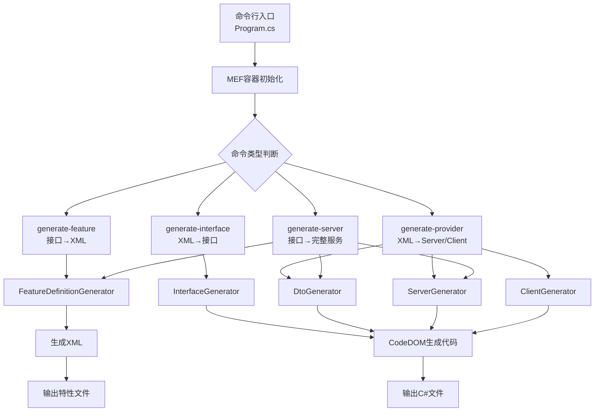

# SiLA2 Generator 技术详解与使用指南

> 基于对话整理的完整技术文档
> 
> 版本: 1.0  
> 日期: 2025年1月

---

## 📑 目录

1. [Generator核心流程](#1-generator核心流程)
2. [CodeDOM代码生成技术](#2-codedom代码生成技术)
3. [XML注释生成机制](#3-xml注释生成机制)
4. [序列化技术：ProtoBuf-net](#4-序列化技术protobuf-net)
5. [生成代码的使用方式](#5-生成代码的使用方式)
6. [ExecutionManager与拦截器](#6-executionmanager与拦截器)
7. [技术栈总览](#7-技术栈总览)

---

## 1. Generator核心流程

### 1.1 整体架构



### 1.2 从XML到C#的转换流程

#### **步骤1: XML加载与解析**

```csharp
// 使用XmlSerializer反序列化SiLA2 XML
var feature = FeatureSerializer.Load("MyFeature.sila.xml");
```

**XML结构示例**：
```xml
<Feature>
  <Identifier>GreetingService</Identifier>
  <Command>
    <Identifier>SayHello</Identifier>
    <Description>向指定名字的人打招呼</Description>
    <Parameter>
      <Identifier>Name</Identifier>
      <Description>被问候人的名字</Description>
      <DataType>
        <Basic>String</Basic>
      </DataType>
    </Parameter>
  </Command>
</Feature>
```

#### **步骤2: 特性对象模型**

```csharp
// Feature对象结构
Feature
├── Identifier: "GreetingService"
├── DisplayName: "Greeting Service"
├── Description: "..."
└── Items: []
    ├── FeatureCommand
    │   ├── Identifier: "SayHello"
    │   ├── Parameter: []
    │   └── Response: []
    ├── FeatureProperty
    └── FeatureDataType
```

#### **步骤3: 类型转换系统**

```csharp
// TypeTranslationProvider处理SiLA类型→.NET类型映射
public interface ITypeTranslator
{
    bool TryTranslate(Type interfaceType, string origin, out DataTypeType silaType);
    bool TryTranslate(DataTypeType silaType, string suggestedName, out ITypeTranslationInfo translationInfo);
}
```

**转换器优先级**:
```
高优先级 (Priority=2):
├─ AnIMLTypeTranslation      - AnIML文档类型
├─ GuidTypeTranslation        - GUID类型
└─ DictionaryTranslator       - 字典类型

中优先级 (Priority=1):
├─ BasicTypeTranslator        - 基础类型(int/string/bool)
├─ CollectionTranslator       - 集合类型
└─ ConstraintsTranslator      - 约束类型

低优先级 (Priority=0):
└─ GeneratedTypeTranslator    - 自定义生成类型
```

#### **步骤4: CodeDOM构建**

```csharp
// 生成接口
var interfaceUnit = interfaceGenerator.GenerateInterfaceUnit(feature, namespace);

// 生成DTO
var dtoUnit = dtoGenerator.GenerateInterfaceUnit(feature, namespace);

// 生成Provider/Client
var providerUnit = serverGenerator.GenerateServer(feature, namespace);
var clientUnit = clientGenerator.GenerateClient(feature, namespace);
```

#### **步骤5: 输出C#代码**

```csharp
CodeGenerationHelper.GenerateCSharp(interfaceUnit, "IGreetingService.cs");
CodeGenerationHelper.GenerateCSharp(dtoUnit, "Dtos.cs");
CodeGenerationHelper.GenerateCSharp(providerUnit, "Provider.cs");
CodeGenerationHelper.GenerateCSharp(clientUnit, "Client.cs");
```

### 1.3 主要技术组件

| 组件 | 职责 | 技术 |
|-----|------|------|
| **FeatureSerializer** | XML序列化/反序列化 | XmlSerializer |
| **TypeTranslationProvider** | 类型转换 | 策略模式 + 优先级排序 |
| **CodeDOM Generators** | 代码生成 | System.CodeDom |
| **CodeGenerationHelper** | 代码输出 | CSharpCodeProvider |
| **MEF Container** | 依赖注入 | System.ComponentModel.Composition |

---

## 2. CodeDOM代码生成技术

### 2.1 什么是CodeDOM？

**CodeDOM** (Code Document Object Model) 是.NET Framework提供的**语言无关的代码表示系统**。

```
源代码 ←→ CodeDOM对象树 ←→ 目标代码
  C#      (抽象表示)      VB.NET/C#/...
```

### 2.2 核心优势

| 优势 | 说明 |
|-----|------|
| **类型安全** | 使用强类型对象构建代码，避免语法错误 |
| **语言无关** | 同一套对象可生成不同语言代码 |
| **结构化** | 代码组织清晰，易于维护 |
| **工具支持** | IDE提供智能提示 |

### 2.3 核心组件

```csharp
// 基础结构
CodeCompileUnit          // 编译单元（文件级）
CodeNamespace           // 命名空间
CodeTypeDeclaration     // 类型声明（class/interface）
CodeMemberMethod        // 方法成员
CodeMemberProperty      // 属性成员
CodeMemberField         // 字段成员

// 表达式与语句
CodePrimitiveExpression              // 基础值: 123, "hello", true
CodeVariableReferenceExpression      // 变量引用: myVariable
CodeMethodInvokeExpression           // 方法调用: obj.Method(arg)
CodeObjectCreateExpression           // 创建对象: new MyClass()
CodeBinaryOperatorExpression         // 二元运算: a + b, x == y
CodeConditionStatement               // 条件语句: if (condition) { }
CodeTryCatchFinallyStatement         // 异常处理: try-catch-finally
```

### 2.4 实际应用示例

#### **生成客户端构造函数**

```csharp
// Generator/Generators/ClientGenerator.cs:967-1001
private void GenerateClientConstructors(CodeTypeDeclaration client, bool initLazyRequests)
{
    var constructor = new CodeConstructor() 
    { 
        Attributes = MemberAttributes.Public 
    };
    
    // 添加参数
    var channelParameter = new CodeParameterDeclarationExpression(
        typeof(IClientChannel).Name, "channel");
    var executionManagerParameter = new CodeParameterDeclarationExpression(
        typeof(IClientExecutionManager).Name, "executionManager");
    
    constructor.Parameters.Add(channelParameter);
    constructor.Parameters.Add(executionManagerParameter);
    
    // 添加赋值语句
    constructor.Statements.Add(new CodeAssignStatement(
        new CodeFieldReferenceExpression(null, "_channel"),
        new CodeArgumentReferenceExpression("channel")));
    
    constructor.Statements.Add(new CodeAssignStatement(
        new CodeFieldReferenceExpression(null, "_executionManager"),
        new CodeArgumentReferenceExpression("executionManager")));
    
    client.Members.Add(constructor);
}
```

**生成的C#代码**:
```csharp
public GreetingServiceClient(IClientChannel channel, IClientExecutionManager executionManager)
{
    _channel = channel;
    _executionManager = executionManager;
}
```

### 2.5 CodeDOM对象树可视化

```
CodeMemberMethod (SayHello)
├─ Attributes: Public | Final
├─ ReturnType: CodeTypeReference(typeof(string))
├─ Parameters
│   └─ CodeParameterDeclarationExpression("name", string)
└─ Statements
    ├─ CodeVariableDeclarationStatement
    │   └─ new CodeObjectCreateExpression(SayHelloRequestDto)
    ├─ CodeVariableDeclarationStatement (callInfo)
    └─ CodeTryCatchFinallyStatement
        ├─ TryStatements
        │   ├─ CodeMethodInvokeExpression (_channel.ExecuteCommand)
        │   └─ CodeMethodReturnStatement
        └─ CatchClauses
            └─ CodeCatchClause (Exception)
```

---

## 3. XML注释生成机制

### 3.1 CodeDOM支持的注释类型

```csharp
// 单行注释
new CodeCommentStatement("这是单行注释", docComment: false)
// 生成: // 这是单行注释

// XML文档注释
new CodeCommentStatement(" <summary>这是文档注释</summary>", docComment: true)
// 生成: /// <summary>这是文档注释</summary>
```

### 3.2 注释数据来源

#### **来源1: SiLA2 XML特性文件**

```xml
<Command>
  <Identifier>GetFeatureDefinition</Identifier>
  <Description>
    Get the Feature Definition of an implemented Feature.
    This command has no preconditions.
  </Description>
  <Parameter>
    <Identifier>FeatureIdentifier</Identifier>
    <Description>
      The fully qualified Feature identifier.
    </Description>
  </Parameter>
</Command>
```

#### **来源2: .NET XML文档文件**

```xml
<!-- MyAssembly.xml -->
<doc>
  <members>
    <member name="M:MyNamespace.IMyInterface.DoSomething(System.String)">
      <summary>执行某操作</summary>
      <param name="input">输入参数</param>
      <returns>操作结果</returns>
    </member>
  </members>
</doc>
```

### 3.3 核心实现：WriteDocumentation扩展方法

```csharp
// Generator/Helper/CodeGenerationHelper.cs:245-314
public static CodeTypeMember WriteDocumentation(
    this CodeTypeMember member, 
    string summary, 
    string returns = null, 
    IReadOnlyDictionary<string, string> parameters = null)
{
    var documentationWriter = new StringBuilder();
    
    // 1. 添加 <summary>
    if (!string.IsNullOrEmpty(summary))
    {
        Write("summary", null, summary, documentationWriter, true, ref written);
    }
    
    // 2. 添加 <param> 标签
    if (parameters != null)
    {
        foreach (var parameter in parameters)
        {
            Write("param", parameter.Key, parameter.Value, 
                  documentationWriter, false, ref written);
        }
    }
    
    // 3. 添加 <returns>
    Write("returns", null, returns, documentationWriter, false, ref written);
    
    // 4. 添加到成员
    if (documentationWriter.Length > 0)
    {
        member.Comments.Add(
            new CodeCommentStatement(documentationWriter.ToString(), true)
        );
    }
    return member;
}
```

### 3.4 格式化智能处理

```csharp
private static void Write(string tag, string name, string value, 
                         StringBuilder documentationWriter, bool forceElement)
{
    var lines = value.Split('\n');
    var tagWithName = name != null ? tag + $" name=\"{name}\"" : tag;
    
    // 单行格式
    if (lines.Length == 1 && !forceElement)
    {
        // <param name="x">描述</param>
        documentationWriter.Append($"<{tagWithName}>{value.Trim()}</{tag}>");
    }
    // 多行格式
    else
    {
        // <summary>
        //  第一行
        //  第二行
        // </summary>
        documentationWriter.AppendLine($"<{tagWithName}>");
        foreach (var line in lines)
        {
            documentationWriter.AppendLine(" " + line.Trim());
        }
        documentationWriter.Append($" </{tag}>");
    }
}
```

### 3.5 实际应用示例

```csharp
// Generator/Generators/ClientGenerator.cs:368-395
var parameterDictionary = new Dictionary<string, string>();

foreach (var parameterType in featureCommand.Parameter)
{
    var parameterName = parameterType.Identifier.ToCamelCase();
    
    // 从XML提取参数描述
    parameterDictionary.Add(
        parameterName, 
        parameterType.Description  // ← 从<Description>标签读取
    );
}

// 生成文档注释
requestMethod.WriteDocumentation(
    summary: featureCommand.Description,  // ← 从<Description>标签
    parameters: parameterDictionary
);
```

**生成效果**:
```csharp
/// <summary>
/// Get the Feature Definition of an implemented Feature.
/// This command has no preconditions.
/// </summary>
/// <param name="featureIdentifier">The fully qualified Feature identifier.</param>
/// <returns>The Feature definition in XML format.</returns>
public string GetFeatureDefinition(string featureIdentifier)
{
    // 实现代码...
}
```

---

## 4. 序列化技术：ProtoBuf-net

### 4.1 为什么使用ProtoBuf？

SiLA2基于gRPC通信，而gRPC原生使用Protocol Buffers作为序列化格式。ProtoBuf-net是.NET的ProtoBuf实现。

**优势**:
- **高性能**: 比JSON/XML更快
- **紧凑**: 二进制格式，体积更小
- **跨语言**: Protocol Buffers是跨平台标准
- **gRPC兼容**: 与gRPC无缝集成

### 4.2 ProtoBuf在Generator中的应用

#### **生成ProtoContract特性**

```csharp
// Generator/Generators/DtoGenerator.cs:329, 444, 493
var dto = new CodeTypeDeclaration(name)
{
    Attributes = MemberAttributes.Public,
    TypeAttributes = TypeAttributes.Public,
    IsClass = true
};

// 添加 [ProtoContract] 特性
AddAttribute(dto.CustomAttributes, typeof(ProtoContractAttribute));
```

#### **生成ProtoMember特性**

```csharp
// Generator/Generators/DtoGenerator.cs:354, 762
var property = new CodeMemberProperty
{
    Name = "Name",
    Type = new CodeTypeReference(typeof(string)),
    Attributes = MemberAttributes.Public,
    HasGet = true,
    HasSet = true
};

// 添加 [ProtoMember(1)] 特性，数字是字段序号
AddAttribute(property.CustomAttributes, typeof(ProtoMemberAttribute), index);
```

### 4.3 生成的DTO代码示例

```csharp
// Examples/HelloSila/HelloSila/GreetingService/Dtos.cs
[ProtoBuf.ProtoContract]  // ← ProtoBuf序列化标记
public class SayHelloRequestDto : ISilaTransferObject, ISilaRequestObject
{
    private StringDto _name;
    
    public SayHelloRequestDto() { }
    
    public SayHelloRequestDto(string name, IBinaryStore store)
    {
        Name = new StringDto(name, store);
    }
    
    [ProtoBuf.ProtoMember(1)]  // ← 字段序号1
    public StringDto Name
    {
        get => _name;
        set => _name = value;
    }
    
    public string CommandIdentifier 
        => "sila.hackathon/demo/GreetingService/v1/Command/SayHello";
    
    public string GetValidationErrors()
    {
        string errors = "";
        if (Name.Value.Length > 20)  // ← 自动生成的验证
        {
            errors += $"Name '{Name.Value}' is longer than allowed length 20.";
        }
        return errors;
    }
}
```

### 4.4 ProtoBuf序列化流程

```
客户端                          网络传输                        服务端
┌─────────────┐                                          ┌─────────────┐
│ C# 对象     │                                          │ C# 对象     │
│ (Request)   │                                          │ (Request)   │
└──────┬──────┘                                          └──────▲──────┘
       │                                                         │
       │ ProtoBuf-net                                   ProtoBuf-net
       │ Serialize                                      Deserialize
       ▼                                                         │
┌─────────────┐          gRPC HTTP/2 传输              ┌─────────────┐
│ 二进制数据   │ ────────────────────────────────────> │ 二进制数据   │
│ (Bytes)     │                                        │ (Bytes)     │
└─────────────┘                                        └─────────────┘
```

---

## 5. 生成代码的使用方式

### 5.1 生成文件结构

```
输出目录/
└── {FeatureName}/
    ├── I{FeatureName}.cs     # 接口定义
    ├── Dtos.cs              # 数据传输对象（带ProtoBuf特性）
    ├── Provider.cs          # 服务端实现
    └── Client.cs            # 客户端实现
```

### 5.2 服务端使用流程

#### **步骤1: 定义接口**

```csharp
using Tecan.Sila2;

[SilaFeature]  // ← 标记为SiLA特性
public interface IGreetingService
{
    /// <summary>向指定名字的人打招呼</summary>
    /// <param name="name">被问候人的名字</param>
    string SayHello([MaximalLength(20)] string name);
}
```

#### **步骤2: 生成代码**

```bash
# 从接口生成完整服务端代码
SilaGen generate-server Contracts.dll ServerProject.csproj
```

#### **步骤3: 实现业务逻辑**

```csharp
using System.ComponentModel.Composition;

[Export(typeof(IGreetingService))]  // ← MEF导出
[PartCreationPolicy(CreationPolicy.Shared)]
public class GreetingService : IGreetingService
{
    public string SayHello(string name)
    {
        if (name.Any(char.IsDigit))
            throw new UnfriendlyNameException("名字不能包含数字");
        
        return $"你好, {name}!";
    }
}
```

#### **步骤4: 启动服务**

```csharp
class Program
{
    static void Main(string[] args)
    {
        // Bootstrapper自动：
        // 1. 扫描MEF组件
        // 2. 加载Provider
        // 3. 启动gRPC服务器
        Bootstrapper.Start(args);
        Console.ReadLine();
    }
}
```

### 5.3 客户端使用流程

#### **步骤1: 生成客户端代码**

```bash
SilaGen generate-client GreetingService.sila.xml ClientProject.csproj
```

#### **步骤2: 使用客户端**

```csharp
using Tecan.Sila2.Client;
using Tecan.Sila2.Client.ExecutionManagement;
using Tecan.Sila2.Discovery;

class Program
{
    static void Main(string[] args)
    {
        // 1. 服务发现
        var connector = new PlaintextConnector(new DiscoveryExecutionManager());
        var discovery = new ServerDiscovery(connector);
        var servers = discovery.GetServers(TimeSpan.FromSeconds(10), nic => true);
        var server = servers.First();
        
        // 2. 创建执行管理器
        var executionManagerFactory = new ExecutionManagerFactory(
            Array.Empty<IClientRequestInterceptor>()
        );
        
        // 3. 创建强类型客户端
        var client = new GreetingServiceClient(
            server.Channel,
            executionManagerFactory.CreateExecutionManager(server)
        );
        
        // 4. 调用服务（像本地方法一样）
        try
        {
            string result = client.SayHello("张三");
            Console.WriteLine(result);  // 输出: 你好, 张三!
        }
        catch (UnfriendlyNameException ex)  // ← 自动转换异常
        {
            Console.WriteLine($"错误: {ex.Message}");
        }
    }
}
```

### 5.4 生成代码的核心优势

| 特性 | 手动实现 | 使用生成代码 |
|-----|---------|------------|
| **类型安全** | ❌ 易出错 | ✅ 编译期检查 |
| **异常处理** | 需手动映射 | ✅ 自动转换 |
| **序列化** | 手动处理DTO | ✅ 自动生成ProtoBuf DTO |
| **元数据** | 手动构建 | ✅ 自动追踪 |
| **gRPC调用** | 底层API | ✅ 高级封装 |
| **文档同步** | 容易不一致 | ✅ 从XML生成 |

---

## 6. ExecutionManager与拦截器

### 6.1 ExecutionManagerFactory是否必须？

**不是必须的！** 它只是一个便利的工厂类。

#### **简化方案**

```csharp
// 方案1: 空数组（推荐用于简单场景）
var executionManagerFactory = new ExecutionManagerFactory(
    Array.Empty<IClientRequestInterceptor>()
);

// 方案2: 直接创建ExecutionManager
var executionManager = new ExecutionManager(
    server, 
    Enumerable.Empty<IClientRequestInterceptor>()
);
```

### 6.2 ExecutionManagerFactory的作用

```csharp
// Client/ExecutionManagement/ExecutionManagerFactory.cs
public class ExecutionManagerFactory : IExecutionManagerFactory
{
    private readonly IEnumerable<IClientRequestInterceptor> _interceptors;
    private readonly Dictionary<ServerData, IClientExecutionManager> _cachedExecutionManagers;
    
    public IClientExecutionManager CreateExecutionManager(ServerData server)
    {
        if (server == null)
            return new DiscoveryExecutionManager();
        
        // 缓存并复用ExecutionManager实例
        if (!_cachedExecutionManagers.TryGetValue(server, out var executionManager))
        {
            executionManager = new ExecutionManager(server, _interceptors);
            _cachedExecutionManagers.Add(server, executionManager);
        }
        return executionManager;
    }
}
```

**主要功能**:
- **缓存管理**: 为多个服务器管理ExecutionManager实例
- **拦截器注入**: 统一管理元数据、认证、锁定等拦截器

### 6.3 什么是拦截器（Interceptor）？

拦截器用于在客户端请求前后注入自定义逻辑：

```csharp
public interface IClientRequestInterceptor
{
    string MetadataIdentifier { get; }
    byte[] GetMetadata(string commandIdentifier);
}
```

#### **实际拦截器示例**

```csharp
// Interoperability/InteropClient/MetadataProvider/StringMetadataInterceptor.cs
internal class StringMetadataInterceptor : IClientRequestInterceptor
{
    public static string Metadata { get; set; }
    
    public string MetadataIdentifier 
        => "org.silastandard/test/MetadataProvider/v1/Metadata/String";
    
    public byte[] GetMetadata(string commandIdentifier)
    {
        return Encoding.UTF8.GetBytes(Metadata ?? "");
    }
}

// 认证拦截器
internal class AuthenticationInterceptor : IClientRequestInterceptor
{
    private readonly IAuthenticationHandler _authHandler;
    
    public byte[] GetMetadata(string commandIdentifier)
    {
        var token = _authHandler.GetToken();
        return Encoding.UTF8.GetBytes(token);
    }
}
```

### 6.4 关于LockingInterceptor

**注意**: `LockingInterceptor` 在当前代码库中**不存在**！

这是示例代码的遗留引用。修复方法：

```csharp
// ❌ 错误示例（HelloSila/Client/Program.cs）
using Tecan.Sila2.Locking;  // ← 这个命名空间不存在
var executionManagerFactory = new ExecutionManagerFactory(
    new IClientRequestInterceptor[] { new LockingInterceptor() }  // ← 这个类不存在
);

// ✅ 正确示例
var executionManagerFactory = new ExecutionManagerFactory(
    Array.Empty<IClientRequestInterceptor>()  // ← 空数组
);
```

### 6.5 拦截器使用场景

| 场景 | 拦截器类型 | 用途 |
|-----|----------|------|
| **认证** | AuthenticationInterceptor | 添加JWT令牌 |
| **元数据** | StringMetadataInterceptor | 传递额外信息 |
| **日志** | LoggingInterceptor | 记录请求/响应 |
| **重试** | RetryInterceptor | 自动重试失败请求 |
| **缓存** | CacheInterceptor | 缓存频繁请求 |

---

## 7. 技术栈总览

### 7.1 核心技术栈

| 层次 | 技术 | 用途 | 位置 |
|-----|------|-----|------|
| **命令行** | CommandLineParser | 参数解析 | Generator/Program.cs |
| **依赖注入** | MEF | 模块化架构 | 全局 |
| **XML处理** | XmlSerializer | 序列化/反序列化 | FeatureSerializer |
| **反射** | System.Reflection | 从程序集提取类型 | FeatureDefinitionGenerator |
| **代码生成** | System.CodeDom | 构建C#代码树 | 所有Generator |
| **代码输出** | CSharpCodeProvider | 生成C#源码 | CodeGenerationHelper |
| **类型系统** | ITypeTranslator插件 | SiLA↔.NET映射 | TypeTranslation/ |
| **验证** | IValidationCreator | 数据约束验证 | Validation/ |
| **序列化** | ProtoBuf-net | gRPC消息序列化 | DtoGenerator |
| **日志** | Common.Logging | 日志记录 | 全局 |

### 7.2 从XML到C#的完整技术链

```
┌─────────────────────────────────────────────┐
│           SiLA2 XML 特性文件                 │
│   <Command>                                  │
│     <Identifier>GetFeature</Identifier>      │
│     <Description>获取特性</Description>      │ ←─ XML
│   </Command>                                 │
└────────────────┬────────────────────────────┘
                 │
                 │ XmlSerializer.Deserialize()
                 ▼
┌─────────────────────────────────────────────┐
│          Feature 对象模型                    │
│   feature.Items[0].Description = "获取特性"  │ ←─ C# Objects
└────────────────┬────────────────────────────┘
                 │
                 │ TypeTranslationProvider
                 │ (SiLA类型 → .NET类型)
                 ▼
┌─────────────────────────────────────────────┐
│         CodeDOM 对象树                       │
│   CodeMemberMethod                           │
│     └─ Comments                              │ ←─ CodeDOM
│         └─ CodeCommentStatement              │
│     └─ Parameters                            │
│     └─ Statements                            │
└────────────────┬────────────────────────────┘
                 │
                 │ CSharpCodeProvider.GenerateCode()
                 ▼
┌─────────────────────────────────────────────┐
│          生成的 C# 文件                      │
│   [ProtoContract]                            │
│   public class RequestDto                    │ ←─ C# Source Code
│   {                                          │
│       [ProtoMember(1)]                       │
│       public string Name { get; set; }       │
│   }                                          │
└─────────────────────────────────────────────┘
```

### 7.3 运行时技术栈

```
客户端应用
    ↓
┌──────────────────────┐
│  生成的Client.cs      │ ←─ CodeDOM生成
│  (强类型客户端)       │
└──────────┬───────────┘
           │
           │ IClientChannel
           ▼
┌──────────────────────┐
│  gRPC Channel        │ ←─ Grpc.Net.Client / Grpc.Core
└──────────┬───────────┘
           │
           │ HTTP/2 + ProtoBuf
           ▼
     [网络传输]
           │
           │ HTTP/2 + ProtoBuf
           ▼
┌──────────────────────┐
│  gRPC Server         │ ←─ Grpc.AspNetCore
└──────────┬───────────┘
           │
           │ IFeatureProvider
           ▼
┌──────────────────────┐
│  生成的Provider.cs    │ ←─ CodeDOM生成
│  (服务端适配器)       │
└──────────┬───────────┘
           │
           │ 接口调用
           ▼
┌──────────────────────┐
│  业务实现类          │ ←─ 开发者编写
│  (IGreetingService)  │
└──────────────────────┘
```

### 7.4 ProtoBuf在通信中的作用

```
┌─────────────┐                              ┌─────────────┐
│  客户端      │                              │  服务端      │
├─────────────┤                              ├─────────────┤
│ C# 对象     │                              │ C# 对象     │
│ Request     │                              │ Request     │
└──────┬──────┘                              └──────▲──────┘
       │                                            │
       │ [ProtoContract] 特性                       │ [ProtoContract] 特性
       │ ProtoBuf.Serializer.Serialize()           │ ProtoBuf.Serializer.Deserialize()
       ▼                                            │
┌─────────────┐                              ┌─────────────┐
│ 二进制数据   │    gRPC (HTTP/2)            │ 二进制数据   │
│ (Bytes)     │ ─────────────────────────>  │ (Bytes)     │
└─────────────┘                              └─────────────┘
       ▲                                            │
       │                                            ▼
┌─────────────┐                              ┌─────────────┐
│ 网络传输     │                              │ 网络接收     │
│ (高效/紧凑)  │                              │ (解析/验证)  │
└─────────────┘                              └─────────────┘
```

---

## 8. 最佳实践

### 8.1 服务端开发

✅ **DO（推荐）**:
1. 使用MEF导出实现: `[Export(typeof(IMyService))]`
2. 为异常添加XML文档注释: `/// <exception cref="MyException">...</exception>`
3. 用特性标记约束: `[MaximalLength(100)]`
4. 实现业务逻辑时验证输入
5. 使用依赖注入管理依赖

❌ **DON'T（避免）**:
1. 不要修改生成的Provider.cs代码
2. 不要在接口中使用泛型方法（不支持）
3. 不要忘记调用`Bootstrapper.Start()`

### 8.2 客户端开发

✅ **DO（推荐）**:
1. 使用`using`释放客户端资源: `using var client = new MyClient(...)`
2. 简单场景使用空拦截器数组: `Array.Empty<IClientRequestInterceptor>()`
3. 正确处理异常（会自动转换为强类型异常）
4. 使用服务发现自动连接服务器

❌ **DON'T（避免）**:
1. 不要修改生成的Client.cs代码
2. 不要在生产环境使用`PlaintextConnector`（不安全）
3. 不要忽略LockingInterceptor缺失的问题

### 8.3 代码生成

✅ **DO（推荐）**:
1. 使用配置文件自定义生成行为
2. 为接口添加完整的XML文档注释
3. 遵循SiLA2命名约定
4. 测试生成的代码

❌ **DON'T（避免）**:
1. 不要手动编辑生成的代码（会被覆盖）
2. 不要混用不同版本的特性文件
3. 不要在接口中使用不支持的类型

---

## 9. 常见问题

### Q1: 为什么使用CodeDOM而不是字符串拼接？

**A**: CodeDOM提供：
- ✅ 类型安全和编译期检查
- ✅ 结构化的代码组织
- ✅ 语言无关性
- ✅ IDE智能提示支持
- ✅ 更易维护和调试

### Q2: ProtoBuf相比JSON有什么优势？

**A**: ProtoBuf优势：
- 🚀 **性能**: 序列化/反序列化速度更快
- 📦 **体积**: 二进制格式，比JSON小50-70%
- 🔒 **类型安全**: 强类型定义
- 🌍 **跨语言**: Protocol Buffers是工业标准
- 🔌 **gRPC原生**: 与gRPC无缝集成

### Q3: 是否必须使用ExecutionManagerFactory？

**A**: **不必须**。简单场景可以：
```csharp
var executionManagerFactory = new ExecutionManagerFactory(
    Array.Empty<IClientRequestInterceptor>()
);
```

### Q4: LockingInterceptor在哪里？

**A**: `LockingInterceptor`在当前代码库中**不存在**，这是示例代码的遗留引用。使用空数组替代：
```csharp
Array.Empty<IClientRequestInterceptor>()
```

### Q5: 如何添加自定义元数据？

**A**: 实现`IClientRequestInterceptor`接口：
```csharp
public class MyMetadataInterceptor : IClientRequestInterceptor
{
    public string MetadataIdentifier => "my.company/metadata/CustomData";
    
    public byte[] GetMetadata(string commandIdentifier)
    {
        return Encoding.UTF8.GetBytes("custom-value");
    }
}
```

---

## 10. 参考资源

### 10.1 核心文件位置

| 组件 | 文件路径 |
|-----|---------|
| **命令行处理** | `Generator/CommandLine/*.cs` |
| **代码生成器** | `Generator/Generators/*.cs` |
| **类型转换** | `Generator/TypeTranslation/*.cs` |
| **验证器** | `Generator/Validation/*.cs` |
| **帮助类** | `Generator/Helper/*.cs` |
| **示例项目** | `Examples/HelloSila/` |

### 10.2 关键接口

```csharp
ICommandLineVerb              // 命令行动词
IFeatureDefinitionGenerator   // 特性生成器
IInterfaceGenerator          // 接口生成器
IDtoGenerator                // DTO生成器
IServerGenerator             // 服务端生成器
IClientGenerator             // 客户端生成器
ITypeTranslator              // 类型转换器
IValidationCreator           // 验证创建器
```

### 10.3 扩展点

可以通过MEF扩展的组件：
- ✅ `ITypeTranslator` - 添加自定义类型转换
- ✅ `IValidationCreator` - 添加自定义验证规则
- ✅ `IGeneratorHook` - 在代码生成前后执行自定义逻辑
- ✅ `IClientRequestInterceptor` - 添加客户端拦截器

---

## 11. 总结

### 11.1 核心技术

Generator项目使用了以下核心技术：

1. **CodeDOM** - 语言无关的代码生成系统
2. **ProtoBuf-net** - 高性能二进制序列化
3. **MEF** - 依赖注入和模块化
4. **XML处理** - 特性文件的序列化/反序列化
5. **反射** - 从程序集提取类型信息
6. **策略模式** - 类型转换器的优先级系统

### 11.2 数据流转

```
接口/XML → 对象模型 → 类型转换 → CodeDOM → C#代码
   ↓          ↓          ↓         ↓        ↓
反射/XML   Feature   TypeTranslation  AST   源文件
```

### 11.3 关键优势

| 特性 | 优势 |
|-----|------|
| **自动化** | 从接口/XML自动生成完整的客户端/服务端代码 |
| **类型安全** | 编译期检查，避免运行时错误 |
| **文档同步** | XML注释自动同步到生成的代码 |
| **高性能** | ProtoBuf序列化，性能优于JSON |
| **可扩展** | 通过MEF插件系统轻松扩展 |
| **标准化** | 遵循SiLA2标准，确保互操作性 |

---

**文档版本**: 1.0  
**最后更新**: 2025年1月  
**维护者**: SiLA2 Generator开发团队  

---

## 附录A: 快速参考

### 命令行速查

```bash
# 从接口生成特性文件
SilaGen generate-feature Assembly.dll FeatureDirectory/

# 从特性文件生成接口
SilaGen generate-interface Feature.sila.xml Interface.cs

# 从特性文件生成DTO和Provider
SilaGen generate-provider Feature.sila.xml Dtos.cs Provider.cs

# 从接口生成完整服务端
SilaGen generate-server Assembly.dll ServerProject.csproj

# 从特性文件生成客户端
SilaGen generate-client Feature.sila.xml ClientProject.csproj

# 生成自签名证书
SilaGen generate-certificate --ca-path ca.key --ca-password pass:1234 ServerUUID
```

### 代码模板

**最简客户端**:
```csharp
var connector = new PlaintextConnector(new DiscoveryExecutionManager());
var discovery = new ServerDiscovery(connector);
var servers = discovery.GetServers(TimeSpan.FromSeconds(10), nic => true);
var server = servers.First();

var executionManagerFactory = new ExecutionManagerFactory(
    Array.Empty<IClientRequestInterceptor>()
);

var client = new MyServiceClient(
    server.Channel,
    executionManagerFactory.CreateExecutionManager(server)
);

var result = client.MyCommand("parameter");
```

**最简服务端**:
```csharp
[Export(typeof(IMyService))]
public class MyService : IMyService
{
    public string MyCommand(string parameter)
    {
        return $"Result: {parameter}";
    }
}

// Program.cs
Bootstrapper.Start(args);
Console.ReadLine();
```

---

*本文档基于对SiLA2 Generator代码的深入分析和实际使用经验编写，旨在帮助开发者理解和使用这个强大的代码生成工具。*


